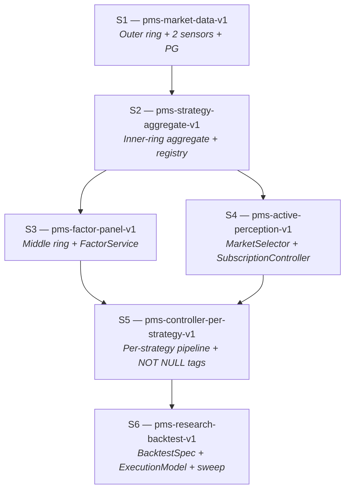

# PMS Project Decomposition Design

## 0. Purpose and relationship to other documents

**What this document is.** The project-level total spec for the
six-sub-spec decomposition that will implement
`agent_docs/architecture-invariants.md`. It defines the scope,
boundaries, and kickoff contract for each sub-spec (S1–S6), and it
provides the boundary-integrity mechanisms (Boundary Matrix, Intake /
Leave-behind, cross-spec gates) that keep the six harness runs from
overlapping or leaving gaps.

**What this document is not.**

- It is not a harness-executable spec. Per-checkpoint acceptance
  criteria, files-of-interest, and effort estimates live in each
  `.harness/pms-<id>-v1/spec.md` when that harness run starts.
- It is not an architecture document. Architecture invariants live
  in `agent_docs/architecture-invariants.md`; this document
  *consumes* those invariants — it does not redefine them.
- It is not a retrospective. Promoted rules from retros live in
  `agent_docs/promoted-rules.md`.

**How to use this document.**

- For designing any new entity or module: read §3 (Boundary Matrix)
  first, then the sub-spec that owns the entity.
- Before starting a new harness run: read §4 (Execution order) and
  the Kickoff Prompt at the end of the relevant sub-spec.
- After finishing a harness run: verify that sub-spec's Leave-behind
  is satisfied, update §12 (Maintenance), and proceed to the next
  gate.

**Source material.**

- `agent_docs/architecture-invariants.md` — the 8 non-negotiable
  architectural invariants. This document's sub-spec acceptance
  criteria reference invariants by number.
- `agent_docs/project-roadmap.md` — the 6-spec DAG skeleton and the
  between-spec gate policy. This document expands that skeleton.
- `agent_docs/promoted-rules.md` — rules promoted from retros.
  Complementary to the invariants: invariants define the positive
  architecture, retros capture past mistakes.
- `docs/notes/2026-04-16-repo-issues-controller-evaluator.md` — the
  schema and `asyncpg` decisions that feed S1 + S2 scope.
- `docs/notes/2026-04-16-evaluator-entity-abstraction.md` — the
  entity catalogue that feeds S2 – S6 scope.
- `src/pms/{sensor,controller,actuator,evaluation}/CLAUDE.md` —
  per-layer enforcement of the invariants most relevant to each
  layer.

---

## 1. Project end state

A **research-grade prediction-market strategy platform** where
multiple strategies run concurrently against live, paper, and
backtest modes under a single runtime, with per-strategy dispatch,
comparable metrics, and active perception driving Sensor
subscription.

### 1.1 Observable capabilities at the finish line

1. **Multi-strategy concurrency.** Several strategies run
   concurrently through a per-strategy `ControllerPipeline`
   (Invariant 1 — concurrent feedback web, not phased runtime).
   Each produces `TradeDecision` rows tagged `(strategy_id,
   strategy_version_id)` (Invariants 2, 3).
2. **Live Polymarket orderbook persistence.** Real `book`
   snapshots and `price_change` deltas from the CLOB WebSocket land
   in `book_snapshots`, `book_levels`, `price_changes`, `trades`
   (Invariants 7, 8). Simulated depth is retired.
3. **`/strategies` dashboard page.** Lists every registered
   strategy with per-strategy Brier, P&L, fill rate, slippage,
   drawdown, and calibration sample count, each grouped by
   `(strategy_id, strategy_version_id)` (Invariant 3).
4. **`/signals` dashboard page.** Renders real orderbook depth
   from the outer-ring tables — the dashboard no longer depends on
   fabricated bid/ask levels.
5. **`/factors` dashboard page.** Shows factor values evolving
   over time per `(factor_id, param, market_id)` (Invariant 4).
6. **`/backtest` dashboard page.** Compares N strategies over a
   configurable market universe and date range, producing a ranked
   comparison report (S6 deliverable).
7. **Strategy onboarding without code rewrite.** A new strategy is
   a new row in `strategies` + a module under
   `src/pms/strategies/<id>/` + a `StrategyConfig` blob; no
   changes required in `src/pms/sensor/` or `src/pms/actuator/`
   (Invariant 5 — strategy-agnostic boundary).
8. **Shared selection path across backtest / paper / live.** All
   three modes consume the same `Factor → StrategySelection →
   Opportunity → PortfolioTarget` chain. Divergence happens only
   inside `ExecutionModel` (S6 owns the abstraction).
9. **Active perception wired end-to-end.**
   `Strategy.select_markets` output drives `MarketSelector`, which
   pushes subscription updates through
   `SensorSubscriptionController` into `MarketDataSensor`. No
   sensor module imports from `pms.strategies.*` (Invariants 5, 6,
   7).
10. **Onion-concentric storage populated.** Outer ring (market
    data, strategy-agnostic), middle ring (factor panel,
    strategy-agnostic cache), and inner ring (strategy products)
    all persist in PostgreSQL with ring-ownership enforced by
    schema plus import-linter rules (Invariant 8).

### 1.2 What the finished system does not do

- **Real-money live execution stays gated** behind
  `live_trading_enabled=false`. The Polymarket adapter exists, is
  integration-tested, and is guarded by
  `LiveTradingDisabledError`; flipping the gate is a human
  decision outside the scope of this decomposition.
- **No automated feedback loop reconfigures strategies.**
  `Feedback` rows from Actuator / Evaluator are surfaced through
  `/feedback` for human resolution; automated strategy adjustment
  is explicitly out of scope (retained from `.harness/pms-v2/`
  non-goals).
- **Kalshi is not implemented.** Venue-agnostic interfaces
  (`ISensor`, `IActuator`) remain in place; a Kalshi adapter pair
  is a follow-on effort after S6.
- **No ORM and no migration framework.** Raw SQL via `asyncpg`
  throughout, with a single `schema.sql` applied at Runner
  startup. Alembic / Sqitch are reconsidered only if schema drift
  makes the single-file approach painful.

### 1.3 How end state differs from the 2026-04-16 baseline

Today (as of the `main` tip on 2026-04-16, commit `b4734fb`):

- The REST sensor's `_gamma_market_to_signal` emits
  `orderbook={"bids": [], "asks": []}` — real orderbook depth is
  absent, not even fabricated
  (`src/pms/sensor/adapters/polymarket_rest.py:90`, inside the
  helper that starts at line 78).
- The stream adapter's top-level `_message_dict_to_signal` keeps
  only messages carrying both `price` and `market_id`, which
  silently drops `book` and `price_change` events
  (`src/pms/sensor/adapters/polymarket_stream.py:71-77`).
  `Runner._build_sensors` never wires the stream sensor in for
  non-backtest modes either
  (`src/pms/runner.py:177-185` — only `PolymarketRestSensor` is
  returned).
- `ControllerPipeline` runs one global pipeline; `TradeDecision`
  has no `strategy_id` / `strategy_version_id` fields.
- `FeedbackStore` and `EvalStore` persist to JSONL under `.data/`;
  there is no PostgreSQL in the runtime path.
- `Factor`, `Strategy`, `MarketSelector`, `BacktestSpec`,
  `StrategyRun` — none of these entities exist.
- The dashboard exposes `/signals`, `/decisions`, `/metrics`, and
  `/backtest` pages plus a feedback panel on the main overview page
  (fed by API routes under `dashboard/app/api/pms/feedback/`). None
  render per-strategy comparison.

End state closes every item above.

---

## 2. Dependency DAG

### 2.1 Graph

### 2.2 Node summary

| ID | Harness directory                          | Invariants primarily closed | Headline deliverable |
|----|--------------------------------------------|-----------------------------|----------------------|
| S1 | `.harness/pms-market-data-v1/`             | 7, 8                        | Real Polymarket orderbook persisted in PG; `/signals` renders real depth; JSONL stores retired |
| S2 | `.harness/pms-strategy-aggregate-v1/`      | 2, 3, 5, 8                  | `Strategy` aggregate + projections; `strategies` / `strategy_versions` tables; import-linter rules; `"default"` strategy seeded |
| S3 | `.harness/pms-factor-panel-v1/`            | 4, 8                        | `factors` + `factor_values` tables; existing rules-detector logic migrated to raw factor definitions |
| S4 | `.harness/pms-active-perception-v1/`       | 6, 7                        | `MarketSelector` + `SensorSubscriptionController` + `Strategy.select_markets` hook wired into Runner |
| S5 | `.harness/pms-controller-per-strategy-v1/` | 2, 3, 5                     | Per-strategy `ControllerPipeline`; per-strategy Evaluator aggregation; `(strategy_id, strategy_version_id)` upgraded to `NOT NULL`; `/strategies` page |
| S6 | `.harness/pms-research-backtest-v1/`       | (uses all; closes none new) | `BacktestSpec` + `ExecutionModel`; market-universe replay; parameter sweep; `/backtest` comparison |

### 2.3 Edge semantics

An edge `S_a → S_b` in §2.1 means **at least one concept owned by
`S_a` is in `S_b`'s Intake subsection.** The concrete Intake /
Leave-behind lines live inside each sub-spec (§§6.6 – 6.7, 7.6 – 7.7,
…); the edges above are the summary projection of those contracts.

Invariant 1 (concurrent feedback web, *not* linear phases) is
deliberately **not** a DAG edge. It governs runtime behaviour, not
authoring order. Every sub-spec's acceptance criteria enforce it
locally — no sub-spec is allowed to introduce a synchronous barrier
between layers. §4 (Execution order) addresses authoring order;
Invariant 1 addresses runtime topology. The two are orthogonal and
must not be conflated.

### 2.4 Branch and swap points

Only one pair of sub-specs has a discretionary ordering: **S3 and
S4** both depend only on S2, and neither is on the other's Intake
chain. §4 (Execution order) explains why the canonical sequence puts
S3 before S4 and the conditions under which the swap is acceptable.
