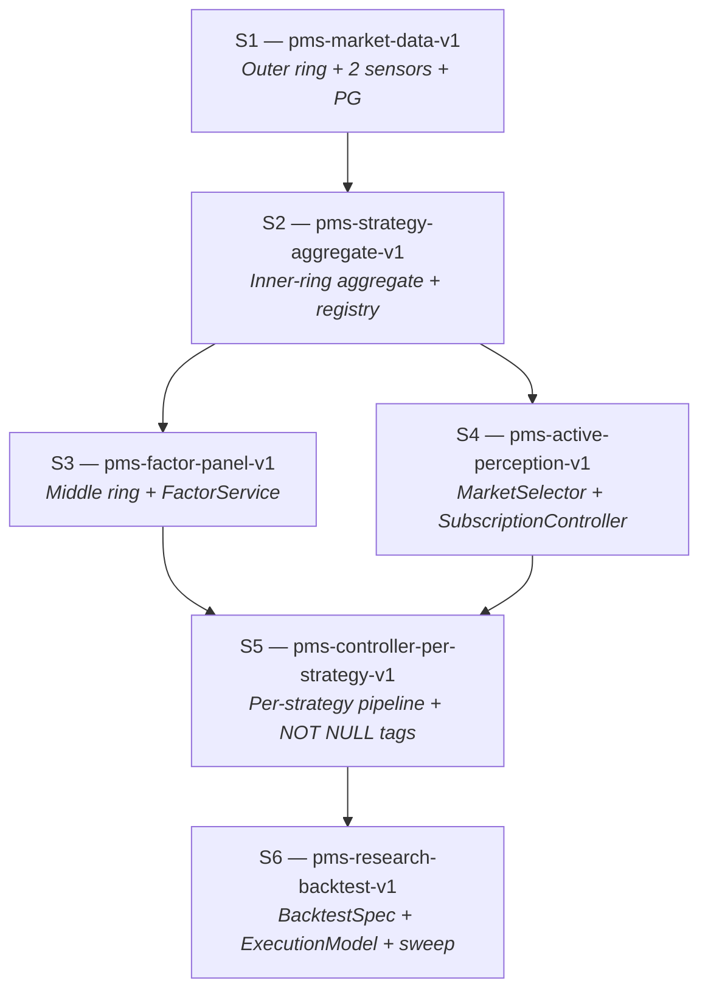

# PMS Project Decomposition Design

## 0. Purpose and relationship to other documents

**What this document is.** The project-level total spec for the
six-sub-spec decomposition that will implement
`agent_docs/architecture-invariants.md`. It defines the scope,
boundaries, and kickoff contract for each sub-spec (S1–S6), and it
provides the boundary-integrity mechanisms (Boundary Matrix, Intake /
Leave-behind, cross-spec gates) that keep the six harness runs from
overlapping or leaving gaps.

**What this document is not.**

- It is not a harness-executable spec. Per-checkpoint acceptance
  criteria, files-of-interest, and effort estimates live in each
  `.harness/pms-<id>-v1/spec.md` when that harness run starts.
- It is not an architecture document. Architecture invariants live
  in `agent_docs/architecture-invariants.md`; this document
  *consumes* those invariants — it does not redefine them.
- It is not a retrospective. Promoted rules from retros live in
  `agent_docs/promoted-rules.md`.

**How to use this document.**

- For designing any new entity or module: read §3 (Boundary Matrix)
  first, then the sub-spec that owns the entity.
- Before starting a new harness run: read §4 (Execution order) and
  the Kickoff Prompt at the end of the relevant sub-spec.
- After finishing a harness run: verify that sub-spec's Leave-behind
  is satisfied, update §12 (Maintenance), and proceed to the next
  gate.

**Source material.**

- `agent_docs/architecture-invariants.md` — the 8 non-negotiable
  architectural invariants. This document's sub-spec acceptance
  criteria reference invariants by number.
- `agent_docs/project-roadmap.md` — the 6-spec DAG skeleton and the
  between-spec gate policy. This document expands that skeleton.
- `agent_docs/promoted-rules.md` — rules promoted from retros.
  Complementary to the invariants: invariants define the positive
  architecture, retros capture past mistakes.
- `docs/notes/2026-04-16-repo-issues-controller-evaluator.md` — the
  schema and `asyncpg` decisions that feed S1 + S2 scope.
- `docs/notes/2026-04-16-evaluator-entity-abstraction.md` — the
  entity catalogue that feeds S2 – S6 scope.
- `src/pms/{sensor,controller,actuator,evaluation}/CLAUDE.md` —
  per-layer enforcement of the invariants most relevant to each
  layer.

---

## 1. Project end state

A **research-grade prediction-market strategy platform** where
multiple strategies run concurrently against live, paper, and
backtest modes under a single runtime, with per-strategy dispatch,
comparable metrics, and active perception driving Sensor
subscription.

### 1.1 Observable capabilities at the finish line

1. **Multi-strategy concurrency.** Several strategies run
   concurrently through a per-strategy `ControllerPipeline`
   (Invariant 1 — concurrent feedback web, not phased runtime).
   Each produces `TradeDecision` rows tagged `(strategy_id,
   strategy_version_id)` (Invariants 2, 3).
2. **Live Polymarket orderbook persistence.** Real `book`
   snapshots and `price_change` deltas from the CLOB WebSocket land
   in `book_snapshots`, `book_levels`, `price_changes`, `trades`
   (Invariants 7, 8). Simulated depth is retired.
3. **`/strategies` dashboard page.** Lists every registered
   strategy with per-strategy Brier, P&L, fill rate, slippage,
   drawdown, and calibration sample count, each grouped by
   `(strategy_id, strategy_version_id)` (Invariant 3).
4. **`/signals` dashboard page.** Renders real orderbook depth
   from the outer-ring tables — the dashboard no longer depends on
   fabricated bid/ask levels.
5. **`/factors` dashboard page.** Shows factor values evolving
   over time per `(factor_id, param, market_id)` (Invariant 4).
6. **`/backtest` dashboard page.** Compares N strategies over a
   configurable market universe and date range, producing a ranked
   comparison report (S6 deliverable).
7. **Strategy onboarding without code rewrite.** A new strategy is
   a new row in `strategies` + a module under
   `src/pms/strategies/<id>/` + a `StrategyConfig` blob; no
   changes required in `src/pms/sensor/` or `src/pms/actuator/`
   (Invariant 5 — strategy-agnostic boundary).
8. **Shared selection path across backtest / paper / live.** All
   three modes consume the same `Factor → StrategySelection →
   Opportunity → PortfolioTarget` chain. Divergence happens only
   inside `ExecutionModel` (S6 owns the abstraction).
9. **Active perception wired end-to-end.**
   `Strategy.select_markets` output drives `MarketSelector`, which
   pushes subscription updates through
   `SensorSubscriptionController` into `MarketDataSensor`. No
   sensor module imports from `pms.strategies.*` (Invariants 5, 6,
   7).
10. **Onion-concentric storage populated.** Outer ring (market
    data, strategy-agnostic), middle ring (factor panel,
    strategy-agnostic cache), and inner ring (strategy products)
    all persist in PostgreSQL with ring-ownership enforced by
    schema plus import-linter rules (Invariant 8).

### 1.2 What the finished system does not do

- **Real-money live execution stays gated** behind
  `live_trading_enabled=false`. The Polymarket adapter exists, is
  integration-tested, and is guarded by
  `LiveTradingDisabledError`; flipping the gate is a human
  decision outside the scope of this decomposition.
- **No automated feedback loop reconfigures strategies.**
  `Feedback` rows from Actuator / Evaluator are surfaced through
  `/feedback` for human resolution; automated strategy adjustment
  is explicitly out of scope (retained from `.harness/pms-v2/`
  non-goals).
- **Kalshi is not implemented.** Venue-agnostic interfaces
  (`ISensor`, `IActuator`) remain in place; a Kalshi adapter pair
  is a follow-on effort after S6.
- **No ORM and no migration framework.** Raw SQL via `asyncpg`
  throughout, with a single `schema.sql` applied at Runner
  startup. Alembic / Sqitch are reconsidered only if schema drift
  makes the single-file approach painful.

### 1.3 How end state differs from the 2026-04-16 baseline

Today (as of the `main` tip on 2026-04-16, commit `b4734fb`):

- The REST sensor's `_gamma_market_to_signal` emits
  `orderbook={"bids": [], "asks": []}` — real orderbook depth is
  absent, not even fabricated
  (`src/pms/sensor/adapters/polymarket_rest.py:90`, inside the
  helper that starts at line 78).
- The stream adapter's top-level `_message_dict_to_signal` keeps
  only messages carrying both `price` and `market_id`, which
  silently drops `book` and `price_change` events
  (`src/pms/sensor/adapters/polymarket_stream.py:71-77`).
  `Runner._build_sensors` never wires the stream sensor in for
  non-backtest modes either
  (`src/pms/runner.py:177-185` — only `PolymarketRestSensor` is
  returned).
- `ControllerPipeline` runs one global pipeline; `TradeDecision`
  has no `strategy_id` / `strategy_version_id` fields.
- `FeedbackStore` and `EvalStore` persist to JSONL under `.data/`;
  there is no PostgreSQL in the runtime path.
- `Factor`, `Strategy`, `MarketSelector`, `BacktestSpec`,
  `StrategyRun` — none of these entities exist.
- The dashboard exposes `/signals`, `/decisions`, `/metrics`, and
  `/backtest` pages plus a feedback panel on the main overview page
  (fed by API routes under `dashboard/app/api/pms/feedback/`). None
  render per-strategy comparison.

End state closes every item above.

---

## 2. Dependency DAG

### 2.1 Graph



### 2.2 Node summary

| ID | Harness directory                          | Invariants primarily closed | Headline deliverable |
|----|--------------------------------------------|-----------------------------|----------------------|
| S1 | `.harness/pms-market-data-v1/`             | 7, 8                        | Real Polymarket orderbook persisted in PG; `/signals` renders real depth; JSONL stores retired |
| S2 | `.harness/pms-strategy-aggregate-v1/`      | 2, 3, 5, 8                  | `Strategy` aggregate + projections; `strategies` / `strategy_versions` tables; import-linter rules; `"default"` strategy seeded |
| S3 | `.harness/pms-factor-panel-v1/`            | 4, 8                        | `factors` + `factor_values` tables; existing rules-detector logic migrated to raw factor definitions |
| S4 | `.harness/pms-active-perception-v1/`       | 6, 7                        | `MarketSelector` + `SensorSubscriptionController` + `Strategy.select_markets` hook wired into Runner |
| S5 | `.harness/pms-controller-per-strategy-v1/` | 2, 3, 5                     | Per-strategy `ControllerPipeline`; per-strategy Evaluator aggregation; `(strategy_id, strategy_version_id)` upgraded to `NOT NULL`; `/strategies` page |
| S6 | `.harness/pms-research-backtest-v1/`       | (uses all; closes none new) | `BacktestSpec` + `ExecutionModel`; market-universe replay; parameter sweep; `/backtest` comparison |

### 2.3 Edge semantics

An edge `S_a → S_b` in §2.1 means **at least one concept owned by
`S_a` is in `S_b`'s Intake subsection.** The concrete Intake /
Leave-behind lines live inside each sub-spec (§§6.6 – 6.7, 7.6 – 7.7,
…); the edges above are the summary projection of those contracts.

Invariant 1 (concurrent feedback web, *not* linear phases) is
deliberately **not** a DAG edge. It governs runtime behaviour, not
authoring order. Every sub-spec's acceptance criteria enforce it
locally — no sub-spec is allowed to introduce a synchronous barrier
between layers. §4 (Execution order) addresses authoring order;
Invariant 1 addresses runtime topology. The two are orthogonal and
must not be conflated.

### 2.4 Branch and swap points

Only one pair of sub-specs has a discretionary ordering: **S3 and
S4** both depend only on S2, and neither is on the other's Intake
chain. §4 (Execution order) explains why the canonical sequence puts
S3 before S4 and the conditions under which the swap is acceptable.

---

## 3. Boundary Matrix

The Boundary Matrix is the single source of truth for **who owns
what** across the six sub-specs. Every load-bearing concept —
component, table, entity, enforcement hook, dashboard page —
appears exactly once and has exactly one **Owner**. Any sub-spec
that needs to reference the concept appears only as a **Consumer**;
it may not claim ownership.

### 3.1 How to use this matrix

- **When authoring a sub-spec's *Scope in / out*** (§§6.2, 7.2, …):
  include only concepts whose Owner is this sub-spec. If a concept
  you need is owned elsewhere, list it under *Dependencies* or
  *Intake*, never under *Scope in*.
- **When reviewing a sub-spec PR:** grep for every concept the PR
  introduces; verify the PR's sub-spec is this matrix's Owner. A
  concept introduced by a non-owner is a boundary violation and
  must be reassigned before merge.
- **When adding a new concept not in the matrix:** open a PR to
  this document first, pick exactly one Owner, list Consumers, note
  the invariant(s) touched. The concept is not ready for
  implementation until the matrix is updated.

### 3.2 Matrix

Column semantics:

- **Concept** — the load-bearing unit of ownership (module, class,
  table, DDL change, enforcement hook, dashboard page, named
  policy object).
- **Owner** — exactly one sub-spec ID.
- **Consumers** — sub-specs that reference / read / invoke the
  concept. Not owners.
- **Invariant** — comma-separated invariant numbers from
  `agent_docs/architecture-invariants.md` that the concept touches.
  A dash means "no invariant directly; scaffolding."
- **Notes** — one-line clarification where the ownership choice is
  non-obvious.

#### 3.2.1 Outer ring (S1 owns)

| Concept | Owner | Consumers | Invariant | Notes |
|---|---|---|---|---|
| `markets` table (DDL + writes) | S1 | S2, S3, S4, S5, S6 | 7, 8 | — |
| `tokens` table (DDL + writes) | S1 | S2, S3, S4, S5, S6 | 7, 8 | — |
| `book_snapshots` table | S1 | S3, S6 | 7, 8 | — |
| `book_levels` table | S1 | S3, S6 | 7, 8 | Per-level rows, no JSON blobs (§Q2 of `docs/notes/2026-04-16-repo-issues-controller-evaluator.md`). |
| `price_changes` table | S1 | S3, S6 | 7, 8 | `size=0` means level removed; Polymarket semantics. |
| `trades` table | S1 | S3, S6 | 7, 8 | — |
| `PostgresMarketDataStore` (typed methods over outer ring) | S1 | S3, S5, S6 | 8 | Single concrete class; no Protocol abstraction today (§Q5 of discovery note). |
| `asyncpg.Pool` lifecycle (Runner-owned) | S1 | all | — | `min_size=2`, `max_size=10` per §Q6 of discovery note. |
| `schema.sql` file (startup-applied) | S1 | S2, S3, S5 extend it | — | No migration framework yet. |
| `MarketDiscoverySensor` class | S1 | S4 | 7 | Unconditional universe scan; writes `markets` / `tokens`. |
| `MarketDataSensor` class | S1 | S4 | 6, 7 | Subscription-driven; consumes push from `SensorSubscriptionController` (S4). |
| `SensorWatchdog` wiring to stream sensor | S1 | — | 7 | Watchdog class exists today; S1 wires it. |
| WebSocket heartbeat + reconnect reconciliation (snapshot re-request) | S1 | — | 7 | Closes open question Q4 of the discovery note. |
| JSONL → PG migration (`FeedbackStore` + `EvalStore` rewritten over SQL) | S1 | S5 (reads) | 8 | Retires `.data/*.jsonl` as runtime contract. |
| Transaction-rollback test fixture (`db_conn`) | S1 | all test-side | — | Per §Test strategy of discovery note. |
| `compose.yml` for local PG (dev) | S1 | all | — | `postgres:16` image; CI matches tag. |
| `/signals` dashboard page (real orderbook depth) | S1 | — | 7 | Replaces today's empty orderbook with live book / delta rendering. |
| Inner-ring `(strategy_id, strategy_version_id)` columns reserved `NULLABLE` on product tables | S1 | S2, S5 | 3, 8 | Columns land here; S2 seeds `"default"`; S5 upgrades to `NOT NULL`. |

#### 3.2.2 Inner ring — aggregate + registry (S2 owns)

| Concept | Owner | Consumers | Invariant | Notes |
|---|---|---|---|---|
| `Strategy` aggregate (`src/pms/strategies/aggregate.py`) | S2 | S4 (via projections), S5 (aggregate reader), S6 (aggregate reader) | 2 | Controller + Evaluator are the only aggregate readers. |
| Projection types (`StrategyConfig`, `RiskParams`, `EvalSpec`, `ForecasterSpec`, `MarketSelectionSpec`) | S2 | S4, S5, S6 | 2, 5 | All `@dataclass(frozen=True)`. |
| `strategies` table | S2 | S5, S6 | 3, 8 | One row per strategy id. |
| `strategy_versions` table (immutable, hash-keyed) | S2 | S3, S4, S5, S6 | 3, 8 | Config hash = deterministic over full config; re-config produces a new row. |
| `strategy_factors` link table | S2 | S3, S5 | 2, 4, 8 | Empty shape in S2; S3 populates as factor definitions land. |
| `PostgresStrategyRegistry` | S2 | S4, S5 | — | CRUD over `strategies` + `strategy_versions`. |
| Import-linter rules (`pms.sensor`, `pms.actuator` cannot import `pms.strategies.*` or `pms.controller.*`; `pms.sensor` cannot import `pms.market_selection`) | S2 | all (enforced in CI) | 5, 6 | Codified in `pyproject.toml` or `ruff.toml`; covers Invariants 5 and 6 import directions. |
| `"default"` strategy + version row seed | S2 | pre-S5 runtime writes | 3 | Lets legacy runtime continue writing product rows tagged to `"default"` until S5 upgrades columns to `NOT NULL`. |
| `/strategies` page — registry listing view | S2 | — | — | Minimal listing of registered strategies. Comparative metrics land in S5. |

#### 3.2.3 Middle ring — factor panel (S3 owns)

| Concept | Owner | Consumers | Invariant | Notes |
|---|---|---|---|---|
| `src/pms/factors/definitions/` module tree (one file per raw factor) | S3 | S5, S6 | 4 | Raw factors only; composite logic lives in `StrategyConfig.factor_composition`. |
| `factors` table (one row per factor definition) | S3 | S5, S6 | 4, 8 | No `factor_type` column distinguishing raw / composite. |
| `factor_values` table (`factor_id, market_id, ts, value`) | S3 | S5, S6 | 4, 8 | No `strategy_id` column (Invariant 8). |
| `FactorService` (compute + persist) | S3 | S5, S6 | 4 | Reads outer ring, writes middle ring. |
| Migration of existing rules-detector heuristics into raw `FactorDefinition`s | S3 | S5 (factors feed forecasters) | 4 | Today's `RulesForecaster` / `StatisticalForecaster` split: raw detection → S3 factors, composition → S5 strategy config. |
| `StrategyConfig.factor_composition` field (per-strategy composition logic, JSONB) | S3 | S5 | 2, 4 | Composition is strategy-scoped — lives on the projection, not in `factors`. |
| `/factors` dashboard page | S3 | — | 4 | Shows factor values per `(factor_id, param, market_id)`. |

#### 3.2.4 Active perception (S4 owns)

| Concept | Owner | Consumers | Invariant | Notes |
|---|---|---|---|---|
| `MarketSelector` (`src/pms/market_selection/selector.py`) | S4 | S5 | 6 | Reads universe, applies each strategy's `select_markets(universe)`, returns merged market-id list. |
| `SensorSubscriptionController` | S4 | — | 6, 7 | Pushes subscription updates to `MarketDataSensor`; Sensor never pulls. |
| `Strategy.select_markets(universe)` method (declaration + body + per-strategy tests) | S4 | S5 (per-strategy dispatch) | 2, 6 | Entire method surface is S4-owned: the aggregate class lives on S2's `Strategy` type, but this method lands with the active-perception machinery (`MarketSelector` + subscription controller) to keep the method and its first consumer in the same commit. |
| Runner wiring: boot order (DiscoverySensor → Selector → SubscriptionController → DataSensor) + incremental resubscribe on strategy-config change | S4 | — | 6 | Cold-start handling per §Invariant 6 of `agent_docs/architecture-invariants.md`. |

#### 3.2.5 Per-strategy Controller + Evaluator (S5 owns)

| Concept | Owner | Consumers | Invariant | Notes |
|---|---|---|---|---|
| Per-strategy `ControllerPipeline` dispatch | S5 | — | 2, 5 | Each strategy gets its own forecaster stack / calibrator / sizer; aggregate reader. |
| Per-strategy `Evaluator` aggregation (`GROUP BY strategy_id, strategy_version_id`) | S5 | S6 (reuses shape in backtest evaluator) | 3, 5 | Retires the global `MetricsCollector.snapshot()` shape. |
| `(strategy_id, strategy_version_id)` `NOT NULL` DDL upgrade on all inner-ring product tables | S5 | — | 3 | Pre-S5 columns are `NULLABLE` with `"default"` tagging; upgrade is schema-change-only, no new table. |
| `TradeDecision` / `OrderState` / `FillRecord` / `EvalRecord` strategy-field population end-to-end | S5 | — | 3 | S1 reserves columns, S2 seeds `"default"`, S5 populates real values from per-strategy dispatch. |
| `Opportunity` entity (Controller output pre-execution) | S5 | S6 | 2 | Carries selected factor values + expected edge + rationale; replaces stringly-typed `stop_conditions` routing / model_id mix. |
| `/strategies` comparative-metrics view (Brier / P&L / fill rate / slippage per strategy) | S5 | — | 3 | Upgrades the S2 listing page. |
| `/metrics` per-strategy breakdown | S5 | — | 3 | Current global `/metrics` page extends to per-strategy rollup. |

#### 3.2.6 Research backtest framework (S6 owns)

| Concept | Owner | Consumers | Invariant | Notes |
|---|---|---|---|---|
| `BacktestSpec` (strategy version + dataset + execution model + risk policy + date range + config hash) | S6 | — | 3 | Stable hash for reproducibility across sweep runs. |
| `ExecutionModel` (fill / fee / slippage / latency / staleness policy) | S6 | — | — | The only place backtest / paper / live legitimately diverge. |
| `BacktestDataset` (source, version, coverage, data-quality gaps) | S6 | — | 8 | References outer + middle ring tables by ring, not by strategy id. |
| `BacktestRun` (materialized run with artifact paths) | S6 | — | 3 | One `BacktestRun`, many `StrategyRun`s when multi-strategy. |
| `StrategyRun` (materialized per-strategy run record for backtest runs) | S6 | — | 3 | Backtest-only entity. Live / paper per-strategy tracking happens through the inner-ring product tables (`fills`, `eval_records`, …) grouped by `(strategy_id, strategy_version_id)` — no separate live `strategy_runs` table is needed, and introducing one would create a reverse dependency S5 → S6 that the DAG (§2) forbids. |
| Market-universe replay engine (multi-day, multi-market outer-ring reader) | S6 | — | 8 | Drives `FactorService` (S3) to precompute panels for the replay window. |
| Parameter sweep (generate N `BacktestSpec`s, compare results with shared factor-panel cache) | S6 | — | — | — |
| `BacktestLiveComparison` (equity divergence + selection overlap + backtest-only / live-only opportunities) | S6 | — | — | — |
| `TimeAlignmentPolicy` + `SymbolNormalizationPolicy` | S6 | — | — | Aligns live and backtest timestamps / identifiers before comparison. |
| `SelectionSimilarityMetric` (denominator explicit: backtest set / live set / union) | S6 | — | — | — |
| `EvaluationReport` (run metadata + metrics + attribution + benchmarks) | S6 | — | — | — |
| `PortfolioTarget` (time-indexed target exposure per strategy) | S6 | — | — | Research abstraction; live runtime continues to produce `TradeDecision` directly. |
| `/backtest` ranked N-strategy comparison view | S6 | — | — | Upgrades the existing `/backtest` page. |

### 3.3 Completeness checks

Two mechanical checks make overlap and gap detectable without
reading the sub-specs themselves.

**Overlap check.** Every value in the **Concept** column of §3.2
must be unique across *all* sub-matrices. Any duplicate is an
overlap by definition. Reviewers should grep the `#### 3.2.\d+`
blocks for concept-name duplication before approving any sub-spec
PR.

**Gap check.** Every one of the 8 invariants in
`agent_docs/architecture-invariants.md` must appear in the
**Invariant** column of at least one row below. A missing invariant
is a gap — either the decomposition is incomplete, or the invariant
is silently dropped. Current coverage:

| Invariant | Carried by rows in… |
|---|---|
| 1 (concurrent feedback web) | *not a row* — enforced per sub-spec's *Acceptance criteria* (see §4 and each sub-spec). Invariant 1 is about runtime topology, not ownership. |
| 2 (aggregate + projections) | S2 (aggregate, projections, `strategy_factors`), S3 (`factor_composition` field), S4 (`select_markets` method), S5 (per-strategy `ControllerPipeline`, `Opportunity`) |
| 3 (immutable version tagging) | S1 (reserved `NULLABLE` columns on product tables), S2 (`strategies` + `strategy_versions` + `"default"` seed), S5 (`NOT NULL` upgrade + field population + per-strategy aggregation + comparative view + per-strategy metrics), S6 (`BacktestSpec` + `BacktestRun` + `StrategyRun`) |
| 4 (raw factors only) | S2 (`strategy_factors` link table), S3 (definitions module, `factors`, `factor_values`, `FactorService`, rules-detector migration, `factor_composition`, `/factors` page) |
| 5 (strategy-aware boundary) | S2 (projections, import-linter rules), S5 (per-strategy `ControllerPipeline` + per-strategy `Evaluator` aggregation) |
| 6 (active perception) | S1 (`MarketDataSensor` as subscription sink), S2 (import-linter rules covering `pms.sensor` → `pms.market_selection`), S4 (`MarketSelector` + `SensorSubscriptionController` + `select_markets` method + Runner wiring) |
| 7 (two-layer sensor) | S1 (`MarketDiscoverySensor` + `MarketDataSensor` + watchdog wiring + outer-ring DDL + `/signals` page), S4 (`SensorSubscriptionController` as the subscription push channel) |
| 8 (onion-concentric storage) | S1 (outer-ring DDL + column reservations + JSONL→PG), S2 (inner-ring aggregate tables + `strategy_factors`), S3 (middle-ring tables), S6 (`BacktestDataset` references rings by ring, not by strategy id) |

Every invariant has at least one owning row (Invariant 1 excepted
for the reason noted).

### 3.4 Entities deliberately out of scope for this decomposition

Entities from
`docs/notes/2026-04-16-evaluator-entity-abstraction.md` that have
not been assigned an owner in §3.2 are **intentionally deferred**:

- `StrategyBundle` (multi-strategy group mapping to one live
  account): intentionally deferred. Today each strategy runs
  independently with shared risk budget at the Runner level. Revisit
  after S5, before considering Kalshi or multi-account expansion.
- `MarketUniverse` as a first-class entity: the universe is the
  implicit set of rows in `markets` today. Elevating it becomes an
  entity only if S6 discovers it must be persisted separately from
  the outer-ring tables (e.g., for dated universe snapshots).
- `FactorAttribution` as a first-class Evaluator artifact: S6
  introduces a `EvaluationReport` that *can* carry attribution
  commentary, but a dedicated attribution entity with its own table
  is deferred until the research workflow proves the need.
- Finer-grained backtest entities (`SelectionSnapshot`,
  `PriceLevel`, `MarketUpdate` as persisted event types): the
  outer-ring tables (`book_snapshots`, `book_levels`,
  `price_changes`) already encode equivalent state. Deferred unless
  S6 finds the extraction worth the schema work.

Any future proposal to add one of these to an owning sub-spec must
amend §3.2 **in the same PR** that changes the sub-spec scope.

---

## 4. Execution order and between-spec gates

§2 describes the dependency DAG; this section describes the
**authoring order** derived from that DAG and the mechanical gates a
human runs before moving from sub-spec N to sub-spec N+1. Authoring
order is **orthogonal** to runtime topology (Invariant 1 — concurrent
feedback web, not phased pipeline): sub-specs are authored one at a
time, but the artefacts they produce continue to run concurrently
once they land (reaffirmed here to close the conflation warning from
§2.3).

### 4.1 Canonical sequence

**S1 → S2 → S3 → S4 → S5 → S6, sequentially, one harness run at a
time.** This is the canonical topological order of the §2.1 DAG with
the S3 ↔ S4 tie broken as §2.4 notes (rationale in §4.2 below).
Parallel authoring across two sub-specs is not supported by this
decomposition: the gates in §4.3 assume sub-spec N is complete before
sub-spec N+1 begins.

### 4.2 Execution rationale per edge

The four directed edges in the §2.1 DAG have four distinct arguments.
Each expands a bullet from `agent_docs/project-roadmap.md` §"Why this
exact order".

**S1 → S2.** S1's schema must reserve `(strategy_id,
strategy_version_id)` columns on every inner-ring product table,
`NULLABLE` in S1, upgraded to `NOT NULL` in S5 (§3.2.1 last row;
Invariants 3, 8). If S2 does not follow S1 directly, S1 lands with
unused columns carrying no writer — `schema.sql` declares strategy
tagging that no code actually populates. That combination is scope
drift against Invariant 8: the inner ring exists as a schema shape
without the aggregate that owns it (Invariant 2). Keeping S2 second
means the aggregate, registry, and `"default"` seed land while the
column-reservation rationale is still fresh, and the pre-S5 runtime
writes legitimately tag `"default"` instead of writing `NULL`.

**S2 → S3 and S2 → S4.** Both S3 and S4 depend only on S2; the DAG
does not force one before the other. The canonical order puts **S3
before S4** for one reason: additive vs behavioural side effects. S3
adds a strategy-agnostic middle-ring cache (§3.2.3) — writing to new
tables, reading from outer-ring tables that S1 already owns. Nothing
about the existing Sensor / Controller / Actuator runtime changes.
S4, by contrast, changes the live Sensor subscription mechanism: the
`MarketDataSensor` stops being configured from a static list and
starts being driven by `SensorSubscriptionController` push (§3.2.4;
Invariants 6, 7). That is a runtime side effect with a larger blast
radius — a regression here can mis-subscribe every strategy at once.
Scheduling S3 first means the observable factor stream exists before
the subscription mechanism changes, so S4-induced regressions are
easier to isolate (the factor stream is known-good reference data).
§2.4 + §4.4 describe when this ordering can be swapped.

**S3 → S5 and S4 → S5.** S5's headline deliverable is per-strategy
`ControllerPipeline` dispatch (§3.2.5; Invariants 2, 3, 5) — each
strategy gets its own forecaster stack, calibrator, sizer, and
Evaluator aggregation. That dispatch needs two inputs simultaneously:
(1) **factor values** from the S3 middle ring (strategies read
factors to produce decisions), and (2) **per-strategy subscriptions**
from S4 (strategies only need to reason about markets their
`select_markets` actually returned — a universal subscription would
waste compute on irrelevant markets and blur per-strategy
accountability). Landing S5 before either of S3 or S4 forces either
mocking factor values or hardcoding subscriptions; both are
known-bad precedents. Keeping S5 after both means the per-strategy
dispatch connects real factor reads to real subscription output in
the same commit.

**S5 → S6.** S6 introduces research-grade backtest infrastructure:
`BacktestSpec`, `ExecutionModel`, parameter sweep, `BacktestLive-
Comparison` (§3.2.6). Its value proposition is comparing strategies,
which requires the full per-strategy runtime (S5) to exist as
**reference behaviour** — backtest results are only interpretable
relative to what the live runtime would have done. Running S6 before
S5 means the backtest compares a global controller against itself,
producing results that cannot be cross-checked against live. S6 also
carries the heaviest scope of the six (market-universe replay,
parameter-sweep infrastructure, shared factor-panel cache), so it
benefits from landing on the most stable foundation — every invariant
already enforced, every dashboard page already shipped.

### 4.3 Between-spec gates

Before opening the harness directory for sub-spec N+1, a human
verifier must confirm every item below against sub-spec N's completed
work. **Every item is verifiable** — no "looks good" gates.

1. **Retro written and indexed.** `.harness/retro/<sub-spec-id>.md`
   exists and is appended to `.harness/retro/index.md` per the retro
   process documented at `.harness/retro/index.md`. A sub-spec
   without a retro cannot clear this gate even if every other item
   passes.
2. **Architecture invariants spot-checked.** Grep sub-spec N's
   introduced concepts (from the PR diff) against §3.2's Owner
   column; every concept must appear in the matrix with sub-spec N
   as Owner. Concepts introduced by a non-owner are boundary
   violations (per §3.1's "When reviewing a sub-spec PR" guidance)
   and must be reassigned before merge. Separately, grep any new
   DDL for `strategy_id` **or** `strategy_version_id` columns on
   outer-ring or middle-ring tables — zero matches required for
   both identifiers (Invariant 8 Enforcement explicitly names both,
   `agent_docs/architecture-invariants.md` §Invariant 8).
3. **`CLAUDE.md` updated with any rule promoted from the retro.**
   If the retro produced a promoted rule per the criteria in
   `agent_docs/promoted-rules.md` §"Promotion process" (observed
   ≥2 times, or high-severity on first observation, or user-
   promoted), the rule is appended to `agent_docs/promoted-rules.md`
   with provenance and mirrored to `CLAUDE.md` §"Promoted rules
   from retros". No mirroring = gate fails.
4. **Boundary integrity check — Leave-behind union matches Intake.**
   Sub-spec N+1's Intake is diffed against the **union of all
   predecessor Leave-behinds** — every sub-spec that has an
   incoming edge to N+1 in the §2.1 DAG, not just the immediately
   prior one in the §4.1 sequence. The five predecessor sets,
   enumerated against §2.1, are: **S2's Intake against S1's
   Leave-behind** (S1 → S2 is S2's only predecessor edge);
   **S3's Intake against S2's Leave-behind** (single edge);
   **S4's Intake against S2's Leave-behind** (same shape);
   **S5's Intake against S3's Leave-behind ∪ S4's Leave-behind**
   (both edges land into S5 per §2.1); **S6's Intake against S5's
   Leave-behind**. Once each sub-spec's Leave-behind subsection
   exists (lands with Commits 4–9 of this document authoring
   effort), diff the union line-by-line. Any concept in sub-spec
   N+1's Intake that is not produced by some predecessor's
   Leave-behind is a boundary gap. **STOP and reconcile** — either
   amend a predecessor to produce the missing concept, or amend
   sub-spec N+1 to drop the dependency. Do not proceed with a
   partial contract. This is the mechanism that prevents drift
   once sub-specs begin landing in `.harness/`; it is the single
   most important gate item.
5. **Canonical gates green on a fresh clone.** `uv run pytest -q`
   and `uv run mypy src/ tests/ --strict` both pass on a fresh
   shell (see §5.1, §5.2; 🟡 Fresh-clone baseline verification).
6. **Human decision gate.** Record the decision `proceed`,
   `pause`, or `reorder` with a timestamp. `reorder` is supported
   **only** for the S3 ↔ S4 pair per §2.4 and §4.4 — reordering
   any other pair breaks a real DAG edge and requires a new retro.

### 4.4 Swap points and reordering

Per §2.4, only **S3 ↔ S4** has a discretionary ordering. The two
conditions under which swapping becomes attractive:

- **S4 material is blocked and S3 is unblocked.** If active
  perception discovery work reveals a gap in the `MarketSelector`
  contract that requires a separate retro (e.g., multi-strategy
  subscription conflict resolution turns out to need its own
  design), then S3's additive work can proceed while S4's design
  unblocks. This keeps the project moving without forcing the team
  to pause.
- **The subscription push path is the higher-risk work and we
  want it out of the way first.** If diagnostic evidence (a bug
  reproduction, a `file:line` failure trace in today's sensor code
  per 🔴 Runtime behaviour > design intent) shows the
  subscription mechanism is already misbehaving in production-
  shape ways, S4 ahead of S3 front-loads the risk. S3's factor
  stream lands against a known-stable subscription path instead
  of a moving one.

Either swap must be recorded in the §4.3 gate-6 decision row
(`reorder`) with the triggering condition cited. Swapping **any
other pair** (S1 ↔ S2, S2 ↔ S3, S4 ↔ S5, S5 ↔ S6) breaks the
rationale in §4.2 and is not supported by this decomposition; it
would require amending §4.2 and opening a new retro documenting
the architectural reason the original rationale no longer holds.

---

## 5. Cross-spec acceptance gates

Every sub-spec PR — regardless of which sub-spec, which checkpoint,
or which harness run — passes the same baseline before merge. §4's
between-spec gates are about the **transition** from N to N+1;
§5's cross-spec gates are about **every PR inside every sub-spec**.
The two layers stack; passing §5 does not skip §4.

### 5.1 Test baseline

`uv run pytest -q` passes with the `CLAUDE.md`-stated baseline:
**≥ 70 tests passing, 2 skipped**, where the 2 skipped are the
`@pytest.mark.integration` tests gated on the
`PMS_RUN_INTEGRATION=1` env var (🟢 Integration test default-skip
pattern, promoted from `pms-phase2` retro Proposal 3). Integration
tests are run on demand:

```bash
PMS_RUN_INTEGRATION=1 uv run pytest -m integration
```

If the baseline fails on a **fresh clone in a fresh shell**, per
🟡 Fresh-clone baseline verification (promoted from `pms-phase2`
retro Proposal 2), the fix is **the first commit on the feature
branch**, with prefix `fix(tests):` or `fix(build):`, and feature
work only begins after that commit lands. Dev-machine state (IDE
plugins, stale venv, `sys.path` injections) can hide config bugs
that bite the next contributor — do not start feature work against
a broken baseline. The rule is load-bearing: running the gates on a
stale venv and declaring the baseline holds is precisely what the
retro was promoted to prevent.

### 5.2 Strict typing

`uv run mypy src/ tests/ --strict` is clean. Every committed module
— `src/pms/**`, `tests/**`, dashboard Python ingress if any — is
strict-typed. No `# type: ignore` may be introduced without a
comment naming the specific type-system limitation (no generic "mypy
is wrong" justifications). Newly-introduced ignores surface in code
review; reviewers reject the ignore unless the accompanying comment
identifies the limitation (stub gap, variance limitation,
third-party lib without py.typed).

### 5.3 Invariant conformance

Every sub-spec PR must demonstrate conformance with every one of
the 8 invariants in `agent_docs/architecture-invariants.md`. The 8
split into three buckets, mirroring what each invariant's
**Enforcement** block actually says. None of the non-behavioural
invariants are enforced by a machine check *alone*: every one of
Invariants 3, 5, 6, 8 also has a code-review component named in
its Enforcement block, and the PR evidence must surface both halves.

- **Mechanically checkable (machine check is sufficient PR
  evidence)** — a machine check (import-linter run, delimited-DDL
  grep) is sufficient because the Enforcement block names *no*
  additional review gate. Invariant 5.
- **Mixed (machine check + review gate)** — the Enforcement block
  names both a mechanical rule and a code-review / reviewer-
  rejection gate. PR evidence must cover both. Invariants 3, 6, 8.
- **Behavioural** — no mechanical check faithfully captures the
  invariant; acceptance criteria + code review are the enforcement.
  Invariants 1, 2, 4, 7.

Be honest about which bucket each invariant lives in — inventing a
grep recipe for a behavioural invariant gives a false-green signal;
a partial grep for a mechanically-checkable invariant misses real
violations; and treating a Mixed invariant as purely mechanical
false-greens PRs that pass the machine check while failing the
review gate (e.g., a PR that satisfies the Invariant 6 import-
linter rule but hardcodes a static subscription list, or a PR that
satisfies the Invariant 8 grep but adds a new table without
declaring its ring).

**Mechanically checkable invariants.** The primary evidence is a
machine check (import-linter run). A grep complement is listed
where it usefully smoke-checks the same property, but the linter
result itself is the PR evidence — not a partial grep recipe. Only
invariants whose **Enforcement** block names *no* additional review
gate live in this bucket.

- **Invariant 5** — import-linter rule (codified in S2's
  `pyproject.toml` or `ruff.toml`): `pms.sensor` and `pms.actuator`
  cannot import from `pms.strategies.aggregate` **or** from
  `pms.controller.*`. The linter rule runs as part of the lint pass;
  the linter report is the PR evidence. Any violation fails CI. A
  grep smoke check exists but must cover both banned targets and
  both `from … import …` and plain `import …` syntaxes (e.g.
  `rg -n '^(from pms\.strategies\.aggregate|from pms\.controller|
  import pms\.strategies\.aggregate|import pms\.controller)'
  src/pms/sensor src/pms/actuator` — zero matches). The grep is not
  a substitute for the linter; it is a cheap preflight.

**Mixed invariants (machine check + review gate).** Each invariant
below has **two** enforcement halves named in its
`agent_docs/architecture-invariants.md` **Enforcement** block: a
mechanical rule and a code-review gate. PR evidence must cover
**both** halves. Passing only the machine check is insufficient and
produces a false-green signal.

- **Invariant 3** — two independent enforcement mechanisms per
  `agent_docs/architecture-invariants.md` §Invariant 3
  **Enforcement**: (a) **schema (mechanical)**: `strategy_version_id`
  is `NOT NULL` on every inner-ring product table after S5
  completes, plus a `CHECK` constraint forbidding known sentinel
  values (empty string). The DDL block must declare both columns
  AND `NOT NULL` AND the `CHECK` once the S5 upgrade lands. A grep
  recipe that only verifies column presence (ignoring `NOT NULL` /
  `CHECK`) is insufficient; the PR evidence is the schema file
  itself plus a post-migration `\d+` or `information_schema` query
  showing the constraint is active. (b) **query-time (review)**:
  no SQL aggregation query over `eval_records` or `fills` may omit
  `GROUP BY strategy_version_id` without an explicit comment
  justifying the cross-version aggregation. A grep can find
  `GROUP BY` clauses but cannot judge whether an omission was
  intentional — reviewer sign-off is the PR evidence.
- **Invariant 6** — two enforcement mechanisms per
  `agent_docs/architecture-invariants.md` §Invariant 6
  **Enforcement**: (a) **import boundary (mechanical)**: import-
  linter rule — `pms.sensor` cannot import from
  `pms.market_selection`. Same mechanism as Invariant 5; linter
  report is the machine-side evidence. Grep smoke check must cover
  both syntaxes
  (`rg -n '^(from pms\.market_selection|import pms\.market_selection)'
  src/pms/sensor` — zero matches). (b) **design review
  (review)**: the Enforcement block requires the spec-evaluation
  reviewer to reject any design that makes Sensor aware of
  strategies to avoid implementing the selector. The linter catches
  a direct import violation but not a semantic one (e.g., Sensor
  hardcoding a static asset-id list that *is* strategy-selected but
  lives in a config file). PR evidence must include a reviewer note
  confirming the Sensor design remains strategy-agnostic —
  specifically that every subscription update arrives through
  `SensorSubscriptionController`, not through a sensor-owned config
  or constant.
- **Invariant 8** — two enforcement mechanisms per
  `agent_docs/architecture-invariants.md` §Invariant 8
  **Enforcement**: (a) **schema (mechanical)**: zero `strategy_id`
  **and** zero `strategy_version_id` columns on outer-ring or
  middle-ring tables. Both identifiers are named explicitly in the
  Enforcement block as the grep-checkable rule. Grep: within the
  outer-ring and middle-ring DDL blocks of `schema.sql` (delimited
  by the block comments introduced in S1 / S3), both identifiers
  must produce zero matches. The DDL block comments are what make
  this mechanical — without them, a naive `rg strategy_id schema.sql`
  would hit legitimate inner-ring declarations. (b) **ring-
  declaration review (review)**: the Enforcement block requires
  that every new-table proposal declare its ring explicitly and
  justify the ring choice. The grep confirms no forbidden columns
  on an existing ring; it does not confirm that a newly-introduced
  table has been placed in the correct ring. PR evidence must
  include the ring declaration in the PR description or migration
  comment and a reviewer sign-off on the ring choice.

**Behavioural invariants** (no grep; enforced by acceptance
criteria and code review).

- **Invariant 1** — concurrent feedback web, not phased runtime.
  There is no grep for "does the runtime actually run layers
  concurrently" — this is enforced by each sub-spec's acceptance
  criteria rejecting synchronous barriers between layers, and by
  code review rejecting any new `asyncio.gather` that blocks one
  layer on another (per `agent_docs/architecture-invariants.md`
  §Invariant 1 **Enforcement**).
- **Invariant 2** — `Strategy` as rich aggregate. The import-linter
  rule (Invariant 5) catches the most common violation, but
  semantic violations like "projection class with mutable
  containers" or "downstream entity field duplicating strategy
  state" are caught by code review reading the diff, not by grep.
- **Invariant 4** — raw factors only. No mechanical check
  distinguishes a "raw" factor from a thinly-disguised composite;
  code review reads the factor definition and rejects any factor
  that encodes strategy-specific weighting (per §3.2.3 and
  `agent_docs/architecture-invariants.md` §Invariant 4
  **Enforcement**).
- **Invariant 7** — two-layer sensor (discovery + data), with
  single-responsibility per class and the discipline that future
  venue adapters land as a pair. `agent_docs/architecture-
  invariants.md` §Invariant 7 **Enforcement** names two review
  gates: (a) S1 acceptance criteria (two separate classes, each
  with a single responsibility); (b) code review of any future
  venue adapter requiring a discovery/data pair. Neither is
  mechanically detectable by a class-name grep — a hybrid adapter
  can satisfy "two class names exist in different files" while
  still owning both responsibilities. A class-name / file-
  separation grep is a useful **smoke check** (zero-match on a
  single-file definition of both classes) but the PR evidence is
  the acceptance-criterion reference and the code-review record.

A sub-spec PR's invariant-conformance section lists (a) which
invariants apply to its scope, (b) for each mechanically checkable
one, the machine-check evidence (import-linter report with expected
zero-match), (c) for each Mixed invariant that applies (3, 6, 8),
**both** the mechanical evidence (schema constraint, linter report,
or delimited-DDL grep) **and** the review-gate evidence (reviewer
sign-off note: aggregation-query review for 3, strategy-agnostic
Sensor design confirmation for 6, ring-declaration justification for
8), (d) for each behavioural one, the acceptance-criterion language
in the sub-spec that enforces it.

### 5.4 Boundary matrix audit

Any load-bearing concept introduced by the sub-spec PR (module,
class, table, DDL change, enforcement hook, dashboard page, named
policy object) must already appear in §3.2 Boundary Matrix with this
sub-spec as its Owner **or** must be added to §3.2 **in the same
PR** — per the §3.1 guidance "When adding a new concept not in the
matrix". A PR that introduces a concept absent from the matrix fails
this gate; the reviewer either approves the matrix update in the
same PR or rejects the concept addition as scope drift.

Reviewer workflow: grep the PR diff for every new class name, table
name, and DDL identifier; for each hit, confirm the identifier
appears in §3.2 with this sub-spec as Owner. If the identifier is
absent, the §3.2 update must land in the same PR.

### 5.5 Retro-promotion workflow

Every sub-spec ends with a retro under `.harness/retro/<sub-spec-
id>.md` (see §4.3 gate 1). If the retro produces a rule that meets
the promotion criteria in `agent_docs/promoted-rules.md`
§"Promotion process" — observed in ≥ 2 task retros, **or**
high-severity on first observation, **or** user-explicit — the rule
is:

1. Appended to `agent_docs/promoted-rules.md` with provenance
   (`Promoted from <sub-spec-id> retro Proposal N`).
2. Mirrored into `CLAUDE.md` §"Promoted rules from retros" with
   severity-emoji (🔴 / 🟡 / 🟢) and a one-line summary.
3. Recorded in `.harness/retro/index.md` with lifecycle column
   moved to `active`.

All three updates land in **one PR** (the retro-promotion PR). A
retro whose rule meets the promotion criteria but whose promotion
PR is not yet merged blocks the §4.3 gate 3 check for the next
sub-spec.

### 5.6 Commit-message discipline

Conventional-commit prefixes are required:

| Prefix | Use for |
|---|---|
| `feat(<scope>):` | New feature / capability |
| `fix(<scope>):` | Bug fix |
| `docs(<scope>):` | Documentation-only change |
| `test(<scope>):` | Test additions / refactoring without behaviour change |
| `refactor(<scope>):` | Code refactor without behaviour change |
| `chore(<scope>):` | Tooling, config, dependency bumps |

Scope is the affected module, sub-spec id, or `build` / `tests` as
appropriate (e.g., `fix(tests): pin pytest-asyncio>=0.23`,
`feat(sensor): two-layer discovery + data split`).

**No `Co-Authored-By` lines.** This is stated twice in the project
rules — once in `CLAUDE.md` §"Do not" (`Never add Co-Authored-By
lines`) and once in `agent_docs/promoted-rules.md` §"Commit-
message precedence" (*Promoted from `pms-v1` retro Proposal 7*).
They are the same rule, promoted. The user's global git rule wins
against any harness / template / upstream default that would add
the line — this is settled, do not re-derive at every commit.
Review-loop commits (`review-loop: changes from round N`) inherit
the same rule.

---
