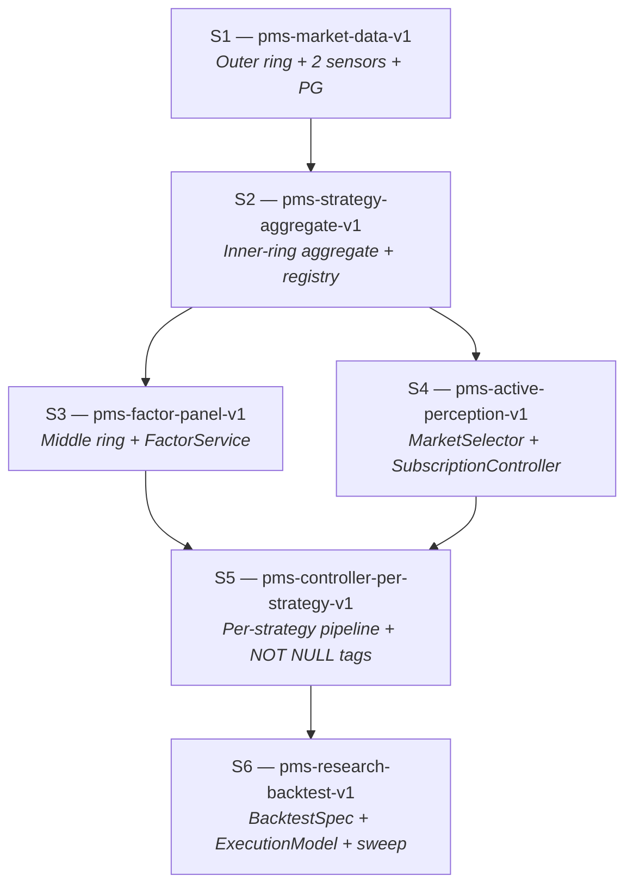

# PMS Project Decomposition Design

## 0. Purpose and relationship to other documents

**What this document is.** The project-level total spec for the
six-sub-spec decomposition that will implement
`agent_docs/architecture-invariants.md`. It defines the scope,
boundaries, and kickoff contract for each sub-spec (S1–S6), and it
provides the boundary-integrity mechanisms (Boundary Matrix, Intake /
Leave-behind, cross-spec gates) that keep the six harness runs from
overlapping or leaving gaps.

**What this document is not.**

- It is not a harness-executable spec. Per-checkpoint acceptance
  criteria, files-of-interest, and effort estimates live in each
  `.harness/pms-<id>-v1/spec.md` when that harness run starts.
- It is not an architecture document. Architecture invariants live
  in `agent_docs/architecture-invariants.md`; this document
  *consumes* those invariants — it does not redefine them.
- It is not a retrospective. Promoted rules from retros live in
  `agent_docs/promoted-rules.md`.

**How to use this document.**

- For designing any new entity or module: read §3 (Boundary Matrix)
  first, then the sub-spec that owns the entity.
- Before starting a new harness run: read §4 (Execution order) and
  the Kickoff Prompt at the end of the relevant sub-spec.
- After finishing a harness run: verify that sub-spec's Leave-behind
  is satisfied, update §12 (Maintenance), and proceed to the next
  gate.

**Source material.**

- `agent_docs/architecture-invariants.md` — the 8 non-negotiable
  architectural invariants. This document's sub-spec acceptance
  criteria reference invariants by number.
- `agent_docs/project-roadmap.md` — the 6-spec DAG skeleton and the
  between-spec gate policy. This document expands that skeleton.
- `agent_docs/promoted-rules.md` — rules promoted from retros.
  Complementary to the invariants: invariants define the positive
  architecture, retros capture past mistakes.
- `docs/notes/2026-04-16-repo-issues-controller-evaluator.md` — the
  schema and `asyncpg` decisions that feed S1 + S2 scope.
- `docs/notes/2026-04-16-evaluator-entity-abstraction.md` — the
  entity catalogue that feeds S2 – S6 scope.
- `src/pms/{sensor,controller,actuator,evaluation}/CLAUDE.md` —
  per-layer enforcement of the invariants most relevant to each
  layer.

---

## 1. Project end state

A **research-grade prediction-market strategy platform** where
multiple strategies run concurrently against live, paper, and
backtest modes under a single runtime, with per-strategy dispatch,
comparable metrics, and active perception driving Sensor
subscription.

### 1.1 Observable capabilities at the finish line

1. **Multi-strategy concurrency.** Several strategies run
   concurrently through a per-strategy `ControllerPipeline`
   (Invariant 1 — concurrent feedback web, not phased runtime).
   Each produces `TradeDecision` rows tagged `(strategy_id,
   strategy_version_id)` (Invariants 2, 3).
2. **Live Polymarket orderbook persistence.** Real `book`
   snapshots and `price_change` deltas from the CLOB WebSocket land
   in `book_snapshots`, `book_levels`, `price_changes`, `trades`
   (Invariants 7, 8). Simulated depth is retired.
3. **`/strategies` dashboard page.** Lists every registered
   strategy with per-strategy Brier, P&L, fill rate, slippage,
   drawdown, and calibration sample count, each grouped by
   `(strategy_id, strategy_version_id)` (Invariant 3).
4. **`/signals` dashboard page.** Renders real orderbook depth
   from the outer-ring tables — the dashboard no longer depends on
   fabricated bid/ask levels.
5. **`/factors` dashboard page.** Shows factor values evolving
   over time per `(factor_id, param, market_id)` (Invariant 4).
6. **`/backtest` dashboard page.** Compares N strategies over a
   configurable market universe and date range, producing a ranked
   comparison report (S6 deliverable).
7. **Strategy onboarding without code rewrite.** A new strategy is
   a new row in `strategies` + a module under
   `src/pms/strategies/<id>/` + a `StrategyConfig` blob; no
   changes required in `src/pms/sensor/` or `src/pms/actuator/`
   (Invariant 5 — strategy-agnostic boundary).
8. **Shared selection path across backtest / paper / live.** All
   three modes consume the same `Factor → StrategySelection →
   Opportunity → PortfolioTarget` chain. Divergence happens only
   inside `ExecutionModel` (S6 owns the abstraction).
9. **Active perception wired end-to-end.**
   `Strategy.select_markets` output drives `MarketSelector`, which
   pushes subscription updates through
   `SensorSubscriptionController` into `MarketDataSensor`. No
   sensor module imports from `pms.strategies.*` (Invariants 5, 6,
   7).
10. **Onion-concentric storage populated.** Outer ring (market
    data, strategy-agnostic), middle ring (factor panel,
    strategy-agnostic cache), and inner ring (strategy products)
    all persist in PostgreSQL with ring-ownership enforced by
    schema plus import-linter rules (Invariant 8).

### 1.2 What the finished system does not do

- **Real-money live execution stays gated** behind
  `live_trading_enabled=false`. The Polymarket adapter exists, is
  integration-tested, and is guarded by
  `LiveTradingDisabledError`; flipping the gate is a human
  decision outside the scope of this decomposition.
- **No automated feedback loop reconfigures strategies.**
  `Feedback` rows from Actuator / Evaluator are surfaced through
  `/feedback` for human resolution; automated strategy adjustment
  is explicitly out of scope (retained from `.harness/pms-v2/`
  non-goals).
- **Kalshi is not implemented.** Venue-agnostic interfaces
  (`ISensor`, `IActuator`) remain in place; a Kalshi adapter pair
  is a follow-on effort after S6.
- **No ORM and no migration framework.** Raw SQL via `asyncpg`
  throughout, with a single `schema.sql` applied at Runner
  startup. Alembic / Sqitch are reconsidered only if schema drift
  makes the single-file approach painful.

### 1.3 How end state differs from the 2026-04-16 baseline

Today (as of the `main` tip on 2026-04-16, commit `b4734fb`):

- The REST sensor's `_gamma_market_to_signal` emits
  `orderbook={"bids": [], "asks": []}` — real orderbook depth is
  absent, not even fabricated
  (`src/pms/sensor/adapters/polymarket_rest.py:90`, inside the
  helper that starts at line 78).
- The stream adapter's top-level `_message_dict_to_signal` keeps
  only messages carrying both `price` and `market_id`, which
  silently drops `book` and `price_change` events
  (`src/pms/sensor/adapters/polymarket_stream.py:71-77`).
  `Runner._build_sensors` never wires the stream sensor in for
  non-backtest modes either
  (`src/pms/runner.py:177-185` — only `PolymarketRestSensor` is
  returned).
- `ControllerPipeline` runs one global pipeline; `TradeDecision`
  has no `strategy_id` / `strategy_version_id` fields.
- `FeedbackStore` and `EvalStore` persist to JSONL under `.data/`;
  there is no PostgreSQL in the runtime path.
- `Factor`, `Strategy`, `MarketSelector`, `BacktestSpec`,
  `StrategyRun` — none of these entities exist.
- The dashboard exposes `/signals`, `/decisions`, `/metrics`, and
  `/backtest` pages plus a feedback panel on the main overview page
  (fed by API routes under `dashboard/app/api/pms/feedback/`). None
  render per-strategy comparison.

End state closes every item above.

---

## 2. Dependency DAG

### 2.1 Graph

### 2.2 Node summary

| ID | Harness directory                          | Invariants primarily closed | Headline deliverable |
|----|--------------------------------------------|-----------------------------|----------------------|
| S1 | `.harness/pms-market-data-v1/`             | 7, 8                        | Real Polymarket orderbook persisted in PG; `/signals` renders real depth; JSONL stores retired |
| S2 | `.harness/pms-strategy-aggregate-v1/`      | 2, 3, 5, 8                  | `Strategy` aggregate + projections; `strategies` / `strategy_versions` tables; import-linter rules; `"default"` strategy seeded |
| S3 | `.harness/pms-factor-panel-v1/`            | 4, 8                        | `factors` + `factor_values` tables; existing rules-detector logic migrated to raw factor definitions |
| S4 | `.harness/pms-active-perception-v1/`       | 6, 7                        | `MarketSelector` + `SensorSubscriptionController` + `Strategy.select_markets` hook wired into Runner |
| S5 | `.harness/pms-controller-per-strategy-v1/` | 2, 3, 5                     | Per-strategy `ControllerPipeline`; per-strategy Evaluator aggregation; `(strategy_id, strategy_version_id)` upgraded to `NOT NULL`; `/strategies` page |
| S6 | `.harness/pms-research-backtest-v1/`       | (uses all; closes none new) | `BacktestSpec` + `ExecutionModel`; market-universe replay; parameter sweep; `/backtest` comparison |

### 2.3 Edge semantics

An edge `S_a → S_b` in §2.1 means **at least one concept owned by
`S_a` is in `S_b`'s Intake subsection.** The concrete Intake /
Leave-behind lines live inside each sub-spec (§§6.6 – 6.7, 7.6 – 7.7,
…); the edges above are the summary projection of those contracts.

Invariant 1 (concurrent feedback web, *not* linear phases) is
deliberately **not** a DAG edge. It governs runtime behaviour, not
authoring order. Every sub-spec's acceptance criteria enforce it
locally — no sub-spec is allowed to introduce a synchronous barrier
between layers. §4 (Execution order) addresses authoring order;
Invariant 1 addresses runtime topology. The two are orthogonal and
must not be conflated.

### 2.4 Branch and swap points

Only one pair of sub-specs has a discretionary ordering: **S3 and
S4** both depend only on S2, and neither is on the other's Intake
chain. §4 (Execution order) explains why the canonical sequence puts
S3 before S4 and the conditions under which the swap is acceptable.

---

## 3. Boundary Matrix

The Boundary Matrix is the single source of truth for **who owns
what** across the six sub-specs. Every load-bearing concept —
component, table, entity, enforcement hook, dashboard page —
appears exactly once and has exactly one **Owner**. Any sub-spec
that needs to reference the concept appears only as a **Consumer**;
it may not claim ownership.

### 3.1 How to use this matrix

- **When authoring a sub-spec's *Scope in / out*** (§§6.2, 7.2, …):
  include only concepts whose Owner is this sub-spec. If a concept
  you need is owned elsewhere, list it under *Dependencies* or
  *Intake*, never under *Scope in*.
- **When reviewing a sub-spec PR:** grep for every concept the PR
  introduces; verify the PR's sub-spec is this matrix's Owner. A
  concept introduced by a non-owner is a boundary violation and
  must be reassigned before merge.
- **When adding a new concept not in the matrix:** open a PR to
  this document first, pick exactly one Owner, list Consumers, note
  the invariant(s) touched. The concept is not ready for
  implementation until the matrix is updated.

### 3.2 Matrix

Column semantics:

- **Concept** — the load-bearing unit of ownership (module, class,
  table, DDL change, enforcement hook, dashboard page, named
  policy object).
- **Owner** — exactly one sub-spec ID.
- **Consumers** — sub-specs that reference / read / invoke the
  concept. Not owners.
- **Invariant** — comma-separated invariant numbers from
  `agent_docs/architecture-invariants.md` that the concept touches.
  A dash means "no invariant directly; scaffolding."
- **Notes** — one-line clarification where the ownership choice is
  non-obvious.

#### 3.2.1 Outer ring (S1 owns)

| Concept | Owner | Consumers | Invariant | Notes |
|---|---|---|---|---|
| `markets` table (DDL + writes) | S1 | S2, S3, S4, S5, S6 | 7, 8 | — |
| `tokens` table (DDL + writes) | S1 | S2, S3, S4, S5, S6 | 7, 8 | — |
| `book_snapshots` table | S1 | S3, S6 | 7, 8 | — |
| `book_levels` table | S1 | S3, S6 | 7, 8 | Per-level rows, no JSON blobs (§Q2 of `docs/notes/2026-04-16-repo-issues-controller-evaluator.md`). |
| `price_changes` table | S1 | S3, S6 | 7, 8 | `size=0` means level removed; Polymarket semantics. |
| `trades` table | S1 | S3, S6 | 7, 8 | — |
| `PostgresMarketDataStore` (typed methods over outer ring) | S1 | S3, S5, S6 | 8 | Single concrete class; no Protocol abstraction today (§Q5 of discovery note). |
| `asyncpg.Pool` lifecycle (Runner-owned) | S1 | all | — | `min_size=2`, `max_size=10` per §Q6 of discovery note. |
| `schema.sql` file (startup-applied) | S1 | S2, S3, S5 extend it | — | No migration framework yet. |
| `MarketDiscoverySensor` class | S1 | S4 | 7 | Unconditional universe scan; writes `markets` / `tokens`. |
| `MarketDataSensor` class | S1 | S4 | 6, 7 | Subscription-driven; consumes push from `SensorSubscriptionController` (S4). |
| `SensorWatchdog` wiring to stream sensor | S1 | — | 7 | Watchdog class exists today; S1 wires it. |
| WebSocket heartbeat + reconnect reconciliation (snapshot re-request) | S1 | — | 7 | Closes open question Q4 of the discovery note. |
| JSONL → PG migration (`FeedbackStore` + `EvalStore` rewritten over SQL) | S1 | S5 (reads) | 8 | Retires `.data/*.jsonl` as runtime contract. |
| Transaction-rollback test fixture (`db_conn`) | S1 | all test-side | — | Per §Test strategy of discovery note. |
| `compose.yml` for local PG (dev) | S1 | all | — | `postgres:16` image; CI matches tag. |
| `/signals` dashboard page (real orderbook depth) | S1 | — | 7 | Replaces today's empty orderbook with live book / delta rendering. |
| Inner-ring `(strategy_id, strategy_version_id)` columns reserved `NULLABLE` on product tables | S1 | S2, S5 | 3, 8 | Columns land here; S2 seeds `"default"`; S5 upgrades to `NOT NULL`. |

#### 3.2.2 Inner ring — aggregate + registry (S2 owns)

| Concept | Owner | Consumers | Invariant | Notes |
|---|---|---|---|---|
| `Strategy` aggregate (`src/pms/strategies/aggregate.py`) | S2 | S4 (via projections), S5 (aggregate reader), S6 (aggregate reader) | 2 | Controller + Evaluator are the only aggregate readers. |
| Projection types (`StrategyConfig`, `RiskParams`, `EvalSpec`, `ForecasterSpec`, `MarketSelectionSpec`) | S2 | S4, S5, S6 | 2, 5 | All `@dataclass(frozen=True)`. |
| `strategies` table | S2 | S5, S6 | 3, 8 | One row per strategy id. |
| `strategy_versions` table (immutable, hash-keyed) | S2 | S3, S4, S5, S6 | 3, 8 | Config hash = deterministic over full config; re-config produces a new row. |
| `strategy_factors` link table | S2 | S3, S5 | 2, 4, 8 | Empty shape in S2; S3 populates as factor definitions land. |
| `PostgresStrategyRegistry` | S2 | S4, S5 | — | CRUD over `strategies` + `strategy_versions`. |
| Import-linter rules (`pms.sensor`, `pms.actuator` cannot import `pms.strategies.*` or `pms.controller.*`; `pms.sensor` cannot import `pms.market_selection`) | S2 | all (enforced in CI) | 5, 6 | Codified in `pyproject.toml` or `ruff.toml`; covers Invariants 5 and 6 import directions. |
| `"default"` strategy + version row seed | S2 | pre-S5 runtime writes | 3 | Lets legacy runtime continue writing product rows tagged to `"default"` until S5 upgrades columns to `NOT NULL`. |
| `/strategies` page — registry listing view | S2 | — | — | Minimal listing of registered strategies. Comparative metrics land in S5. |
| `Strategy.select_markets(universe)` method **signature** (stub body raising `NotImplementedError`) | S2 | S4 (fills body) | 2, 6 | Signature belongs on the aggregate in S2; real implementations + tests land in S4. |

#### 3.2.3 Middle ring — factor panel (S3 owns)

| Concept | Owner | Consumers | Invariant | Notes |
|---|---|---|---|---|
| `src/pms/factors/definitions/` module tree (one file per raw factor) | S3 | S5, S6 | 4 | Raw factors only; composite logic lives in `StrategyConfig.factor_composition`. |
| `factors` table (one row per factor definition) | S3 | S5, S6 | 4, 8 | No `factor_type` column distinguishing raw / composite. |
| `factor_values` table (`factor_id, market_id, ts, value`) | S3 | S5, S6 | 4, 8 | No `strategy_id` column (Invariant 8). |
| `FactorService` (compute + persist) | S3 | S5, S6 | 4 | Reads outer ring, writes middle ring. |
| Migration of existing rules-detector heuristics into raw `FactorDefinition`s | S3 | S5 (factors feed forecasters) | 4 | Today's `RulesForecaster` / `StatisticalForecaster` split: raw detection → S3 factors, composition → S5 strategy config. |
| `StrategyConfig.factor_composition` field (per-strategy composition logic, JSONB) | S3 | S5 | 2, 4 | Composition is strategy-scoped — lives on the projection, not in `factors`. |
| `/factors` dashboard page | S3 | — | 4 | Shows factor values per `(factor_id, param, market_id)`. |

#### 3.2.4 Active perception (S4 owns)

| Concept | Owner | Consumers | Invariant | Notes |
|---|---|---|---|---|
| `MarketSelector` (`src/pms/market_selection/selector.py`) | S4 | S5 | 6 | Reads universe, applies each strategy's `select_markets(universe)`, returns merged market-id list. |
| `SensorSubscriptionController` | S4 | — | 6, 7 | Pushes subscription updates to `MarketDataSensor`; Sensor never pulls. |
| `Strategy.select_markets` **body + per-strategy tests** | S4 | S5 (per-strategy dispatch) | 2, 6 | Signature reserved in S2; body + coverage land here. |
| Runner wiring: boot order (DiscoverySensor → Selector → SubscriptionController → DataSensor) + incremental resubscribe on strategy-config change | S4 | — | 6 | Cold-start handling per §Invariant 6 of `agent_docs/architecture-invariants.md`. |

#### 3.2.5 Per-strategy Controller + Evaluator (S5 owns)

| Concept | Owner | Consumers | Invariant | Notes |
|---|---|---|---|---|
| Per-strategy `ControllerPipeline` dispatch | S5 | — | 2, 5 | Each strategy gets its own forecaster stack / calibrator / sizer; aggregate reader. |
| Per-strategy `Evaluator` aggregation (`GROUP BY strategy_id, strategy_version_id`) | S5 | S6 (reuses shape in backtest evaluator) | 3, 5 | Retires the global `MetricsCollector.snapshot()` shape. |
| `(strategy_id, strategy_version_id)` `NOT NULL` DDL upgrade on all inner-ring product tables | S5 | — | 3 | Pre-S5 columns are `NULLABLE` with `"default"` tagging; upgrade is schema-change-only, no new table. |
| `TradeDecision` / `OrderState` / `FillRecord` / `EvalRecord` strategy-field population end-to-end | S5 | — | 3 | S1 reserves columns, S2 seeds `"default"`, S5 populates real values from per-strategy dispatch. |
| `Opportunity` entity (Controller output pre-execution) | S5 | S6 | 2 | Carries selected factor values + expected edge + rationale; replaces stringly-typed `stop_conditions` routing / model_id mix. |
| `/strategies` comparative-metrics view (Brier / P&L / fill rate / slippage per strategy) | S5 | — | 3 | Upgrades the S2 listing page. |
| `/metrics` per-strategy breakdown | S5 | — | 3 | Current global `/metrics` page extends to per-strategy rollup. |

#### 3.2.6 Research backtest framework (S6 owns)

| Concept | Owner | Consumers | Invariant | Notes |
|---|---|---|---|---|
| `BacktestSpec` (strategy version + dataset + execution model + risk policy + date range + config hash) | S6 | — | 3 | Stable hash for reproducibility across sweep runs. |
| `ExecutionModel` (fill / fee / slippage / latency / staleness policy) | S6 | — | — | The only place backtest / paper / live legitimately diverge. |
| `BacktestDataset` (source, version, coverage, data-quality gaps) | S6 | — | 8 | References outer + middle ring tables by ring, not by strategy id. |
| `BacktestRun` (materialized run with artifact paths) | S6 | — | 3 | One `BacktestRun`, many `StrategyRun`s when multi-strategy. |
| `StrategyRun` (materialized per-strategy run record, live or backtest) | S6 | S5 (reads the shape when persisting live per-strategy sessions) | 3 | Entity + DDL owned by S6; S5 may persist rows under the same shape for live sessions. |
| Market-universe replay engine (multi-day, multi-market outer-ring reader) | S6 | — | 8 | Drives `FactorService` (S3) to precompute panels for the replay window. |
| Parameter sweep (generate N `BacktestSpec`s, compare results with shared factor-panel cache) | S6 | — | — | — |
| `BacktestLiveComparison` (equity divergence + selection overlap + backtest-only / live-only opportunities) | S6 | — | — | — |
| `TimeAlignmentPolicy` + `SymbolNormalizationPolicy` | S6 | — | — | Aligns live and backtest timestamps / identifiers before comparison. |
| `SelectionSimilarityMetric` (denominator explicit: backtest set / live set / union) | S6 | — | — | — |
| `EvaluationReport` (run metadata + metrics + attribution + benchmarks) | S6 | — | — | — |
| `PortfolioTarget` (time-indexed target exposure per strategy) | S6 | — | — | Research abstraction; live runtime continues to produce `TradeDecision` directly. |
| `/backtest` ranked N-strategy comparison view | S6 | — | — | Upgrades the existing `/backtest` page. |

### 3.3 Completeness checks

Two mechanical checks make overlap and gap detectable without
reading the sub-specs themselves.

**Overlap check.** Every value in the **Concept** column of §3.2
must be unique across *all* sub-matrices. Any duplicate is an
overlap by definition. Reviewers should grep the `#### 3.2.\d+`
blocks for concept-name duplication before approving any sub-spec
PR.

**Gap check.** Every one of the 8 invariants in
`agent_docs/architecture-invariants.md` must appear in the
**Invariant** column of at least one row below. A missing invariant
is a gap — either the decomposition is incomplete, or the invariant
is silently dropped. Current coverage:

| Invariant | Carried by rows in… |
|---|---|
| 1 (concurrent feedback web) | *not a row* — enforced per sub-spec's *Acceptance criteria* (see §4 and each sub-spec). Invariant 1 is about runtime topology, not ownership. |
| 2 (aggregate + projections) | S2 (aggregate + projections), S4 (`select_markets` body), S5 (per-strategy dispatch, `Opportunity`) |
| 3 (immutable version tagging) | S1 (reserved columns + JSONL→PG migration), S2 (`strategy_versions` + `"default"` seed), S5 (`NOT NULL` upgrade + field population + per-strategy aggregation), S6 (`BacktestSpec` + `BacktestRun` + `StrategyRun`) |
| 4 (raw factors only) | S2 (`strategy_factors` link table), S3 (all factor concepts), S5 (`Opportunity` carries selected factor values) |
| 5 (strategy-aware boundary) | S2 (import-linter rules + projections), S5 (per-strategy dispatch + per-strategy aggregation) |
| 6 (active perception) | S1 (`MarketDataSensor` as subscription sink), S2 (`select_markets` signature + import-linter rules), S4 (`MarketSelector` + `SensorSubscriptionController` + `select_markets` body + Runner wiring) |
| 7 (two-layer sensor) | S1 (`MarketDiscoverySensor` + `MarketDataSensor` + watchdog + outer-ring DDL + `/signals` page) |
| 8 (onion-concentric storage) | S1 (outer ring + JSONL→PG + column reservations), S2 (inner-ring aggregate + `strategy_factors`), S3 (middle ring), S5 (inner-ring product population via `NOT NULL` upgrade), S6 (`BacktestDataset` references rings by ring, not by strategy) |

Every invariant has at least one owning row (Invariant 1 excepted
for the reason noted).

### 3.4 Entities deliberately out of scope for this decomposition

Entities from
`docs/notes/2026-04-16-evaluator-entity-abstraction.md` that have
not been assigned an owner in §3.2 are **intentionally deferred**:

- `StrategyBundle` (multi-strategy group mapping to one live
  account): intentionally deferred. Today each strategy runs
  independently with shared risk budget at the Runner level. Revisit
  after S5, before considering Kalshi or multi-account expansion.
- `MarketUniverse` as a first-class entity: the universe is the
  implicit set of rows in `markets` today. Elevating it becomes an
  entity only if S6 discovers it must be persisted separately from
  the outer-ring tables (e.g., for dated universe snapshots).
- `FactorAttribution` as a first-class Evaluator artifact: S6
  introduces a `EvaluationReport` that *can* carry attribution
  commentary, but a dedicated attribution entity with its own table
  is deferred until the research workflow proves the need.
- Finer-grained backtest entities (`SelectionSnapshot`,
  `PriceLevel`, `MarketUpdate` as persisted event types): the
  outer-ring tables (`book_snapshots`, `book_levels`,
  `price_changes`) already encode equivalent state. Deferred unless
  S6 finds the extraction worth the schema work.

Any future proposal to add one of these to an owning sub-spec must
amend §3.2 **in the same PR** that changes the sub-spec scope.
