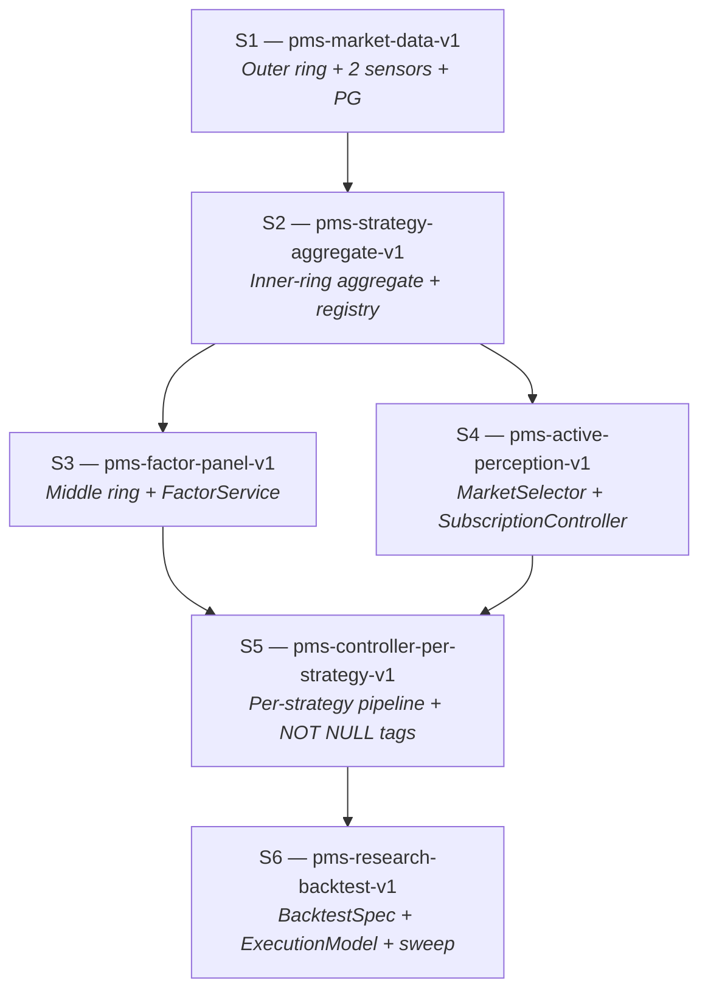

# PMS Project Decomposition Design

## 0. Purpose and relationship to other documents

**What this document is.** The project-level total spec for the
six-sub-spec decomposition that will implement
`agent_docs/architecture-invariants.md`. It defines the scope,
boundaries, and kickoff contract for each sub-spec (S1–S6), and it
provides the boundary-integrity mechanisms (Boundary Matrix, Intake /
Leave-behind, cross-spec gates) that keep the six harness runs from
overlapping or leaving gaps.

**What this document is not.**

- It is not a harness-executable spec. Per-checkpoint acceptance
  criteria, files-of-interest, and effort estimates live in each
  `.harness/pms-<id>-v1/spec.md` when that harness run starts.
- It is not an architecture document. Architecture invariants live
  in `agent_docs/architecture-invariants.md`; this document
  *consumes* those invariants — it does not redefine them.
- It is not a retrospective. Promoted rules from retros live in
  `agent_docs/promoted-rules.md`.

**How to use this document.**

- For designing any new entity or module: read §3 (Boundary Matrix)
  first, then the sub-spec that owns the entity.
- Before starting a new harness run: read §4 (Execution order) and
  the Kickoff Prompt at the end of the relevant sub-spec.
- After finishing a harness run: verify that sub-spec's Leave-behind
  is satisfied, update §12 (Maintenance), and proceed to the next
  gate.

**Source material.**

- `agent_docs/architecture-invariants.md` — the 8 non-negotiable
  architectural invariants. This document's sub-spec acceptance
  criteria reference invariants by number.
- `agent_docs/project-roadmap.md` — the 6-spec DAG skeleton and the
  between-spec gate policy. This document expands that skeleton.
- `agent_docs/promoted-rules.md` — rules promoted from retros.
  Complementary to the invariants: invariants define the positive
  architecture, retros capture past mistakes.
- `docs/notes/2026-04-16-repo-issues-controller-evaluator.md` — the
  schema and `asyncpg` decisions that feed S1 + S2 scope.
- `docs/notes/2026-04-16-evaluator-entity-abstraction.md` — the
  entity catalogue that feeds S2 – S6 scope.
- `src/pms/{sensor,controller,actuator,evaluation}/CLAUDE.md` —
  per-layer enforcement of the invariants most relevant to each
  layer.

---

## 1. Project end state

A **research-grade prediction-market strategy platform** where
multiple strategies run concurrently against live, paper, and
backtest modes under a single runtime, with per-strategy dispatch,
comparable metrics, and active perception driving Sensor
subscription.

### 1.1 Observable capabilities at the finish line

1. **Multi-strategy concurrency.** Several strategies run
   concurrently through a per-strategy `ControllerPipeline`
   (Invariant 1 — concurrent feedback web, not phased runtime).
   Each produces `TradeDecision` rows tagged `(strategy_id,
   strategy_version_id)` (Invariants 2, 3).
2. **Live Polymarket orderbook persistence.** Real `book`
   snapshots and `price_change` deltas from the CLOB WebSocket land
   in `book_snapshots`, `book_levels`, `price_changes`, `trades`
   (Invariants 7, 8). Simulated depth is retired.
3. **`/strategies` dashboard page.** Lists every registered
   strategy with per-strategy Brier, P&L, fill rate, slippage,
   drawdown, and calibration sample count, each grouped by
   `(strategy_id, strategy_version_id)` (Invariant 3).
4. **`/signals` dashboard page.** Renders real orderbook depth
   from the outer-ring tables — the dashboard no longer depends on
   fabricated bid/ask levels.
5. **`/factors` dashboard page.** Shows factor values evolving
   over time per `(factor_id, param, market_id)` (Invariant 4).
6. **`/backtest` dashboard page.** Compares N strategies over a
   configurable market universe and date range, producing a ranked
   comparison report (S6 deliverable).
7. **Strategy onboarding without code rewrite.** A new strategy is
   a new row in `strategies` + a module under
   `src/pms/strategies/<id>/` + a `StrategyConfig` blob; no
   changes required in `src/pms/sensor/` or `src/pms/actuator/`
   (Invariant 5 — strategy-agnostic boundary).
8. **Shared selection path across backtest / paper / live.** All
   three modes consume the same `Factor → StrategySelection →
   Opportunity → PortfolioTarget` chain. Divergence happens only
   inside `ExecutionModel` (S6 owns the abstraction).
9. **Active perception wired end-to-end.**
   `Strategy.select_markets` output drives `MarketSelector`, which
   pushes subscription updates through
   `SensorSubscriptionController` into `MarketDataSensor`. No
   sensor module imports from `pms.strategies.*` (Invariants 5, 6,
   7).
10. **Onion-concentric storage populated.** Outer ring (market
    data, strategy-agnostic), middle ring (factor panel,
    strategy-agnostic cache), and inner ring (strategy products)
    all persist in PostgreSQL with ring-ownership enforced by
    schema plus import-linter rules (Invariant 8).

### 1.2 What the finished system does not do

- **Real-money live execution stays gated** behind
  `live_trading_enabled=false`. The Polymarket adapter exists, is
  integration-tested, and is guarded by
  `LiveTradingDisabledError`; flipping the gate is a human
  decision outside the scope of this decomposition.
- **No automated feedback loop reconfigures strategies.**
  `Feedback` rows from Actuator / Evaluator are surfaced through
  `/feedback` for human resolution; automated strategy adjustment
  is explicitly out of scope (retained from `.harness/pms-v2/`
  non-goals).
- **Kalshi is not implemented.** Venue-agnostic interfaces
  (`ISensor`, `IActuator`) remain in place; a Kalshi adapter pair
  is a follow-on effort after S6.
- **No ORM and no migration framework.** Raw SQL via `asyncpg`
  throughout, with a single `schema.sql` applied at Runner
  startup. Alembic / Sqitch are reconsidered only if schema drift
  makes the single-file approach painful.

### 1.3 How end state differs from the 2026-04-16 baseline

Today (as of the `main` tip on 2026-04-16, commit `b4734fb`):

- The REST sensor's `_gamma_market_to_signal` emits
  `orderbook={"bids": [], "asks": []}` — real orderbook depth is
  absent, not even fabricated
  (`src/pms/sensor/adapters/polymarket_rest.py:90`, inside the
  helper that starts at line 78).
- The stream adapter's top-level `_message_dict_to_signal` keeps
  only messages carrying both `price` and `market_id`, which
  silently drops `book` and `price_change` events
  (`src/pms/sensor/adapters/polymarket_stream.py:71-77`).
  `Runner._build_sensors` never wires the stream sensor in for
  non-backtest modes either
  (`src/pms/runner.py:177-185` — only `PolymarketRestSensor` is
  returned).
- `ControllerPipeline` runs one global pipeline; `TradeDecision`
  has no `strategy_id` / `strategy_version_id` fields.
- `FeedbackStore` and `EvalStore` persist to JSONL under `.data/`;
  there is no PostgreSQL in the runtime path.
- `Factor`, `Strategy`, `MarketSelector`, `BacktestSpec`,
  `StrategyRun` — none of these entities exist.
- The dashboard exposes `/signals`, `/decisions`, `/metrics`, and
  `/backtest` pages plus a feedback panel on the main overview page
  (fed by API routes under `dashboard/app/api/pms/feedback/`). None
  render per-strategy comparison.

End state closes every item above.

---

## 2. Dependency DAG

### 2.1 Graph



### 2.2 Node summary

| ID | Harness directory                          | Invariants primarily closed | Headline deliverable |
|----|--------------------------------------------|-----------------------------|----------------------|
| S1 | `.harness/pms-market-data-v1/`             | 7, 8                        | Real Polymarket orderbook persisted in PG; `/signals` renders real depth; JSONL stores retired |
| S2 | `.harness/pms-strategy-aggregate-v1/`      | 2, 3, 5, 8                  | `Strategy` aggregate + projections; `strategies` / `strategy_versions` tables; import-linter rules; `"default"` strategy seeded |
| S3 | `.harness/pms-factor-panel-v1/`            | 4, 8                        | `factors` + `factor_values` tables; existing rules-detector logic migrated to raw factor definitions |
| S4 | `.harness/pms-active-perception-v1/`       | 6, 7                        | `MarketSelector` + `SensorSubscriptionController` + `Strategy.select_markets` hook wired into Runner |
| S5 | `.harness/pms-controller-per-strategy-v1/` | 2, 3, 5                     | Per-strategy `ControllerPipeline`; per-strategy Evaluator aggregation; `(strategy_id, strategy_version_id)` upgraded to `NOT NULL`; `/strategies` page |
| S6 | `.harness/pms-research-backtest-v1/`       | (uses all; closes none new) | `BacktestSpec` + `ExecutionModel`; market-universe replay; parameter sweep; `/backtest` comparison |

### 2.3 Edge semantics

An edge `S_a → S_b` in §2.1 means **at least one concept owned by
`S_a` is in `S_b`'s Intake subsection.** The concrete Intake /
Leave-behind lines live inside each sub-spec (§§6.6 – 6.7, 7.6 – 7.7,
…); the edges above are the summary projection of those contracts.

Invariant 1 (concurrent feedback web, *not* linear phases) is
deliberately **not** a DAG edge. It governs runtime behaviour, not
authoring order. Every sub-spec's acceptance criteria enforce it
locally — no sub-spec is allowed to introduce a synchronous barrier
between layers. §4 (Execution order) addresses authoring order;
Invariant 1 addresses runtime topology. The two are orthogonal and
must not be conflated.

### 2.4 Branch and swap points

Only one pair of sub-specs has a discretionary ordering: **S3 and
S4** both depend only on S2, and neither is on the other's Intake
chain. §4 (Execution order) explains why the canonical sequence puts
S3 before S4 and the conditions under which the swap is acceptable.

---

## 3. Boundary Matrix

The Boundary Matrix is the single source of truth for **who owns
what** across the six sub-specs. Every load-bearing concept —
component, table, entity, enforcement hook, dashboard page —
appears exactly once and has exactly one **Owner**. Any sub-spec
that needs to reference the concept appears only as a **Consumer**;
it may not claim ownership.

### 3.1 How to use this matrix

- **When authoring a sub-spec's *Scope in / out*** (§§6.2, 7.2, …):
  include only concepts whose Owner is this sub-spec. If a concept
  you need is owned elsewhere, list it under *Dependencies* or
  *Intake*, never under *Scope in*.
- **When reviewing a sub-spec PR:** grep for every concept the PR
  introduces; verify the PR's sub-spec is this matrix's Owner. A
  concept introduced by a non-owner is a boundary violation and
  must be reassigned before merge.
- **When adding a new concept not in the matrix:** open a PR to
  this document first, pick exactly one Owner, list Consumers, note
  the invariant(s) touched. The concept is not ready for
  implementation until the matrix is updated.

### 3.2 Matrix

Column semantics:

- **Concept** — the load-bearing unit of ownership (module, class,
  table, DDL change, enforcement hook, dashboard page, named
  policy object).
- **Owner** — exactly one sub-spec ID.
- **Consumers** — sub-specs that reference / read / invoke the
  concept. Not owners.
- **Invariant** — comma-separated invariant numbers from
  `agent_docs/architecture-invariants.md` that the concept touches.
  A dash means "no invariant directly; scaffolding."
- **Notes** — one-line clarification where the ownership choice is
  non-obvious.

#### 3.2.1 Outer ring (S1 owns)

| Concept | Owner | Consumers | Invariant | Notes |
|---|---|---|---|---|
| `markets` table (DDL + writes) | S1 | S2, S3, S4, S5, S6 | 7, 8 | — |
| `tokens` table (DDL + writes) | S1 | S2, S3, S4, S5, S6 | 7, 8 | — |
| `book_snapshots` table | S1 | S3, S6 | 7, 8 | — |
| `book_levels` table | S1 | S3, S6 | 7, 8 | Per-level rows, no JSON blobs (§Q2 of `docs/notes/2026-04-16-repo-issues-controller-evaluator.md`). |
| `price_changes` table | S1 | S3, S6 | 7, 8 | `size=0` means level removed; Polymarket semantics. |
| `trades` table | S1 | S3, S6 | 7, 8 | — |
| `PostgresMarketDataStore` (typed methods over outer ring) | S1 | S3, S5, S6 | 8 | Single concrete class; no Protocol abstraction today (§Q5 of discovery note). |
| `asyncpg.Pool` lifecycle (Runner-owned) | S1 | all | — | `min_size=2`, `max_size=10` per §Q6 of discovery note. |
| `schema.sql` file (startup-applied) | S1 | S2, S3, S5 extend it | — | No migration framework yet. |
| `MarketDiscoverySensor` class | S1 | S4 | 7 | Unconditional universe scan; writes `markets` / `tokens`. |
| `MarketDataSensor` class | S1 | S4 | 6, 7 | Subscription-driven; consumes push from `SensorSubscriptionController` (S4). |
| `SensorWatchdog` wiring to stream sensor | S1 | — | 7 | Watchdog class exists today; S1 wires it. |
| WebSocket heartbeat + reconnect reconciliation (snapshot re-request) | S1 | — | 7 | Closes open question Q4 of the discovery note. |
| JSONL → PG migration (`FeedbackStore` + `EvalStore` rewritten over SQL) | S1 | S5 (reads) | 8 | Retires `.data/*.jsonl` as runtime contract. |
| Transaction-rollback test fixture (`db_conn`) | S1 | all test-side | — | Per §Test strategy of discovery note. |
| `compose.yml` for local PG (dev) | S1 | all | — | `postgres:16` image; CI matches tag. |
| `/signals` dashboard page (real orderbook depth) | S1 | — | 7 | Replaces today's empty orderbook with live book / delta rendering. |
| Inner-ring `(strategy_id, strategy_version_id)` columns reserved `NULLABLE` on product tables | S1 | S2, S5 | 3, 8 | Columns land here; S2 seeds `"default"`; S5 upgrades to `NOT NULL`. |

#### 3.2.2 Inner ring — aggregate + registry (S2 owns)

| Concept | Owner | Consumers | Invariant | Notes |
|---|---|---|---|---|
| `Strategy` aggregate (`src/pms/strategies/aggregate.py`) | S2 | S4 (via projections), S5 (aggregate reader), S6 (aggregate reader) | 2 | Controller + Evaluator are the only aggregate readers. |
| Projection types (`StrategyConfig`, `RiskParams`, `EvalSpec`, `ForecasterSpec`, `MarketSelectionSpec`) | S2 | S4, S5, S6 | 2, 5 | All `@dataclass(frozen=True)`. |
| `strategies` table | S2 | S5, S6 | 3, 8 | One row per strategy id. |
| `strategy_versions` table (immutable, hash-keyed) | S2 | S3, S4, S5, S6 | 3, 8 | Config hash = deterministic over full config; re-config produces a new row. |
| `strategy_factors` link table | S2 | S3, S5 | 2, 4, 8 | Empty shape in S2; S3 populates as factor definitions land. |
| `PostgresStrategyRegistry` | S2 | S4, S5 | — | CRUD over `strategies` + `strategy_versions`. |
| Import-linter rules (`pms.sensor`, `pms.actuator` cannot import `pms.strategies.*` or `pms.controller.*`; `pms.sensor` cannot import `pms.market_selection`) | S2 | all (enforced in CI) | 5, 6 | Codified in `pyproject.toml` or `ruff.toml`; covers Invariants 5 and 6 import directions. |
| `"default"` strategy + version row seed | S2 | pre-S5 runtime writes | 3 | Lets legacy runtime continue writing product rows tagged to `"default"` until S5 upgrades columns to `NOT NULL`. |
| `/strategies` page — registry listing view | S2 | — | — | Minimal listing of registered strategies. Comparative metrics land in S5. |

#### 3.2.3 Middle ring — factor panel (S3 owns)

| Concept | Owner | Consumers | Invariant | Notes |
|---|---|---|---|---|
| `src/pms/factors/definitions/` module tree (one file per raw factor) | S3 | S5, S6 | 4 | Raw factors only; composite logic lives in `StrategyConfig.factor_composition`. |
| `factors` table (one row per factor definition) | S3 | S5, S6 | 4, 8 | No `factor_type` column distinguishing raw / composite. |
| `factor_values` table (`factor_id, market_id, ts, value`) | S3 | S5, S6 | 4, 8 | No `strategy_id` column (Invariant 8). |
| `FactorService` (compute + persist) | S3 | S5, S6 | 4 | Reads outer ring, writes middle ring. |
| Migration of existing rules-detector heuristics into raw `FactorDefinition`s | S3 | S5 (factors feed forecasters) | 4 | Today's `RulesForecaster` / `StatisticalForecaster` split: raw detection → S3 factors, composition → S5 strategy config. |
| `StrategyConfig.factor_composition` field (per-strategy composition logic, JSONB) | S3 | S5 | 2, 4 | Composition is strategy-scoped — lives on the projection, not in `factors`. |
| `/factors` dashboard page | S3 | — | 4 | Shows factor values per `(factor_id, param, market_id)`. |

#### 3.2.4 Active perception (S4 owns)

| Concept | Owner | Consumers | Invariant | Notes |
|---|---|---|---|---|
| `MarketSelector` (`src/pms/market_selection/selector.py`) | S4 | S5 | 6 | Reads universe, applies each strategy's `select_markets(universe)`, returns merged market-id list. |
| `SensorSubscriptionController` | S4 | — | 6, 7 | Pushes subscription updates to `MarketDataSensor`; Sensor never pulls. |
| `Strategy.select_markets(universe)` method (declaration + body + per-strategy tests) | S4 | S5 (per-strategy dispatch) | 2, 6 | Entire method surface is S4-owned: the aggregate class lives on S2's `Strategy` type, but this method lands with the active-perception machinery (`MarketSelector` + subscription controller) to keep the method and its first consumer in the same commit. |
| Runner wiring: boot order (DiscoverySensor → Selector → SubscriptionController → DataSensor) + incremental resubscribe on strategy-config change | S4 | — | 6 | Cold-start handling per §Invariant 6 of `agent_docs/architecture-invariants.md`. |

#### 3.2.5 Per-strategy Controller + Evaluator (S5 owns)

| Concept | Owner | Consumers | Invariant | Notes |
|---|---|---|---|---|
| Per-strategy `ControllerPipeline` dispatch | S5 | — | 2, 5 | Each strategy gets its own forecaster stack / calibrator / sizer; aggregate reader. |
| Per-strategy `Evaluator` aggregation (`GROUP BY strategy_id, strategy_version_id`) | S5 | S6 (reuses shape in backtest evaluator) | 3, 5 | Retires the global `MetricsCollector.snapshot()` shape. |
| `(strategy_id, strategy_version_id)` `NOT NULL` DDL upgrade on all inner-ring product tables | S5 | — | 3 | Pre-S5 columns are `NULLABLE` with `"default"` tagging; upgrade is schema-change-only, no new table. |
| `TradeDecision` / `OrderState` / `FillRecord` / `EvalRecord` strategy-field population end-to-end | S5 | — | 3 | S1 reserves columns, S2 seeds `"default"`, S5 populates real values from per-strategy dispatch. |
| `Opportunity` entity (Controller output pre-execution) | S5 | S6 | 2 | Carries selected factor values + expected edge + rationale; replaces stringly-typed `stop_conditions` routing / model_id mix. |
| `/strategies` comparative-metrics view (Brier / P&L / fill rate / slippage per strategy) | S5 | — | 3 | Upgrades the S2 listing page. |
| `/metrics` per-strategy breakdown | S5 | — | 3 | Current global `/metrics` page extends to per-strategy rollup. |

#### 3.2.6 Research backtest framework (S6 owns)

| Concept | Owner | Consumers | Invariant | Notes |
|---|---|---|---|---|
| `BacktestSpec` (strategy version + dataset + execution model + risk policy + date range + config hash) | S6 | — | 3 | Stable hash for reproducibility across sweep runs. |
| `ExecutionModel` (fill / fee / slippage / latency / staleness policy) | S6 | — | — | The only place backtest / paper / live legitimately diverge. |
| `BacktestDataset` (source, version, coverage, data-quality gaps) | S6 | — | 8 | References outer + middle ring tables by ring, not by strategy id. |
| `BacktestRun` (materialized run with artifact paths) | S6 | — | 3 | One `BacktestRun`, many `StrategyRun`s when multi-strategy. |
| `StrategyRun` (materialized per-strategy run record for backtest runs) | S6 | — | 3 | Backtest-only entity. Live / paper per-strategy tracking happens through the inner-ring product tables (`fills`, `eval_records`, …) grouped by `(strategy_id, strategy_version_id)` — no separate live `strategy_runs` table is needed, and introducing one would create a reverse dependency S5 → S6 that the DAG (§2) forbids. |
| Market-universe replay engine (multi-day, multi-market outer-ring reader) | S6 | — | 8 | Drives `FactorService` (S3) to precompute panels for the replay window. |
| Parameter sweep (generate N `BacktestSpec`s, compare results with shared factor-panel cache) | S6 | — | — | — |
| `BacktestLiveComparison` (equity divergence + selection overlap + backtest-only / live-only opportunities) | S6 | — | — | — |
| `TimeAlignmentPolicy` + `SymbolNormalizationPolicy` | S6 | — | — | Aligns live and backtest timestamps / identifiers before comparison. |
| `SelectionSimilarityMetric` (denominator explicit: backtest set / live set / union) | S6 | — | — | — |
| `EvaluationReport` (run metadata + metrics + attribution + benchmarks) | S6 | — | — | — |
| `PortfolioTarget` (time-indexed target exposure per strategy) | S6 | — | — | Research abstraction; live runtime continues to produce `TradeDecision` directly. |
| `/backtest` ranked N-strategy comparison view | S6 | — | — | Upgrades the existing `/backtest` page. |

### 3.3 Completeness checks

Two mechanical checks make overlap and gap detectable without
reading the sub-specs themselves.

**Overlap check.** Every value in the **Concept** column of §3.2
must be unique across *all* sub-matrices. Any duplicate is an
overlap by definition. Reviewers should grep the `#### 3.2.\d+`
blocks for concept-name duplication before approving any sub-spec
PR.

**Gap check.** Every one of the 8 invariants in
`agent_docs/architecture-invariants.md` must appear in the
**Invariant** column of at least one row below. A missing invariant
is a gap — either the decomposition is incomplete, or the invariant
is silently dropped. Current coverage:

| Invariant | Carried by rows in… |
|---|---|
| 1 (concurrent feedback web) | *not a row* — enforced per sub-spec's *Acceptance criteria* (see §4 and each sub-spec). Invariant 1 is about runtime topology, not ownership. |
| 2 (aggregate + projections) | S2 (aggregate, projections, `strategy_factors`), S3 (`factor_composition` field), S4 (`select_markets` method), S5 (per-strategy `ControllerPipeline`, `Opportunity`) |
| 3 (immutable version tagging) | S1 (reserved `NULLABLE` columns on product tables), S2 (`strategies` + `strategy_versions` + `"default"` seed), S5 (`NOT NULL` upgrade + field population + per-strategy aggregation + comparative view + per-strategy metrics), S6 (`BacktestSpec` + `BacktestRun` + `StrategyRun`) |
| 4 (raw factors only) | S2 (`strategy_factors` link table), S3 (definitions module, `factors`, `factor_values`, `FactorService`, rules-detector migration, `factor_composition`, `/factors` page) |
| 5 (strategy-aware boundary) | S2 (projections, import-linter rules), S5 (per-strategy `ControllerPipeline` + per-strategy `Evaluator` aggregation) |
| 6 (active perception) | S1 (`MarketDataSensor` as subscription sink), S2 (import-linter rules covering `pms.sensor` → `pms.market_selection`), S4 (`MarketSelector` + `SensorSubscriptionController` + `select_markets` method + Runner wiring) |
| 7 (two-layer sensor) | S1 (`MarketDiscoverySensor` + `MarketDataSensor` + watchdog wiring + outer-ring DDL + `/signals` page), S4 (`SensorSubscriptionController` as the subscription push channel) |
| 8 (onion-concentric storage) | S1 (outer-ring DDL + column reservations + JSONL→PG), S2 (inner-ring aggregate tables + `strategy_factors`), S3 (middle-ring tables), S6 (`BacktestDataset` references rings by ring, not by strategy id) |

Every invariant has at least one owning row (Invariant 1 excepted
for the reason noted).

### 3.4 Entities deliberately out of scope for this decomposition

Entities from
`docs/notes/2026-04-16-evaluator-entity-abstraction.md` that have
not been assigned an owner in §3.2 are **intentionally deferred**:

- `StrategyBundle` (multi-strategy group mapping to one live
  account): intentionally deferred. Today each strategy runs
  independently with shared risk budget at the Runner level. Revisit
  after S5, before considering Kalshi or multi-account expansion.
- `MarketUniverse` as a first-class entity: the universe is the
  implicit set of rows in `markets` today. Elevating it becomes an
  entity only if S6 discovers it must be persisted separately from
  the outer-ring tables (e.g., for dated universe snapshots).
- `FactorAttribution` as a first-class Evaluator artifact: S6
  introduces a `EvaluationReport` that *can* carry attribution
  commentary, but a dedicated attribution entity with its own table
  is deferred until the research workflow proves the need.
- Finer-grained backtest entities (`SelectionSnapshot`,
  `PriceLevel`, `MarketUpdate` as persisted event types): the
  outer-ring tables (`book_snapshots`, `book_levels`,
  `price_changes`) already encode equivalent state. Deferred unless
  S6 finds the extraction worth the schema work.

Any future proposal to add one of these to an owning sub-spec must
amend §3.2 **in the same PR** that changes the sub-spec scope.

---

## 4. Execution order and between-spec gates

§2 describes the dependency DAG; this section describes the
**authoring order** derived from that DAG and the mechanical gates a
human runs before moving from sub-spec N to sub-spec N+1. Authoring
order is **orthogonal** to runtime topology (Invariant 1 — concurrent
feedback web, not phased pipeline): sub-specs are authored one at a
time, but the artefacts they produce continue to run concurrently
once they land (reaffirmed here to close the conflation warning from
§2.3).

### 4.1 Canonical sequence

**S1 → S2 → S3 → S4 → S5 → S6, sequentially, one harness run at a
time.** This is the canonical topological order of the §2.1 DAG with
the S3 ↔ S4 tie broken as §2.4 notes (rationale in §4.2 below).
Parallel authoring across two sub-specs is not supported by this
decomposition: the gates in §4.3 assume sub-spec N is complete before
sub-spec N+1 begins.

### 4.2 Execution rationale per edge

The four directed edges in the §2.1 DAG have four distinct arguments.
Each expands a bullet from `agent_docs/project-roadmap.md` §"Why this
exact order".

**S1 → S2.** S1's schema must reserve `(strategy_id,
strategy_version_id)` columns on every inner-ring product table,
`NULLABLE` in S1, upgraded to `NOT NULL` in S5 (§3.2.1 last row;
Invariants 3, 8). If S2 does not follow S1 directly, S1 lands with
unused columns carrying no writer — `schema.sql` declares strategy
tagging that no code actually populates. That combination is scope
drift against Invariant 8: the inner ring exists as a schema shape
without the aggregate that owns it (Invariant 2). Keeping S2 second
means the aggregate, registry, and `"default"` seed land while the
column-reservation rationale is still fresh, and the pre-S5 runtime
writes legitimately tag `"default"` instead of writing `NULL`.

**S2 → S3 and S2 → S4.** Both S3 and S4 depend only on S2; the DAG
does not force one before the other. The canonical order puts **S3
before S4** for one reason: additive vs behavioural side effects. S3
adds a strategy-agnostic middle-ring cache (§3.2.3) — writing to new
tables, reading from outer-ring tables that S1 already owns. Nothing
about the existing Sensor / Controller / Actuator runtime changes.
S4, by contrast, changes the live Sensor subscription mechanism: the
`MarketDataSensor` stops being configured from a static list and
starts being driven by `SensorSubscriptionController` push (§3.2.4;
Invariants 6, 7). That is a runtime side effect with a larger blast
radius — a regression here can mis-subscribe every strategy at once.
Scheduling S3 first means the observable factor stream exists before
the subscription mechanism changes, so S4-induced regressions are
easier to isolate (the factor stream is known-good reference data).
§2.4 + §4.4 describe when this ordering can be swapped.

**S3 → S5 and S4 → S5.** S5's headline deliverable is per-strategy
`ControllerPipeline` dispatch (§3.2.5; Invariants 2, 3, 5) — each
strategy gets its own forecaster stack, calibrator, sizer, and
Evaluator aggregation. That dispatch needs two inputs simultaneously:
(1) **factor values** from the S3 middle ring (strategies read
factors to produce decisions), and (2) **per-strategy subscriptions**
from S4 (strategies only need to reason about markets their
`select_markets` actually returned — a universal subscription would
waste compute on irrelevant markets and blur per-strategy
accountability). Landing S5 before either of S3 or S4 forces either
mocking factor values or hardcoding subscriptions; both are
known-bad precedents. Keeping S5 after both means the per-strategy
dispatch connects real factor reads to real subscription output in
the same commit.

**S5 → S6.** S6 introduces research-grade backtest infrastructure:
`BacktestSpec`, `ExecutionModel`, parameter sweep, `BacktestLive-
Comparison` (§3.2.6). Its value proposition is comparing strategies,
which requires the full per-strategy runtime (S5) to exist as
**reference behaviour** — backtest results are only interpretable
relative to what the live runtime would have done. Running S6 before
S5 means the backtest compares a global controller against itself,
producing results that cannot be cross-checked against live. S6 also
carries the heaviest scope of the six (market-universe replay,
parameter-sweep infrastructure, shared factor-panel cache), so it
benefits from landing on the most stable foundation — every invariant
already enforced, every dashboard page already shipped.

### 4.3 Between-spec gates

Before opening the harness directory for sub-spec N+1, a human
verifier must confirm every item below against sub-spec N's completed
work. **Every item is verifiable** — no "looks good" gates.

1. **Retro written and indexed.** `.harness/retro/<sub-spec-id>.md`
   exists and is appended to `.harness/retro/index.md` per the retro
   process documented at `.harness/retro/index.md`. A sub-spec
   without a retro cannot clear this gate even if every other item
   passes.
2. **Architecture invariants spot-checked.** Grep sub-spec N's
   introduced concepts (from the PR diff) against §3.2's Owner
   column; every concept must appear in the matrix with sub-spec N
   as Owner. Concepts introduced by a non-owner are boundary
   violations (per §3.1's "When reviewing a sub-spec PR" guidance)
   and must be reassigned before merge. Separately, grep any new
   DDL for `strategy_id` **or** `strategy_version_id` columns on
   outer-ring or middle-ring tables — zero matches required for
   both identifiers (Invariant 8 Enforcement explicitly names both,
   `agent_docs/architecture-invariants.md` §Invariant 8).
3. **`CLAUDE.md` updated with any rule promoted from the retro.**
   If the retro produced a promoted rule per the criteria in
   `agent_docs/promoted-rules.md` §"Promotion process" (observed
   ≥2 times, or high-severity on first observation, or user-
   promoted), the rule is appended to `agent_docs/promoted-rules.md`
   with provenance and mirrored to `CLAUDE.md` §"Promoted rules
   from retros". No mirroring = gate fails.
4. **Boundary integrity check — Leave-behind union matches Intake.**
   Sub-spec N+1's Intake is diffed against the **union of all
   predecessor Leave-behinds** — every sub-spec that has an
   incoming edge to N+1 in the §2.1 DAG, not just the immediately
   prior one in the §4.1 sequence. The five predecessor sets,
   enumerated against §2.1, are: **S2's Intake against S1's
   Leave-behind** (S1 → S2 is S2's only predecessor edge);
   **S3's Intake against S2's Leave-behind** (single edge);
   **S4's Intake against S2's Leave-behind** (same shape);
   **S5's Intake against S3's Leave-behind ∪ S4's Leave-behind**
   (both edges land into S5 per §2.1); **S6's Intake against S5's
   Leave-behind**. Once each sub-spec's Leave-behind subsection
   exists (lands with Commits 4–9 of this document authoring
   effort), diff the union line-by-line. Any concept in sub-spec
   N+1's Intake that is not produced by some predecessor's
   Leave-behind is a boundary gap. **STOP and reconcile** — either
   amend a predecessor to produce the missing concept, or amend
   sub-spec N+1 to drop the dependency. Do not proceed with a
   partial contract. This is the mechanism that prevents drift
   once sub-specs begin landing in `.harness/`; it is the single
   most important gate item.
5. **Canonical gates green on a fresh clone.** `uv run pytest -q`
   and `uv run mypy src/ tests/ --strict` both pass on a fresh
   shell (see §5.1, §5.2; 🟡 Fresh-clone baseline verification).
6. **Human decision gate.** Record the decision `proceed`,
   `pause`, or `reorder` with a timestamp. `reorder` is supported
   **only** for the S3 ↔ S4 pair per §2.4 and §4.4 — reordering
   any other pair breaks a real DAG edge and requires a new retro.

### 4.4 Swap points and reordering

Per §2.4, only **S3 ↔ S4** has a discretionary ordering. The two
conditions under which swapping becomes attractive:

- **S4 material is blocked and S3 is unblocked.** If active
  perception discovery work reveals a gap in the `MarketSelector`
  contract that requires a separate retro (e.g., multi-strategy
  subscription conflict resolution turns out to need its own
  design), then S3's additive work can proceed while S4's design
  unblocks. This keeps the project moving without forcing the team
  to pause.
- **The subscription push path is the higher-risk work and we
  want it out of the way first.** If diagnostic evidence (a bug
  reproduction, a `file:line` failure trace in today's sensor code
  per 🔴 Runtime behaviour > design intent) shows the
  subscription mechanism is already misbehaving in production-
  shape ways, S4 ahead of S3 front-loads the risk. S3's factor
  stream lands against a known-stable subscription path instead
  of a moving one.

Either swap must be recorded in the §4.3 gate-6 decision row
(`reorder`) with the triggering condition cited. Swapping **any
other pair** (S1 ↔ S2, S2 ↔ S3, S4 ↔ S5, S5 ↔ S6) breaks the
rationale in §4.2 and is not supported by this decomposition; it
would require amending §4.2 and opening a new retro documenting
the architectural reason the original rationale no longer holds.

---

## 5. Cross-spec acceptance gates

Every sub-spec PR — regardless of which sub-spec, which checkpoint,
or which harness run — passes the same baseline before merge. §4's
between-spec gates are about the **transition** from N to N+1;
§5's cross-spec gates are about **every PR inside every sub-spec**.
The two layers stack; passing §5 does not skip §4.

### 5.1 Test baseline

`uv run pytest -q` passes with the `CLAUDE.md`-stated baseline:
**≥ 70 tests passing, 2 skipped**, where the 2 skipped are the
`@pytest.mark.integration` tests gated on the
`PMS_RUN_INTEGRATION=1` env var (🟢 Integration test default-skip
pattern, promoted from `pms-phase2` retro Proposal 3). Integration
tests are run on demand:

```bash
PMS_RUN_INTEGRATION=1 uv run pytest -m integration
```

If the baseline fails on a **fresh clone in a fresh shell**, per
🟡 Fresh-clone baseline verification (promoted from `pms-phase2`
retro Proposal 2), the fix is **the first commit on the feature
branch**, with prefix `fix(tests):` or `fix(build):`, and feature
work only begins after that commit lands. Dev-machine state (IDE
plugins, stale venv, `sys.path` injections) can hide config bugs
that bite the next contributor — do not start feature work against
a broken baseline. The rule is load-bearing: running the gates on a
stale venv and declaring the baseline holds is precisely what the
retro was promoted to prevent.

### 5.2 Strict typing

`uv run mypy src/ tests/ --strict` is clean. Every committed module
— `src/pms/**`, `tests/**`, dashboard Python ingress if any — is
strict-typed. No `# type: ignore` may be introduced without a
comment naming the specific type-system limitation (no generic "mypy
is wrong" justifications). Newly-introduced ignores surface in code
review; reviewers reject the ignore unless the accompanying comment
identifies the limitation (stub gap, variance limitation,
third-party lib without py.typed).

### 5.3 Invariant conformance

Every sub-spec PR must demonstrate conformance with every one of
the 8 invariants in `agent_docs/architecture-invariants.md`. The 8
split into three buckets, mirroring what each invariant's
**Enforcement** block actually says. Of the four non-behavioural
invariants, exactly one (Invariant 5) is enforced by a machine
check alone; the other three (Invariants 3, 6, 8) each name a
second, review-gate enforcement half in their Enforcement block,
and the PR evidence must surface both halves.

- **Mechanically checkable (machine check is sufficient PR
  evidence)** — a machine check (import-linter run, delimited-DDL
  grep) is sufficient because the Enforcement block names *no*
  additional review gate. Invariant 5.
- **Mixed (machine check + review gate)** — the Enforcement block
  names both a mechanical rule and a code-review / reviewer-
  rejection gate. PR evidence must cover both. Invariants 3, 6, 8.
- **Behavioural** — no mechanical check faithfully captures the
  invariant; acceptance criteria + code review are the enforcement.
  Invariants 1, 2, 4, 7.

Be honest about which bucket each invariant lives in — inventing a
grep recipe for a behavioural invariant gives a false-green signal;
a partial grep for a mechanically-checkable invariant misses real
violations; and treating a Mixed invariant as purely mechanical
false-greens PRs that pass the machine check while failing the
review gate (e.g., a PR that satisfies the Invariant 6 import-
linter rule but hardcodes a static subscription list, or a PR that
satisfies the Invariant 8 grep but adds a new table without
declaring its ring).

**Mechanically checkable invariants.** The primary evidence is a
machine check (import-linter run). A grep complement is listed
where it usefully smoke-checks the same property, but the linter
result itself is the PR evidence — not a partial grep recipe. Only
invariants whose **Enforcement** block names *no* additional review
gate live in this bucket.

- **Invariant 5** — import-linter rule (codified in S2's
  `pyproject.toml` or `ruff.toml`): `pms.sensor` and `pms.actuator`
  cannot import from `pms.strategies.aggregate` **or** from
  `pms.controller.*`. The linter rule runs as part of the lint pass;
  the linter report is the PR evidence. Any violation fails CI. A
  grep smoke check exists but must cover both banned targets and
  both `from … import …` and plain `import …` syntaxes (e.g.
  `rg -n '^(from pms\.strategies\.aggregate|from pms\.controller|
  import pms\.strategies\.aggregate|import pms\.controller)'
  src/pms/sensor src/pms/actuator` — zero matches). The grep is not
  a substitute for the linter; it is a cheap preflight.

**Mixed invariants (machine check + review gate).** Each invariant
below has **two** enforcement halves named in its
`agent_docs/architecture-invariants.md` **Enforcement** block: a
mechanical rule and a code-review gate. PR evidence must cover
**both** halves. Passing only the machine check is insufficient and
produces a false-green signal.

- **Invariant 3** — two independent enforcement mechanisms per
  `agent_docs/architecture-invariants.md` §Invariant 3
  **Enforcement**: (a) **schema (mechanical)**: `strategy_version_id`
  is `NOT NULL` on every inner-ring product table after S5
  completes, plus a `CHECK` constraint forbidding known sentinel
  values (empty string). The DDL block must declare both columns
  AND `NOT NULL` AND the `CHECK` once the S5 upgrade lands. A grep
  recipe that only verifies column presence (ignoring `NOT NULL` /
  `CHECK`) is insufficient; the PR evidence is the schema file
  itself plus a post-migration `\d+` or `information_schema` query
  showing the constraint is active. (b) **query-time (review)**:
  no SQL aggregation query over `eval_records` or `fills` may omit
  `GROUP BY strategy_version_id` without an explicit comment
  justifying the cross-version aggregation. A grep can find
  `GROUP BY` clauses but cannot judge whether an omission was
  intentional — reviewer sign-off is the PR evidence.
- **Invariant 6** — two enforcement mechanisms per
  `agent_docs/architecture-invariants.md` §Invariant 6
  **Enforcement**: (a) **import boundary (mechanical)**: import-
  linter rule — `pms.sensor` cannot import from
  `pms.market_selection`. Same mechanism as Invariant 5; linter
  report is the machine-side evidence. Grep smoke check must cover
  both syntaxes
  (`rg -n '^(from pms\.market_selection|import pms\.market_selection)'
  src/pms/sensor` — zero matches). (b) **design review
  (review)**: the Enforcement block requires the spec-evaluation
  reviewer to reject any design that makes Sensor aware of
  strategies to avoid implementing the selector. The linter catches
  a direct import violation but not a semantic one (e.g., Sensor
  hardcoding a static asset-id list that *is* strategy-selected but
  lives in a config file). PR evidence must include a reviewer note
  confirming the Sensor design remains strategy-agnostic —
  specifically that every subscription update arrives through
  `SensorSubscriptionController`, not through a sensor-owned config
  or constant.
- **Invariant 8** — two enforcement mechanisms per
  `agent_docs/architecture-invariants.md` §Invariant 8
  **Enforcement**: (a) **schema (mechanical)**: zero `strategy_id`
  **and** zero `strategy_version_id` columns on outer-ring or
  middle-ring tables. Both identifiers are named explicitly in the
  Enforcement block as the grep-checkable rule. Grep: within the
  outer-ring and middle-ring DDL blocks of `schema.sql` (delimited
  by the block comments introduced in S1 / S3), both identifiers
  must produce zero matches. The DDL block comments are what make
  this mechanical — without them, a naive `rg strategy_id schema.sql`
  would hit legitimate inner-ring declarations. (b) **ring-
  declaration review (review)**: the Enforcement block requires
  that every new-table proposal declare its ring explicitly and
  justify the ring choice. The grep confirms no forbidden columns
  on an existing ring; it does not confirm that a newly-introduced
  table has been placed in the correct ring. PR evidence must
  include the ring declaration in the PR description or migration
  comment and a reviewer sign-off on the ring choice.

**Behavioural invariants** (no grep; enforced by acceptance
criteria and code review).

- **Invariant 1** — concurrent feedback web, not phased runtime.
  There is no grep for "does the runtime actually run layers
  concurrently" — this is enforced by each sub-spec's acceptance
  criteria rejecting synchronous barriers between layers, and by
  code review rejecting any new `asyncio.gather` that blocks one
  layer on another (per `agent_docs/architecture-invariants.md`
  §Invariant 1 **Enforcement**).
- **Invariant 2** — `Strategy` as rich aggregate. The import-linter
  rule (Invariant 5) catches the most common violation, but
  semantic violations like "projection class with mutable
  containers" or "downstream entity field duplicating strategy
  state" are caught by code review reading the diff, not by grep.
- **Invariant 4** — raw factors only. No mechanical check
  distinguishes a "raw" factor from a thinly-disguised composite;
  code review reads the factor definition and rejects any factor
  that encodes strategy-specific weighting (per §3.2.3 and
  `agent_docs/architecture-invariants.md` §Invariant 4
  **Enforcement**).
- **Invariant 7** — two-layer sensor (discovery + data), with
  single-responsibility per class and the discipline that future
  venue adapters land as a pair. `agent_docs/architecture-
  invariants.md` §Invariant 7 **Enforcement** names two review
  gates: (a) S1 acceptance criteria (two separate classes, each
  with a single responsibility); (b) code review of any future
  venue adapter requiring a discovery/data pair. Neither is
  mechanically detectable by a class-name grep — a hybrid adapter
  can satisfy "two class names exist in different files" while
  still owning both responsibilities. A class-name / file-
  separation grep is a useful **smoke check** (zero-match on a
  single-file definition of both classes) but the PR evidence is
  the acceptance-criterion reference and the code-review record.

A sub-spec PR's invariant-conformance section lists (a) which
invariants apply to its scope, (b) for each mechanically checkable
one, the machine-check evidence (import-linter report with expected
zero-match), (c) for each Mixed invariant that applies (3, 6, 8),
**both** the mechanical evidence (schema constraint, linter report,
or delimited-DDL grep) **and** the review-gate evidence (reviewer
sign-off note: aggregation-query review for 3, strategy-agnostic
Sensor design confirmation for 6, ring-declaration justification for
8), (d) for each behavioural one, the acceptance-criterion language
in the sub-spec that enforces it.

### 5.4 Boundary matrix audit

Any load-bearing concept introduced by the sub-spec PR (module,
class, table, DDL change, enforcement hook, dashboard page, named
policy object) must already appear in §3.2 Boundary Matrix with this
sub-spec as its Owner **or** must be added to §3.2 **in the same
PR** — per the §3.1 guidance "When adding a new concept not in the
matrix". A PR that introduces a concept absent from the matrix fails
this gate; the reviewer either approves the matrix update in the
same PR or rejects the concept addition as scope drift.

Reviewer workflow: grep the PR diff for every new class name, table
name, and DDL identifier; for each hit, confirm the identifier
appears in §3.2 with this sub-spec as Owner. If the identifier is
absent, the §3.2 update must land in the same PR.

### 5.5 Retro-promotion workflow

Every sub-spec ends with a retro under `.harness/retro/<sub-spec-
id>.md` (see §4.3 gate 1). If the retro produces a rule that meets
the promotion criteria in `agent_docs/promoted-rules.md`
§"Promotion process" — observed in ≥ 2 task retros, **or**
high-severity on first observation, **or** user-explicit — the rule
is:

1. Appended to `agent_docs/promoted-rules.md` with provenance
   (`Promoted from <sub-spec-id> retro Proposal N`).
2. Mirrored into `CLAUDE.md` §"Promoted rules from retros" with
   severity-emoji (🔴 / 🟡 / 🟢) and a one-line summary.
3. Recorded in `.harness/retro/index.md` with lifecycle column
   moved to `active`.

All three updates land in **one PR** (the retro-promotion PR). A
retro whose rule meets the promotion criteria but whose promotion
PR is not yet merged blocks the §4.3 gate 3 check for the next
sub-spec.

### 5.6 Commit-message discipline

Conventional-commit prefixes are required:

| Prefix | Use for |
|---|---|
| `feat(<scope>):` | New feature / capability |
| `fix(<scope>):` | Bug fix |
| `docs(<scope>):` | Documentation-only change |
| `test(<scope>):` | Test additions / refactoring without behaviour change |
| `refactor(<scope>):` | Code refactor without behaviour change |
| `chore(<scope>):` | Tooling, config, dependency bumps |

Scope is the affected module, sub-spec id, or `build` / `tests` as
appropriate (e.g., `fix(tests): pin pytest-asyncio>=0.23`,
`feat(sensor): two-layer discovery + data split`).

**No `Co-Authored-By` lines.** This is stated twice in the project
rules — once in `CLAUDE.md` §"Do not" (`Never add Co-Authored-By
lines`) and once in `agent_docs/promoted-rules.md` §"Commit-
message precedence" (*Promoted from `pms-v1` retro Proposal 7*).
They are the same rule, promoted. The user's global git rule wins
against any harness / template / upstream default that would add
the line — this is settled, do not re-derive at every commit.
Review-loop commits (`review-loop: changes from round N`) inherit
the same rule.

---

## 6. Sub-spec S1 — pms-market-data-v1

S1 is the **entry point** of the DAG (§2.1): it has no predecessors,
and the five downstream sub-specs all depend — directly or
transitively — on its outer-ring schema, the `asyncpg.Pool` the
Runner owns, and the two-sensor split that Invariant 7 requires.
This section expands the skeleton in `agent_docs/project-roadmap.md`
§S1 into the project-level contract that the harness run under
`.harness/pms-market-data-v1/` will consume.

### 6.1 Goal

S1 replaces today's fabricated orderbook depth with **live
Polymarket CLOB data persisted in PostgreSQL and rendered on
`/signals`** — closing observable-capability items #2 and #4 of §1.1
(real book snapshots + `price_change` deltas land in
`book_snapshots` / `book_levels` / `price_changes` / `trades`;
`/signals` renders real depth, not fabricated bid/ask). In doing so,
S1 also lands as the **schema-foundation sub-spec**: `schema.sql`
declares the outer-ring tables plus the inner-ring product-table
shells that existing runtime code already depends on — today that
is exactly `feedback` and `eval_records`, the two JSONL stores
being migrated per §3.2.1 row 14. Both carry `(strategy_id,
strategy_version_id)` columns reserved `NULLABLE` so S2 can seed
`"default"` and S5 can upgrade to `NOT NULL` without a second
full-table migration (§3.2.1 row 18, Invariants 3 + 8). The middle
ring (`factors` / `factor_values`) is owned by S3 (§3.2.3) and does
not appear in S1's `schema.sql` — Invariant 8 (onion-concentric
ring ownership) keeps the middle-ring DDL outside the outer-ring
sub-spec.

### 6.2 Scope (in / out)

**Scope in.** Exactly the 18 concepts owned by S1 in §3.2.1, in the
same order, each with a one-line scope descriptor. Reviewers
verifying boundary integrity grep §3.2.1 against this list; the
lists must match concept-for-concept.

1. **`markets` table (DDL + writes).** Outer-ring table keyed on
   Polymarket `condition_id`; populated by `MarketDiscoverySensor`
   polling the Gamma `/markets` endpoint (Invariants 7, 8).
2. **`tokens` table (DDL + writes).** Per-outcome `YES` / `NO`
   token ids referencing `markets.condition_id`; populated
   alongside `markets` (Invariants 7, 8).
3. **`book_snapshots` table.** One row per `book` event (subscribe /
   reconnect / periodic checkpoint); stores metadata (`ts`, `hash`,
   `source`) (Invariants 7, 8).
4. **`book_levels` table.** Per-level rows referencing
   `book_snapshots.id` with `ON DELETE CASCADE`; no JSON blobs, per
   discovery-note Q2 resolution (Invariants 7, 8).
5. **`price_changes` table.** One row per `price_change` event with
   `size` as the NEW total at the level (Polymarket delta semantics,
   `size = 0` means level removed), plus `best_bid` / `best_ask` for
   quick-scan queries (Invariants 7, 8).
6. **`trades` table.** One row per `last_trade_price` event; minimal
   columns (`market_id`, `token_id`, `ts`, `price`) (Invariants 7, 8).
7. **`PostgresMarketDataStore` (typed methods over outer ring).**
   Single concrete class under `src/pms/storage/` with typed methods
   (`write_market`, `write_token`, `write_book_snapshot`,
   `write_book_level`, `write_price_change`, `write_trade`, plus
   read helpers the dashboard and evaluator need). No
   `IMarketDataStore` Protocol — discovery-note Q5 resolved
   (Invariant 8).
8. **`asyncpg.Pool` lifecycle (Runner-owned).** Single pool created
   in `Runner.start()`, closed in `Runner.stop()`, `min_size=2` /
   `max_size=10`, shared across sensor / controller / actuator /
   evaluator / API tasks (discovery-note Q6).
9. **`schema.sql` file (startup-applied).** One file declaring
   outer-ring tables plus inner-ring product-table shells with
   reserved nullable strategy columns; applied on Runner boot if
   target tables do not exist; no migration framework.
10. **`MarketDiscoverySensor` class.** Low-frequency, strategy-
    agnostic, unconditional; polls Gamma `/markets` on a coarse
    cadence; writes `markets` + `tokens` (Invariant 7).
11. **`MarketDataSensor` class.** High-frequency, subscription-
    driven; connects to the CLOB WebSocket market channel; parses
    `book` + `price_change` + `last_trade_price` events with a
    stateful per-asset orderbook mirror; writes
    `book_snapshots` / `book_levels` / `price_changes` / `trades`
    (Invariants 6, 7).
12. **`SensorWatchdog` wiring to stream sensor.** Existing
    `src/pms/sensor/watchdog.py` class wired to `MarketDataSensor`
    via the same stale-detection hook used elsewhere in the Sensor
    layer (Invariant 7).
13. **WebSocket heartbeat + reconnect reconciliation.** 10-second
    PING / PONG loop on the CLOB connection; on reconnect, re-issue
    the subscribe message and treat the first arriving `book` event
    as the canonical snapshot (`source='reconnect'` on the row);
    resolves discovery-note §1a Q4 (Invariant 7).
14. **JSONL → PG migration (`FeedbackStore` + `EvalStore` rewritten
    over SQL).** Both stores become thin SQL wrappers over the
    shared pool; `.data/*.jsonl` retires from the runtime contract;
    per-shell DB isolation replaces `PMS_DATA_DIR` (discovery-note
    "Storage unification" decision, Invariant 8).
15. **Transaction-rollback test fixture (`db_conn`).** Session-
    scoped schema load + per-test transaction that rolls back on
    teardown; no `pytest-postgresql` dependency. Cross-connection
    integration tests fall back to `TRUNCATE` in an `autouse`
    fixture (discovery-note "Test strategy" decision).
16. **`compose.yml` for local PG (dev).** Committed `postgres:16`
    service definition; CI uses the same image tag via GitHub
    Actions `services.postgres.image`.
17. **`/signals` dashboard page (real orderbook depth).** Replaces
    today's empty-orderbook rendering
    (`src/pms/sensor/adapters/polymarket_rest.py:90` —
    `orderbook={"bids": [], "asks": []}`) with a live view
    reconstructed from `book_snapshots` + `book_levels` + recent
    `price_changes` (Invariant 7).

18. **Inner-ring `(strategy_id, strategy_version_id)` columns
    reserved `NULLABLE` on product tables.** `feedback` +
    `eval_records` (the two inner-ring product tables S1 creates,
    matching the JSONL→PG migration in §3.2.1 row 14) carry both
    columns `NULLABLE`; S2 seeds `"default"`, S5 upgrades to
    `NOT NULL` (Invariants 3, 8). Additional inner-ring product
    tables (e.g. for `OrderState` / `FillRecord` persistence) are
    introduced by the sub-spec that needs them with the matching
    §3.2 amendment per §5.4 boundary-matrix audit.

**Scope out.** The following look S1-adjacent but are owned by
other sub-specs. A PR landing any of these under `.harness/pms-
market-data-v1/` is scope drift.

- `Strategy` aggregate + projection types (`StrategyConfig`,
  `RiskParams`, `EvalSpec`, `ForecasterSpec`, `MarketSelectionSpec`)
  → **S2** (§3.2.2; Invariants 2 + 5 — Strategy as rich aggregate,
  strategy-aware boundary). S1 does not import `pms.strategies.*`
  from any sensor or storage module.
- `strategies` / `strategy_versions` aggregate tables and the
  `PostgresStrategyRegistry` → **S2** (§3.2.2; Invariants 3 + 8 —
  immutable version tagging, inner-ring ownership).
- `strategy_factors` link table → **S2** (§3.2.2; Invariants 2 + 4
  + 8 — strategy-side composition over raw factors, inner-ring
  ownership); empty shape only in S2.
- `factors` / `factor_values` tables and `FactorService` → **S3**
  (§3.2.3; Invariants 4 + 8 — raw factors only, middle-ring
  ownership).
- `/factors` dashboard page → **S3** (§3.2.3; Invariant 4).
- `MarketSelector` + `SensorSubscriptionController` +
  `Strategy.select_markets(universe)` method + boot-order wiring
  (DiscoverySensor → Selector → SubscriptionController → DataSensor)
  → **S4** (§3.2.4; Invariants 6 + 7 — active perception,
  subscription sink on data sensor). S1's `MarketDataSensor` ships
  as a subscription *sink* but gets its asset-id list from
  configuration (or a stub loader) until S4 lands the push channel.
- Per-strategy `ControllerPipeline` dispatch, per-strategy Evaluator
  aggregation, the `(strategy_id, strategy_version_id)` `NOT NULL`
  schema upgrade, `Opportunity` entity, `/strategies` comparative
  view, `/metrics` per-strategy breakdown → **S5** (§3.2.5;
  Invariants 2 + 3 + 5 — projections, immutable version tagging,
  strategy-aware boundary for Controller + Evaluator).
- `BacktestSpec` / `ExecutionModel` / `BacktestDataset` /
  `BacktestRun` / `StrategyRun` / parameter sweep /
  `BacktestLiveComparison` / `/backtest` ranked N-strategy view →
  **S6** (§3.2.6; uses Invariants 3 + 8 — version-tagged
  reproducibility and ring-respecting reads).

### 6.3 Acceptance criteria (system-level)

Nine observable-capability bullets. Each is verifiable at the
system level — not a checklist item for an individual CP.

1. **`schema.sql` applies cleanly.** Running the file against a
   fresh PostgreSQL 16 database via `psql -f schema.sql` completes
   with zero errors and produces `markets`, `tokens`,
   `book_snapshots`, `book_levels`, `price_changes`, `trades`,
   `feedback`, `eval_records`, plus inner-ring product-table shells
   with `(strategy_id, strategy_version_id)` columns `NULLABLE`
   (Invariants 3, 7, 8).
2. **A `book` event arrives within 5 seconds of subscription.**
   From a cold start against live Polymarket CLOB, the first
   `book_snapshots` row with `source='subscribe'` is written within
   5 seconds of `MarketDataSensor.subscribe(asset_ids)` being
   called (Invariant 7).
3. **Delta semantics are lossless.** Applying every `price_changes`
   row for a given `(market_id, token_id)` in insertion order on
   top of the most recent `book_snapshots` + `book_levels` rows
   reconstructs an orderbook identical (modulo float tolerance) to
   what the WebSocket last pushed — including zero-size level
   removal per Polymarket semantics (Invariants 7, 8).
4. **`/signals` renders real depth, not fabricated bid/ask.** The
   dashboard `/signals` page displays actual bid/ask levels drawn
   from the outer-ring tables; a Playwright assertion confirms at
   least two distinct depth levels are present on an active market
   (closing `1a Orderbook Data: Simulated, Not Real` of
   `docs/notes/2026-04-16-repo-issues-controller-evaluator.md`).
5. **JSONL runtime contract is retired.** `Runner.start()` +
   `FeedbackStore` + `EvalStore` never read from nor write to
   `.data/*.jsonl`; the runtime contract is the PostgreSQL pool.
   A startup-time assertion fails loudly if the legacy directory
   path is referenced anywhere in the runtime path (Invariant 8).
6. **Discovery and data cadences run independently.** The
   full-universe `markets` / `tokens` refresh cadence (coarse,
   driven by `MarketDiscoverySensor`) and the streaming
   book / delta / trade ingest rate (high-frequency, driven by
   `MarketDataSensor`) are observable as two separate write
   streams; one can stall or restart without blocking the other
   (Invariant 7 — two-layer sensor with independent writers).
7. **Heartbeat + reconnect reconciliation work end-to-end.** A
   forced WebSocket disconnect mid-run is followed by an automatic
   reconnect, a re-subscribe message, and a `book_snapshots` row
   with `source='reconnect'`; the stateful parser resumes without
   double-counting or dropping deltas (Invariant 7).
8. **No market-data row is tagged with a strategy.** Rows written
   to outer-ring tables (`markets`, `tokens`, `book_snapshots`,
   `book_levels`, `price_changes`, `trades`) are visible to every
   strategy and every backtest without per-strategy duplication;
   the same `book` event is written once, not once per strategy
   (Invariant 8 — outer-ring data is strategy-agnostic and
   shared). The mechanical schema grep that witnesses this
   invariant lives in §5.3 Mixed-invariant evidence, not in AC.
9. **Canonical gates green on a fresh clone.** `uv run pytest -q`
   passes with ≥ 70 tests + 2 skipped (integration gated on
   `PMS_RUN_INTEGRATION=1`) and `uv run mypy src/ tests/ --strict`
   is clean, on a fresh shell per 🟡 Fresh-clone baseline
   verification (§5.1, §5.2).

### 6.4 Non-goals

Explicit deferrals. An S1 harness spec that lands any of these
items is scope drift.

- **No ORM, no SQLAlchemy, no SQL query builder.** Raw SQL strings
  via `asyncpg` return frozen dataclasses (discovery-note
  "Persistence Decision" §Non-goals).
- **No migration framework.** No Alembic, no Sqitch, no in-house
  migration runner. Schema iteration during S1–S5 goes through
  edits to `schema.sql`; fresh-dev-DB and fresh-CI-DB reloads
  re-apply the full file. Alembic or Sqitch is reconsidered only
  if the single-file approach becomes painful.
- **No `MarketSignal.orderbook` in-memory model refactor.** The
  in-memory dict shape (`{"bids": [...], "asks": [...]}`) stays as
  today's backward-compatible presentation layer; the new outer-
  ring tables are the authoritative durable record. Revisit only
  if downstream consumers (S3 factors, S5 controller) need a
  different shape — the discovery-note Q2 open sub-question.
- **No backtest replay engine changes.** `HistoricalSensor` keeps
  its current JSONL/CSV replay behaviour; outer-ring reads against
  persisted Polymarket history land in S6.
- **No per-strategy subscription logic.** `MarketDataSensor`
  accepts a flat `asset_ids: list[str]` at start-up. The push
  channel from `SensorSubscriptionController` is S4-owned; S1
  stubs the loader so S4 can replace it without touching sensor
  internals (Invariants 5, 6).
- **Discovery-note open questions NOT resolved in S1:**
  (a) **retention policy** (§Schema Design Q4) — fully deferred
  past S1. S1's implicit contract is "keep everything until disk
  pressure forces action"; the real decision happens during S3 or
  S6 when factor-panel / backtest-replay query shapes make the
  trade-offs concrete. Not on CP-DQ.
  (b) **`price_changes` UNIQUE constraint on `(market_id, ts,
  price, side)` vs. allow duplicates** (§Q2 sub-question) —
  deferred to harness-spec review (see §6.8 CP-DQ below).
  (c) **`sensor_sessions` lifecycle table** (§Q2 sub-question) —
  deferred to the same CP-DQ; if the review chooses to add the
  table, it becomes an S1 concept and §3.2.1 must be amended in
  the same PR. If it stays deferred, Evaluator-side "no event vs.
  sensor down" discrimination lands as a separate future retro-
  triggered change, not inside S1.

### 6.5 Dependencies

- **Upstream sub-specs.** None. S1 is the entry point of the
  §2.1 DAG; no other sub-spec appears as a predecessor edge.
- **Upstream invariants.** Primary: **7** (two-layer sensor) and
  **8** (onion-concentric storage). Partial touches:
  **3** (reserved `NULLABLE` strategy-version columns on inner-ring
  product tables so S5's `NOT NULL` upgrade is a schema-change-only
  migration) and **6** (`MarketDataSensor` ships as the
  subscription sink, shaped so S4's `SensorSubscriptionController`
  push channel drops in without changing Sensor internals —
  Invariants 5 + 6 enforced by the S2 import-linter rule once S2
  lands).

### 6.6 Intake

Minimum set that must exist before a harness run opens under
`.harness/pms-market-data-v1/`. S1 being the DAG entry point,
this list is the shortest in the document.

1. **Canonical gates green on a fresh clone.** `uv run pytest -q`
   passes with ≥ 70 tests + 2 skipped; `uv run mypy src/ tests/
   --strict` is clean (§5.1, §5.2; 🟡 Fresh-clone baseline
   verification).
2. **Polymarket CLOB WebSocket reachable from the dev
   environment.** `wss://ws-subscriptions-clob.polymarket.com/ws/
   market` accepts a connection and responds to a subscribe
   message without authentication — the market channel is public
   per the discovery note §1a "Available Polymarket APIs".
3. **`uv.lock` is current.** `uv sync` leaves no unlocked
   dependency edits in the working tree; `asyncpg` and any
   websocket client updates are captured in the lockfile.
4. **No conflicting migration or schema files in the tree.** No
   `alembic/`, `migrations/`, or `schema/versions/` directories
   exist — S1 is the first sub-spec to introduce durable schema,
   and partial pre-work would indicate scope overlap with a
   parallel effort that must first reconcile.

### 6.7 Leave-behind

Enumerated artefacts produced by S1, keyed back to §3.2.1 row
numbers so the §4.3 gate-4 boundary-integrity check (§4.3 gate 4)
can diff S2's Intake (once §7.6 lands) against this list.

1. **`schema.sql`** (§3.2.1 row 9) applies cleanly against a fresh
   PG 16 DB and produces:
   - Outer ring: `markets`, `tokens`, `book_snapshots`,
     `book_levels`, `price_changes`, `trades` (§3.2.1 rows 1–6;
     Invariants 7, 8).
   - Inner-ring product-table shells: `feedback`, `eval_records`,
     each with `(strategy_id, strategy_version_id)` `NULLABLE`
     (§3.2.1 row 18, Invariants 3, 8). Additional inner-ring
     product tables for `OrderState` / `FillRecord` persistence
     are explicitly out of S1 scope — added by the sub-spec that
     needs them per the §5.4 boundary-matrix audit rule.
   - Middle ring: **no** `factors` / `factor_values` DDL lands in
     S1's `schema.sql` — S3 owns both tables (§3.2.3, Invariants
     4 + 8 — middle-ring ownership).
2. **`PostgresMarketDataStore`** (§3.2.1 row 7) at
   `src/pms/storage/market_data_store.py` (harness spec may choose
   final path) with typed methods matching discovery-note Q6 shape
   (one INSERT per event, `write_price_change` / `write_book_level`
   signatures batch-friendly for future COPY upgrade).
3. **`asyncpg.Pool` owned by `Runner`** (§3.2.1 row 8) created in
   `Runner.start()`, closed in `Runner.stop()`,
   `min_size=2` / `max_size=10`, shared across every runtime task.
4. **`MarketDiscoverySensor` + `MarketDataSensor` as separate
   classes** (§3.2.1 rows 10–11) with `Runner._build_sensors()`
   instantiating both for non-backtest modes.
5. **`SensorWatchdog` wired to `MarketDataSensor`** (§3.2.1 row 12).
6. **WebSocket heartbeat + reconnect reconciliation** (§3.2.1
   row 13) active on `MarketDataSensor`; reconnect produces a
   `book_snapshots` row with `source='reconnect'`.
7. **`FeedbackStore` + `EvalStore` rewritten as SQL wrappers**
   (§3.2.1 row 14); `.data/*.jsonl` retired from the runtime
   contract.
8. **Transaction-rollback `db_conn` fixture** (§3.2.1 row 15)
   usable by every subsequent sub-spec's storage-layer tests.
9. **`compose.yml` for local PG + matching CI service
   definition** (§3.2.1 row 16).
10. **`/signals` dashboard page rendering real depth** (§3.2.1
    row 17) from outer-ring tables, verified by Playwright e2e.
11. **Inner-ring product tables reserve `(strategy_id,
    strategy_version_id)` `NULLABLE` columns** (§3.2.1 row 18) so
    S2 can seed `"default"` and S5 can upgrade to `NOT NULL`
    schema-change-only.

S2's Intake (authored in Commit 5 of this document authoring
effort) reads from this list; diffing the two is the §4.3 gate-4
mechanism.

### 6.8 Checkpoint skeleton

Flat one-line-each list. **Not harness acceptance criteria** — the
per-CP acceptance criteria, files-of-interest, effort estimates,
and test expectations land in `.harness/pms-market-data-v1/spec.md`
when the kickoff prompt (§6.11) triggers that authoring session.

- **CP1 — PG pool + `schema.sql` bootstrap.**
- **CP2 — Test infra (`db_conn` fixture + `compose.yml` + CI
  service).**
- **CP3 — `PostgresMarketDataStore` typed methods.**
- **CP4 — `MarketDiscoverySensor` split.**
- **CP5 — `MarketDataSensor` split + stateful WebSocket parser.**
- **CP6 — Heartbeat + reconnect reconciliation +
  `SensorWatchdog` wiring.**
- **CP7 — JSONL → PG storage unification (`FeedbackStore` +
  `EvalStore`).**
- **CP8 — `/signals` dashboard page upgrade.**
- **CP9 — Inner-ring `(strategy_id, strategy_version_id)` column
  reservations + `"default"` placeholder tolerance.**
- **CP-DQ — Decide deferred §Q2 sub-questions (spec-review
  checkpoint, no code).**

### 6.9 Effort estimate

**L** (largest sub-spec; 10 CPs per §6.8 — CP1–CP9 + CP-DQ;
schema + two sensors + storage layer + CI infra). S1 is the
foundation for every downstream sub-spec and carries the broadest
surface area: a new persistence backend (PostgreSQL + `asyncpg`),
a sensor split that rewrites the conflated `PolymarketRestSensor`,
a WebSocket parser with stateful orderbook reconstruction +
reconnect handling, a JSONL-to-SQL migration for two existing
stores, committed local-dev + CI infra, and a dashboard page
rewrite — each individually medium, together the largest S1–S6
scope.

### 6.10 Risk register

| Risk | Likelihood | Impact | Mitigation | Trigger / early-warning |
|---|---|---|---|---|
| Polymarket WebSocket contract drift (`book` / `price_change` event shape changes upstream) | M | H | Parser logs any unrecognised event shape at WARN with the full raw payload (via existing Python logging); schema-validation test fixtures replay known-good events; upgrade window tracked against Polymarket SDK changelogs | CI integration test fails on a known-good fixture replay; live sensor error-rate counter spikes; unrecognised-event WARN log entries appear |
| `asyncpg.Pool` starvation under burst event rates (price_change bursts during high-volatility periods) | M | M | Start at `max_size=10` per discovery-note Q6; add a bounded in-memory buffer with "batch flush" escape hatch if observed; metrics on `pool.acquire()` latency published to `/metrics` | `pool.acquire()` p99 latency > 100 ms under normal paper-mode load |
| Local PG provisioning friction for contributors without Docker | M | L | `compose.yml` is the primary path; `brew install postgresql@16` documented as fallback; README links directly; CI uses the same image tag so "works in CI" is reproducible locally | New contributor opens a `help wanted` issue citing DB setup; CI green but local `pytest` red |
| Dual-write race between `MarketDiscoverySensor` and `MarketDataSensor` on the same `market` row | L | M | `markets` upsert uses `INSERT ... ON CONFLICT (condition_id) DO UPDATE`; discovery sensor runs on a coarse cadence (seconds), data sensor never writes `markets` (only `book_snapshots` / `book_levels` / `price_changes` / `trades`) — separation is ownership-based, not timing-based (Invariant 7) | Deadlock / lock-wait timeout entries in PG logs; duplicate-key errors in Runner logs |
| JSONL → PG migration data loss for dev environments with existing `.data/*.jsonl` | L | L | `.data/*.jsonl` is gitignored and dev-only per discovery-note §"Storage unification"; a one-off read-only migration script is provided but contributors can also drop-and-restart; migration is bounded (two files, flat schema) | Contributor reports `.data/feedback.jsonl` they wanted to preserve; migration script produces a row-count mismatch |
| `schema.sql`-only approach making iteration painful without a migration framework | M | M | Schema iteration during S1–S5 lands as edits to `schema.sql` with fresh-DB reloads in dev + CI; re-evaluate at S5 completion — if the pattern becomes painful, open a retro and add Alembic or Sqitch before S6 (discovery-note "Persistence Decision" §Non-goals) | Schema-iteration PRs during S2–S4 trigger more than three "had to drop my dev DB" follow-ups across contributors |

### 6.11 Kickoff Prompt

The block below is **copy-paste-ready** for a fresh Claude session
whose job is to author `.harness/pms-market-data-v1/spec.md` — the
harness-executable spec with per-CP acceptance criteria,
files-of-interest, effort, and intra-spec dependencies. The future
session has **no memory** of this document; the prompt is
self-contained.

```
SCOPE:

You are starting harness task `pms-market-data-v1` in the
prediction-market-system repository at
/Users/stometa/dev/prediction-market-system. Your job this
session is to author the harness-executable spec file at
/Users/stometa/dev/prediction-market-system/.harness/pms-market-data-v1/spec.md
(the directory may not yet exist; you will create it).

REQUIRED READING (ordered — read in this order before touching
anything, all paths absolute):

1. /Users/stometa/dev/prediction-market-system/docs/superpowers/specs/2026-04-16-pms-project-decomposition-design.md
   — specifically §6 (this sub-spec's total-spec contract).
2. /Users/stometa/dev/prediction-market-system/agent_docs/architecture-invariants.md
   — focus on Invariants 7 (two-layer sensor) and 8 (onion-
   concentric storage). Partial touches on 3 and 6.
3. /Users/stometa/dev/prediction-market-system/agent_docs/promoted-rules.md
   — especially Runtime behaviour > design intent (🔴),
   Fresh-clone baseline verification (🟡), Integration test
   default-skip pattern (🟢), and Lifecycle cleanup on all exit
   paths (🟡 — relevant for pool + WebSocket lifecycle).
4. /Users/stometa/dev/prediction-market-system/docs/notes/2026-04-16-repo-issues-controller-evaluator.md
   — the primary source document. Load-bearing sections:
   "Persistence Decision: PostgreSQL, All Environments",
   "Schema Design: Open Questions" Q1 / Q2 / Q4 / Q5 / Q6,
   "Summary: Decisions Captured On 2026-04-16".
5. /Users/stometa/dev/prediction-market-system/src/pms/sensor/CLAUDE.md
   — per-layer invariant enforcement for Sensor.
6. /Users/stometa/dev/prediction-market-system/.harness/pms-v2/spec.md
   — structural reference for harness-grade spec shape (CP shape,
   acceptance-criteria shape, files-of-interest shape).

CURRENT STATE SNAPSHOT:

S1 is the entry point of the project decomposition DAG. No prior
sub-specs have landed. The project-level spec
(/Users/stometa/dev/prediction-market-system/docs/superpowers/specs/2026-04-16-pms-project-decomposition-design.md)
is the authoritative boundary contract: §3.2.1 enumerates the 18
concepts S1 owns, §6 is S1's total-spec subsection.

PREFLIGHT (boundary check — run before any authoring; every
shell command below assumes cwd is
/Users/stometa/dev/prediction-market-system):

- §6.6 Intake items must all be satisfied. If any fails, HALT and
  tell the user:
  * `uv run pytest -q` passes with ≥ 70 tests + 2 skipped
    (PMS_RUN_INTEGRATION=1 gate), and
    `uv run mypy /Users/stometa/dev/prediction-market-system/src/ /Users/stometa/dev/prediction-market-system/tests/ --strict`
    is clean, on a fresh shell.
  * The Polymarket CLOB WebSocket at
    `wss://ws-subscriptions-clob.polymarket.com/ws/market` accepts
    a connection without authentication.
  * `uv sync` leaves no unlocked dependency edits in the working
    tree.
  * No `alembic/`, `migrations/`, or `schema/versions/` directory
    exists under /Users/stometa/dev/prediction-market-system/.

TASK:

Create
/Users/stometa/dev/prediction-market-system/.harness/pms-market-data-v1/spec.md
by expanding §6.8 (Checkpoint skeleton) into harness-grade CPs
with:

- Per-CP acceptance criteria (observable, falsifiable, not
  implementation notes).
- Per-CP files-of-interest (absolute paths under
  /Users/stometa/dev/prediction-market-system/).
- Per-CP effort estimate (S / M / L).
- Intra-spec CP dependencies (which CPs block which).

Use
/Users/stometa/dev/prediction-market-system/.harness/pms-v2/spec.md
as the structural reference for shape. Draft only — stop and wait
for spec-evaluation approval before running any checkpoint.

CONSTRAINTS:

- New feature branch `feat/pms-market-data-v1` off `main`. Never
  commit to `main` directly.
- Respect §3 Boundary Matrix of the project-level spec
  (/Users/stometa/dev/prediction-market-system/docs/superpowers/specs/2026-04-16-pms-project-decomposition-design.md).
  Never claim a concept owned by another sub-spec (S2–S6). The 18
  concepts enumerated in §6.2 Scope-in are the complete authorised
  set for S1; anything else is scope drift.
- Every Strategy / Factor / Sensor / ring-ownership claim must
  cite an invariant number from
  /Users/stometa/dev/prediction-market-system/agent_docs/architecture-invariants.md.
- No `Co-Authored-By` lines in any commit
  (/Users/stometa/dev/prediction-market-system/CLAUDE.md §"Do
  not"; promoted rule "Commit-message precedence").
- Conventional-commit prefixes required (§5.6 of the project
  spec): `feat(<scope>):`, `fix(<scope>):`, `docs(<scope>):`,
  `test(<scope>):`, `refactor(<scope>):`, `chore(<scope>):`.
- Follow the promoted rule 🟡 Lifecycle cleanup on all exit paths
  for the asyncpg pool and the WebSocket client: acquire + release
  in the same commit, `try/finally` on all four exit paths.

HALT CONDITIONS:

- Any invariant in
  /Users/stometa/dev/prediction-market-system/agent_docs/architecture-invariants.md
  cannot be satisfied by the design you are authoring. Do NOT
  silently amend the invariant. Open a retro under
  /Users/stometa/dev/prediction-market-system/.harness/retro/ and
  return to the user.
- Any attempt to add a `strategy_id` or `strategy_version_id`
  column to an outer-ring table (`markets`, `tokens`,
  `book_snapshots`, `book_levels`, `price_changes`, `trades`).
  This is an Invariant 8 violation — STOP immediately.
- The 18 concepts you author CPs for do not match §3.2.1 of the
  project-level spec
  (/Users/stometa/dev/prediction-market-system/docs/superpowers/specs/2026-04-16-pms-project-decomposition-design.md),
  concept-for-concept. Reconcile first.

FIRST ACTION:

Run:

    cd /Users/stometa/dev/prediction-market-system \
      && git status && git branch --show-current \
      && git log --oneline -5

Then read the 6 files in the REQUIRED READING block, in order,
before drafting any content. After reading, report your
understanding of §6.8's 10 checkpoints (CP1–CP9 + CP-DQ) and wait
for go-ahead before drafting
/Users/stometa/dev/prediction-market-system/.harness/pms-market-data-v1/spec.md.
```

---

## 7. Sub-spec S2 — pms-strategy-aggregate-v1

S2 is the **second node** of the DAG (§2.1). Its single predecessor
edge is S1 (S1 → S2); its outgoing edges are S2 → S3 and S2 → S4
(§2.1, §2.4). S2 is the sub-spec that turns S1's reserved
`NULLABLE` strategy columns into a populated inner-ring aggregate,
puts the import-linter rules that Invariants 2 + 5 + 6 require into
CI, and seeds a `"default"` strategy so legacy runtime writes stop
producing implicit `NULL` tags. This section expands the skeleton in
`agent_docs/project-roadmap.md` §S2 into the project-level contract
that the harness run under `.harness/pms-strategy-aggregate-v1/`
will consume.

### 7.1 Goal

S2 delivers the **inner-ring aggregate and registry** that makes
**strategy onboarding without code rewrite** possible — closing
observable-capability item #7 of §1.1 (new strategy = new row in
`strategies` + a module under `src/pms/strategies/<id>/` + a
`StrategyConfig` blob, with no changes required in `src/pms/sensor/`
or `src/pms/actuator/`; Invariant 5 — strategy-agnostic boundary).
Concretely, S2 lands a rich `Strategy` aggregate (Invariant 2) with
frozen projection types (`StrategyConfig`, `RiskParams`, `EvalSpec`,
`ForecasterSpec`, `MarketSelectionSpec`), the
`strategies` + `strategy_versions` + `strategy_factors` DDL
(Invariants 3, 8), a `PostgresStrategyRegistry` CRUD class,
import-linter rules in CI that codify Invariants 2 + 5 + 6 import
directions, a `"default"` strategy + version row seed so legacy
runtime writes tag `"default"` instead of `NULL` during the pre-S5
window (Invariant 3 pattern: NULLABLE → seed → NOT NULL), and a
minimal `/strategies` listing page. **No per-strategy dispatch
lands in S2** — per-strategy `ControllerPipeline` dispatch,
per-strategy Evaluator aggregation, and the `(strategy_id,
strategy_version_id)` `NOT NULL` upgrade are S5-owned (§3.2.5).

### 7.2 Scope (in / out)

**Scope in.** Exactly the 9 concepts owned by S2 in §3.2.2, in the
same order, each with a one-line scope descriptor. Reviewers
verifying boundary integrity grep §3.2.2 against this list; the
lists must match concept-for-concept.

1. **`Strategy` aggregate** at
   `src/pms/strategies/aggregate.py`. The DDD-style rich aggregate
   that owns factor specs, risk params, eval spec, market selection
   rules, forecaster composition, router gating, and versioning
   (Invariant 2). Consumed by S4 (via projections), S5 (aggregate
   reader), and S6 (aggregate reader).
2. **Projection types** (`StrategyConfig`, `RiskParams`,
   `EvalSpec`, `ForecasterSpec`, `MarketSelectionSpec`) at
   `src/pms/strategies/projections.py`. All `@dataclass(frozen=
   True)`; downstream layers receive these, never the aggregate
   itself (Invariants 2, 5). Consumed by S4, S5, S6.
3. **`strategies` table.** One row per strategy id; the inner-ring
   identity table (Invariants 3, 8). Consumed by S5, S6.
4. **`strategy_versions` table** (immutable, hash-keyed). Config
   hash = deterministic hash over the full `StrategyConfig` +
   `RiskParams` + `EvalSpec` + `ForecasterSpec` +
   `MarketSelectionSpec` projection set; re-configuring produces a
   new row, never an in-place edit (Invariants 3, 8). Consumed by
   S3, S4, S5, S6.
5. **`strategy_factors` link table.** Empty shape in S2 —
   columns `(strategy_id, strategy_version_id, factor_id, param,
   weight, direction)` declared but no rows populated until S3
   lands factor definitions. The `strategy_version_id` column is
   required so old strategy versions retain their factor wiring
   after a strategy re-config creates a new version row
   (Invariant 3 immutability). Consumed by S3, S5 (Invariants 2,
   4, 8).
6. **`PostgresStrategyRegistry`.** CRUD class over `strategies` +
   `strategy_versions` using the S1-owned `asyncpg.Pool`; typed
   methods return frozen dataclasses (matches S1's raw-SQL
   convention). Consumed by S4, S5.
7. **Import-linter rules.** Codified in `pyproject.toml` or
   `ruff.toml` per the wording of §3.2.2 row 7: `pms.sensor` and
   `pms.actuator` cannot import `pms.strategies.*` or
   `pms.controller.*`; `pms.sensor` cannot import
   `pms.market_selection`. The authoritative rule target is
   `pms.strategies.aggregate` (per
   `agent_docs/architecture-invariants.md` §§Invariants 2 + 5
   Enforcement); the `pms.strategies.projections` submodule is
   explicitly **allowed** for downstream layers (`RiskParams` is
   the canonical Actuator-boundary import). The linter config
   implements the narrower rule (aggregate forbidden, projections
   allowed) so legitimate projection imports continue to work
   (Invariants 5, 6). Enforced in CI; consumed by all sub-specs
   transitively (every PR runs the linter).
8. **`"default"` strategy + version row seed.** A single seed row
   in `strategies` and a corresponding deterministic-hash row in
   `strategy_versions` so legacy runtime writes (which predate
   per-strategy dispatch) tag `(strategy_id='default',
   strategy_version_id='default-v1')` on every inner-ring product
   row (Invariant 3, NULLABLE→seed pattern). Consumed by pre-S5
   runtime writes.
9. **`/strategies` dashboard page — registry listing view.** A
   minimal Next.js page that reads `strategies` +
   `strategy_versions` through the FastAPI layer and lists each
   registered strategy (id, active version id, created_at).
   Comparative Brier / P&L / fill-rate metrics **do not** land
   here; those are an S5 upgrade to this page (§3.2.5).

**Scope out.** The following look S2-adjacent but are owned by
other sub-specs. A PR landing any of these under
`.harness/pms-strategy-aggregate-v1/` is scope drift.

- **`MarketDiscoverySensor` / `MarketDataSensor` / outer-ring DDL /
  `PostgresMarketDataStore` / `asyncpg.Pool` lifecycle /
  `schema.sql` bootstrap / JSONL → PG migration / `/signals`
  dashboard page → S1** (§3.2.1). S2 extends `schema.sql` to add
  the aggregate tables but does not modify the outer-ring DDL S1
  already applied.
- **`factors` table / `factor_values` table / `FactorService` /
  `src/pms/factors/definitions/` module tree / rules-detector
  migration into raw factors / `StrategyConfig.factor_composition`
  body wiring / `/factors` dashboard page → S3** (§3.2.3). S2
  declares the `strategy_factors` link table as an empty shape
  only; populating it is S3 work.
- **`MarketSelector` / `SensorSubscriptionController` /
  `Strategy.select_markets(universe)` method (declaration + body +
  per-strategy tests) / Runner wiring for the boot order → S4**
  (§3.2.4). §3.2.4 row 3 states the *entire method surface* is
  S4-owned — S2 does **not** ship a `select_markets` signature
  declaration, signature stub, or docstring on the aggregate;
  the method lands wholesale with S4's active-perception
  machinery to keep the method and its first consumer in the
  same commit.
- **Per-strategy `ControllerPipeline` dispatch / per-strategy
  Evaluator aggregation / `(strategy_id, strategy_version_id)`
  `NOT NULL` DDL upgrade on inner-ring product tables /
  `TradeDecision` + `OrderState` + `FillRecord` + `EvalRecord`
  strategy-field population / `Opportunity` entity / `/strategies`
  comparative-metrics view / `/metrics` per-strategy breakdown →
  S5** (§3.2.5). S2 keeps product-table columns `NULLABLE` with
  the `"default"` seed tagging legacy writes; upgrading to
  `NOT NULL` is S5 schema-change-only work.
- **`BacktestSpec` / `ExecutionModel` / `BacktestDataset` /
  `BacktestRun` / `StrategyRun` / market-universe replay engine /
  parameter sweep / `BacktestLiveComparison` /
  `TimeAlignmentPolicy` / `SymbolNormalizationPolicy` /
  `SelectionSimilarityMetric` / `EvaluationReport` /
  `PortfolioTarget` / `/backtest` ranked view → S6** (§3.2.6).
  Strategy-parameter-sweep tooling is an S6 concern; S2 produces
  the aggregate + version hash that S6 will reference, not the
  sweep infrastructure.

### 7.3 Acceptance criteria (system-level)

Eight observable-capability bullets. Each is verifiable at the
system level — not a checklist item for an individual CP.

1. **Aggregate + projection types exist with correct shape.**
   `src/pms/strategies/aggregate.py` defines a `Strategy` class
   that owns `StrategyConfig`, `RiskParams`, `EvalSpec`,
   `ForecasterSpec`, `MarketSelectionSpec`;
   `src/pms/strategies/projections.py` declares all five as
   `@dataclass(frozen=True)` with no setters and no mutable
   containers (Invariant 2). Mypy strict is clean on both modules
   (§5.2).
2. **`strategies` + `strategy_versions` + `strategy_factors` DDL
   lands in `schema.sql` and applies cleanly.** Running `psql -f
   schema.sql` against a fresh PG 16 DB now produces the three
   aggregate tables alongside S1's outer-ring tables; zero errors
   (Invariants 3, 8). All three tables are inner-ring;
   `strategy_factors` is a link table that will carry
   `strategy_id` + `strategy_version_id` + `factor_id` + per-
   strategy weighting columns (populated by S3), which is correct
   for its inner-ring classification. The Invariant 8 check
   (§5.3 mechanical half) is that **no outer-ring or middle-ring
   table gains a `strategy_id` or `strategy_version_id` column** —
   verified by the delimited-DDL grep on the outer-ring and
   middle-ring blocks of `schema.sql`; zero matches required.
3. **Version-hash function is deterministic across processes.**
   Given identical projection inputs, the hash function in
   `src/pms/strategies/versioning.py` (or wherever the harness
   spec places it) produces identical `strategy_version_id`
   output across Python 3.13 sub-interpreters, across machines,
   and across repeated module reloads. A test locks this in
   against at least three synthetic `StrategyConfig` inputs
   (Invariant 3 immutability rationale).
4. **`PostgresStrategyRegistry` CRUD round-trips.** Inserting a
   `Strategy` aggregate via the registry, then reading it back
   through the registry's `get_by_id` + `list_versions` methods,
   produces a byte-identical projection tuple; all tests run
   against the S1-owned `db_conn` transaction-rollback fixture
   (Invariant 2).
5. **Every legacy runtime write carries `(strategy_id='default',
   strategy_version_id='default-v1')`.** A system-level
   integration test drives a signal → decision → eval_record flow
   through the pre-S5 Runner; every resulting row in the
   inner-ring product tables that exist by the end of S2
   (`feedback` and `eval_records` from S1, plus any S2 tables)
   carries the `"default"` tag (Invariant 3 NULLABLE→seed pattern
   enforced; no implicit `NULL` strategy-tag rows). `OrderState`
   / `FillRecord` persistence tables are out of S1 scope per S1
   §6.7 and so are out of this acceptance criterion's surface
   unless S2 introduces them with a §3.2.2 amendment.
6. **Import-linter rules run in CI and block violations.** A PR
   that introduces `from pms.strategies.aggregate import Strategy`
   inside `src/pms/sensor/` or `src/pms/actuator/` fails CI at the
   linter stage; a PR that introduces `from pms.market_selection`
   inside `src/pms/sensor/` fails likewise. Both rule targets are
   codified; the linter report is the PR evidence (Invariants 5,
   6 — Invariant 5 is mechanically checkable per §5.3; Invariant 6
   is Mixed per §5.3 and also requires reviewer sign-off on
   Sensor strategy-agnosticism).
7. **`/strategies` page renders the seeded `"default"` row.** A
   Playwright assertion loads `/strategies`, confirms at least one
   row is present with id `"default"` and version `"default-v1"`,
   and confirms the page fetches via the FastAPI route rather than
   a hardcoded fixture.
8. **Canonical gates green on a fresh clone.** `uv run pytest -q`
   passes with the §5.1 baseline (≥ 70 tests + 2 skipped
   integration tests gated on `PMS_RUN_INTEGRATION=1`) and
   `uv run mypy src/ tests/ --strict` is clean, on a fresh shell
   per 🟡 Fresh-clone baseline verification (§5.1, §5.2).

### 7.4 Non-goals

Explicit deferrals. An S2 harness spec that lands any of these
items is scope drift.

- **No per-strategy `ControllerPipeline` dispatch.** The existing
  single-global `ControllerPipeline` keeps running through S2;
  dispatching a pipeline per registered strategy is S5 (§3.2.5,
  Invariants 2, 5).
- **No `Strategy.select_markets(universe)` method at all** — no
  declaration, no signature stub, no docstring. Per §3.2.4 row 3
  of the main spec the entire method surface (declaration + body
  + per-strategy tests) is S4-owned and lands wholesale with the
  active-perception machinery in the same commit (§3.2.4,
  Invariant 6).
- **No factor definitions.** `src/pms/factors/definitions/`, the
  `factors` and `factor_values` tables, and `FactorService` are
  S3 (§3.2.3, Invariant 4). The `strategy_factors` link table
  lands as an empty shape only — its rows populate in S3.
- **No `NOT NULL` upgrade on inner-ring product tables.**
  Whatever inner-ring product tables exist by the start of S5
  (`feedback` and `eval_records` from S1, plus any additional
  tables introduced by S2–S4 with matching §3.2 amendments per
  §5.4) keep `(strategy_id, strategy_version_id)` `NULLABLE`
  through S2–S4; the schema-change-only upgrade is S5 (§3.2.5,
  Invariant 3).
- **No parameter-sweep tooling or `BacktestSpec` / `BacktestRun`
  integration.** Strategy-parameter sweeps, backtest run
  materialisation, and N-strategy comparison reports are S6
  (§3.2.6).
- **No `StrategyBundle` / multi-strategy account grouping.**
  §3.4 defers `StrategyBundle` to post-S5; S2 treats each
  strategy as independent.

### 7.5 Dependencies

- **Upstream sub-specs.** **S1 only.** S2's single incoming DAG
  edge is S1 → S2 (§2.1); S2's Intake (§7.6) reads S1's
  Leave-behind (§6.7) concept-for-concept.
- **Upstream invariants.** Primary: **2** (Strategy as rich
  aggregate; projections), **3** (immutable version tagging),
  **5** (strategy-agnostic Sensor + Actuator boundary),
  **8** (inner-ring ownership of aggregate + product tables).
  Partial touches:
  - **4** — S2 lands the `strategy_factors` link table as an empty
    shape so S3 has the foreign-key shape to populate when factor
    definitions arrive; the raw-factors-only rule (Invariant 4
    Enforcement) is S3-owned.
  - **6** — S2 closes only the **import-boundary half** of
    Invariant 6 (the import-linter rule `pms.sensor` cannot import
    `pms.market_selection`, codified per §3.2.2 row 7 with
    Invariant column "5, 6"). The **behavioural half** of
    Invariant 6 (`MarketSelector` + `SensorSubscriptionController`
    + active-perception loop wiring) is S4-owned (§3.2.4,
    §5.3 Mixed-invariant review gate).

### 7.6 Intake

Minimum set that must exist before a harness run opens under
`.harness/pms-strategy-aggregate-v1/`. S1's Leave-behind (§6.7) is
the source of truth; the items below reference §3.2.1 rows by
number so the §4.3 gate-4 boundary-integrity check can diff this
list against S1's Leave-behind mechanically.

1. **Outer-ring DDL applied via `schema.sql`** (§3.2.1 rows 1–6 +
   row 9). `markets`, `tokens`, `book_snapshots`, `book_levels`,
   `price_changes`, `trades` all exist in a fresh PG 16 DB; S2's
   new `strategies` / `strategy_versions` / `strategy_factors`
   tables land as additions to the same `schema.sql` file, not a
   replacement (Invariant 8 — outer ring untouched by S2).
2. **`PostgresMarketDataStore` available** (§3.2.1 row 7). The
   typed-methods storage layer over the outer ring is in place;
   S2's `PostgresStrategyRegistry` follows the same shape
   (concrete class, no Protocol abstraction, returns frozen
   dataclasses).
3. **`asyncpg.Pool` lifecycle in Runner** (§3.2.1 row 8). The
   Runner-owned pool with `min_size=2` / `max_size=10` is
   created in `Runner.start()` and closed in `Runner.stop()`;
   S2's registry acquires connections from the same pool.
4. **Inner-ring product tables with `(strategy_id,
   strategy_version_id)` reserved `NULLABLE`** (§3.2.1 row 18).
   The two inner-ring product tables S1 creates — `feedback` and
   `eval_records`, matching the JSONL→PG migration of §3.2.1 row
   14 — carry both columns `NULLABLE`; S2 seeds `"default"` to
   populate the columns without requiring a schema change.
   Additional inner-ring product tables (e.g. for `OrderState` /
   `FillRecord` persistence) are explicitly **out of S1 scope**
   per S1 §6.7 item 1 + S1 §6.2 concept 18; if S2 needs an
   `orders` or `fills` table, S2 must add it with the matching
   §3.2.2 amendment per the §5.4 boundary-matrix audit rule.
5. **`/signals` page rendering real depth from outer-ring
   tables** (§3.2.1 row 17). The Playwright e2e confirming real
   depth is green on main; S2's `/strategies` page is additive
   and must not regress this.
6. **Transaction-rollback `db_conn` fixture** (§3.2.1 row 15).
   Every S2 storage-layer test uses this fixture; no test-side
   schema work is required.

The §5.1 / §5.2 **canonical gates green on a fresh clone** is a
cross-spec gate (per §4.3 gate 5 and §§5.1, 5.2; 🟡 Fresh-clone
baseline verification) that every sub-spec's harness run must
satisfy before opening — it is **not** an S1 Leave-behind concept
and therefore not an Intake line item. The §4.3 gate-4 diff
mechanism only compares S1's §6.7 Leave-behind rows against this
§7.6 Intake list; the baseline gates are verified separately under
§4.3 gate 5 and enumerated again in the §7.11 Kickoff Prompt
preflight.

### 7.7 Leave-behind

Enumerated artefacts produced by S2, keyed back to §3.2.2 row
numbers so the §4.3 gate-4 boundary-integrity check can diff S3's
and S4's Intake subsections (once §§8.6, 9.6 land) against this
list.

1. **`Strategy` aggregate class** (§3.2.2 row 1) at
   `src/pms/strategies/aggregate.py` — DDD-style aggregate with no
   setters, no mutable containers, and no direct persistence hooks
   (persistence goes through the registry).
2. **Five frozen projection dataclasses** (§3.2.2 row 2) at
   `src/pms/strategies/projections.py`: `StrategyConfig`,
   `RiskParams`, `EvalSpec`, `ForecasterSpec`,
   `MarketSelectionSpec`. All `@dataclass(frozen=True)`, mypy
   strict clean.
3. **`strategies` table** (§3.2.2 row 3) populated with at least
   the `"default"` seed row.
4. **`strategy_versions` table** (§3.2.2 row 4) populated with
   at least the `"default-v1"` seed row; the deterministic-hash
   function used to compute `strategy_version_id` is exported and
   reusable from tests.
5. **`strategy_factors` link table** (§3.2.2 row 5) declared as
   an empty shape with columns `(strategy_id,
   strategy_version_id, factor_id, param, weight, direction)`; S3
   populates rows as factor definitions land.
6. **`PostgresStrategyRegistry`** (§3.2.2 row 6) at
   `src/pms/storage/strategy_registry.py` (harness spec may pick
   the final path) with typed CRUD methods
   (`create_strategy`, `create_version`, `get_by_id`,
   `list_strategies`, `list_versions`) acquiring from the S1
   pool.
7. **Import-linter rules in CI** (§3.2.2 row 7) codified in
   `pyproject.toml` or `ruff.toml`. The narrowed rule set,
   resolving the §3.2.2 row 7 wildcard against the
   `agent_docs/architecture-invariants.md` §§Invariants 2 + 5
   Enforcement text:
   - `pms.sensor` cannot import from `pms.strategies.aggregate`
     or `pms.controller.*` (Invariant 5);
   - `pms.actuator` cannot import from `pms.strategies.aggregate`
     or `pms.controller.*` (Invariant 5);
   - `pms.sensor` cannot import from `pms.market_selection`
     (Invariant 6 import-boundary half).
   - `pms.strategies.projections` is **explicitly allowed** for
     both `pms.sensor` and `pms.actuator` (Invariant 2 / 5
     Enforcement: "they may import from
     `pms.strategies.projections`").
   A PR violating any of the four bans above fails CI at the
   linter stage.
8. **`"default"` strategy + version seed** (§3.2.2 row 8) applied
   on Runner boot alongside `schema.sql` (either as a trailing
   `INSERT ... ON CONFLICT DO NOTHING` in the same file or as a
   one-shot boot hook — harness spec decides); every legacy
   runtime write from S2 onward carries `"default"` tags.
9. **`/strategies` listing page** (§3.2.2 row 9) under
   `dashboard/app/strategies/` with a matching FastAPI route under
   `src/pms/api/strategies.py` (or the current API convention);
   Playwright e2e asserts the `"default"` row renders.

S3's Intake (authored in Commit 6 of this document authoring
effort) and S4's Intake (Commit 7) both read from this list;
diffing the two is the §4.3 gate-4 mechanism.

### 7.8 Checkpoint skeleton

Flat one-line-each list. **Not harness acceptance criteria** — the
per-CP acceptance criteria, files-of-interest, and effort
estimates land in `.harness/pms-strategy-aggregate-v1/spec.md`
when the kickoff prompt (§7.11) triggers that authoring session.

- **CP1 — Strategy aggregate + projection types.** Frozen
  dataclasses for the five projections under
  `src/pms/strategies/projections.py`; `Strategy` aggregate class
  under `src/pms/strategies/aggregate.py` with no setters, no
  mutable containers; mypy strict clean (Invariant 2).
- **CP2 — `strategies` + `strategy_versions` tables DDL +
  version-hash function.** Both tables added to `schema.sql`;
  deterministic hash function exported from
  `src/pms/strategies/versioning.py`; hash-stability tests lock
  in byte-identical output across repeated calls (Invariants 3,
  8).
- **CP3 — `strategy_factors` link table (empty shape).** DDL
  added to `schema.sql` with columns `(strategy_id,
  strategy_version_id, factor_id, param, weight, direction)`;
  no rows populated; foreign-key columns declared so S3 can
  insert definitions without a schema change (Invariants 2, 4, 8).
- **CP4 — `PostgresStrategyRegistry` CRUD.** Concrete class with
  typed methods acquiring from the S1 pool; unit-tested against
  the `db_conn` fixture; frozen-dataclass returns match the
  projection types (Invariant 2).
- **CP5 — Import-linter rules in CI.** Rules codified in
  `pyproject.toml` or `ruff.toml`; CI runs the linter as part of
  the lint pass; at least one test-fixture PR (or a unit-level
  equivalent) demonstrates the rule blocks a known violation
  (Invariants 5, 6).
- **CP6 — `"default"` strategy + version seed + legacy runtime
  tagging.** Seed applied on Runner boot (trailing
  `INSERT ... ON CONFLICT DO NOTHING` or equivalent boot hook);
  legacy Runner write paths (`FeedbackStore`, `EvalStore`, and
  any inner-ring writers S1 shipped) tag `"default"` on every
  row; integration test confirms no `NULL` tag slips through
  (Invariant 3 NULLABLE→seed pattern).
- **CP7 — `/strategies` listing page.** Next.js page under
  `dashboard/app/strategies/` + FastAPI route reading the
  registry; Playwright e2e asserts the `"default"` row renders;
  no per-strategy metrics yet (that upgrade is S5).

### 7.9 Effort estimate

**M** (5–8 CPs; new aggregate + registry + import-linter rules).
Seven CPs per §7.8. S2's scope is narrower than S1's L (10 CPs
including schema foundation, two sensors, and a dashboard
rewrite): S2 adds a bounded surface area — one Python module for
the aggregate, one for projections, one for versioning, one for
the registry, three aggregate-ring DDL blocks appended to the
existing `schema.sql`, a lint-rule block in `pyproject.toml`, a
seed row, and a minimal listing page. No new persistence backend,
no new streaming adapter, no WebSocket state machine. The
import-linter rule set is the one piece with cross-cutting
impact, but it is additive (rules fail closed — no existing
import is allowed to violate them, so the lint pass stays green
or an existing violation is fixed in the same PR).

### 7.10 Risk register

| Risk | Likelihood | Impact | Mitigation | Trigger / early-warning |
|---|---|---|---|---|
| Strategy config-hash instability across Python versions / runs (e.g. `dict` iteration order, `hash()` randomization, `dataclasses.asdict` field ordering changes) | M | H | Hash over a **canonical serialisation** — `json.dumps(..., sort_keys=True, separators=(",", ":"))` of a fully-sorted projection tuple — not over `repr()` or `hash()`; hash-stability test exercises at least three synthetic configs across repeated process launches; document the canonicalisation choice in `src/pms/strategies/versioning.py` docstring (Invariant 3 rationale) | Hash-stability test fails between two CI runs of the same commit; historical `strategy_versions` rows re-hash to different ids after a Python minor-version bump |
| Import-linter false positives blocking legitimate imports (e.g. typing-only imports under `TYPE_CHECKING`, test-fixture imports that legitimately touch the aggregate) | M | M | Configure `TYPE_CHECKING`-guarded imports as an explicit exemption in the linter config; scope the rule to `src/pms/sensor/` and `src/pms/actuator/` source trees only (not `tests/pms/sensor/`); document the exemption rationale in the linter config with a comment referencing Invariants 5, 6 | Contributor opens an issue citing a rejected PR where the import is type-only; CI false-red on a PR that an independent code review confirms does not actually violate the invariant |
| `"default"` strategy seed causing latent Invariant 3 violations when production strategies arrive in S5 (e.g. `UPDATE` queries that silently change `strategy_id` from `"default"` to a real id, or aggregate queries that double-count `"default"` rows as a real strategy) | L | H | S5's `NOT NULL` upgrade includes a one-off migration that retags legacy `"default"` rows to the appropriate real strategy id **or** archives them to a `legacy_default_records` table; §5.3 Invariant 3 review-gate enforcement (no aggregation query over `eval_records` / `fills` may omit `GROUP BY strategy_version_id` without an explicit justifying comment) catches query-level violations during S5 code review | S5 code review surfaces an aggregate query that silently groups `"default"` with a real strategy; a dashboard metric shows anomalous sample counts traceable to a mixed `"default"` + real-strategy group |
| Projection-type serialization gap if a dashboard or API client deserializes `StrategyConfig` JSONB (e.g. `strategy_versions.config_json` as a client-visible blob) and silently drops frozen-dataclass invariants (field order, typed enums) | L | M | Projection types declare a `from_json(cls, data: dict) -> Self` class method that validates field presence and type (e.g. via `pydantic.TypeAdapter` or a hand-rolled validator); the FastAPI route reading `strategy_versions` goes through this class method, not a naive `dict(row)` dump; mypy strict on the API layer catches type drift at boundary | API integration test surfaces a `StrategyConfig` round-trip mismatch; a dashboard field renders as `null` when the backend row has a value |
| Aggregate-to-projection conversion overhead if called per-signal in the hot controller path (pre-emptive perf concern for S5 — but the shape of the conversion is S2-owned) | L | M | Projections are designed to be **cached on the aggregate** — `Strategy.config` / `Strategy.risk_params` / `Strategy.eval_spec` / `Strategy.forecaster_spec` / `Strategy.market_selection_spec` are computed-once properties that return cached frozen dataclasses; the aggregate class exposes a `snapshot()` method returning all five projections in one call so S5's per-signal controller loop reuses the tuple; document the caching contract in the aggregate-class docstring | S5 profiling during per-strategy dispatch rollout shows projection-conversion time dominating the per-signal latency budget |

### 7.11 Kickoff Prompt

The block below is **copy-paste-ready** for a fresh Claude session
whose job is to author `.harness/pms-strategy-aggregate-v1/spec.md`
— the harness-executable spec with per-CP acceptance criteria,
files-of-interest, effort, and intra-spec dependencies. The future
session has **no memory** of this document; the prompt is
self-contained.

```
You are starting harness task `pms-strategy-aggregate-v1` in the
prediction-market-system repo.

REPO ROOT: /Users/stometa/dev/prediction-market-system
OUTPUT FILE: /Users/stometa/dev/prediction-market-system/.harness/pms-strategy-aggregate-v1/spec.md

REQUIRED READING (ordered, absolute paths — read in this order
before touching anything):

1. /Users/stometa/dev/prediction-market-system/docs/superpowers/specs/2026-04-16-pms-project-decomposition-design.md
   — specifically §7 (this sub-spec's total-spec contract). Also
   §3.2.2 Boundary Matrix rows (your complete Scope-in set),
   §3.2.1 (S1's Leave-behind, which is your Intake), §4.2 (S1 →
   S2 execution rationale), and §5 (cross-spec acceptance gates).
   If the absolute path above does not yet exist on `main` (i.e.
   the project-decomposition spec has not yet merged), read the
   branch-stable copy via:
       git show docs/pms-project-decomposition:docs/superpowers/specs/2026-04-16-pms-project-decomposition-design.md
   and HALT before writing any spec content — the project-level
   spec must be merged before S2's harness run opens (it is S1's
   §6.11 reading prerequisite as well).
2. /Users/stometa/dev/prediction-market-system/agent_docs/architecture-invariants.md
   — focus on Invariants 2 (Strategy as rich aggregate;
   projections), 3 (immutable version tagging), 5 (strategy-
   agnostic Sensor + Actuator boundary), and 8 (onion-concentric
   storage; inner ring). Partial touch on Invariant 4 via the
   empty-shape `strategy_factors` link table.
3. /Users/stometa/dev/prediction-market-system/agent_docs/promoted-rules.md
   — especially Runtime behaviour > design intent (🔴),
   Review-loop rejection discipline (🔴), Fresh-clone baseline
   verification (🟡), and Commit-message precedence (no
   Co-Authored-By).
4. /Users/stometa/dev/prediction-market-system/docs/notes/2026-04-16-evaluator-entity-abstraction.md
   — the primary source document for S2's entity design. Load-
   bearing sections: "Strategy Entities" block (StrategyDefinition,
   StrategyConfig, StrategyVersion, StrategySelection, Opportunity,
   PortfolioTarget), "Proposed Abstraction Direction" §§1–3
   (separate stages from entities, Factor as first Controller
   primitive, Strategy as first user-facing primitive).
5. /Users/stometa/dev/prediction-market-system/src/pms/controller/CLAUDE.md
   — per-layer invariant enforcement for Controller; S2's
   `Strategy` aggregate becomes what Controller reads post-S5.
6. /Users/stometa/dev/prediction-market-system/.harness/pms-v2/spec.md
   — structural reference for harness-grade spec shape (CP shape,
   acceptance-criteria shape, files-of-interest shape).

CURRENT STATE SNAPSHOT:

S1 is complete; its Leave-behind (§6.7 of the project-level spec)
is your Intake (§7.6). The outer-ring DDL is applied,
`PostgresMarketDataStore` exists, the `asyncpg.Pool` is Runner-
owned, `feedback` + `eval_records` carry `(strategy_id,
strategy_version_id)` columns reserved `NULLABLE`, `/signals`
renders real orderbook depth, and the canonical gates are green on
a fresh clone. Inner-ring product-table columns are still
`NULLABLE` — S5 will upgrade them to `NOT NULL`; your job is the
aggregate + registry + linter + seed that makes the `NULLABLE`
columns carry `"default"` instead of `NULL`.

PREFLIGHT (boundary check — run before any authoring):

- §7.6 Intake items must all be satisfied. If any fails, HALT and
  tell the user:
  * Outer-ring DDL is applied in a fresh PG 16 DB via `schema.sql`
    (S1 §3.2.1 rows 1–6 + row 9).
  * `PostgresMarketDataStore` exists at the path S1 shipped it to
    (S1 §3.2.1 row 7).
  * `Runner.start()` creates the `asyncpg.Pool`; `Runner.stop()`
    closes it (S1 §3.2.1 row 8; `min_size=2` / `max_size=10`).
  * `feedback` and `eval_records` carry `(strategy_id,
    strategy_version_id)` `NULLABLE` columns (S1 §3.2.1 row 18).
  * `/signals` renders real depth end-to-end; Playwright e2e green
    on main.
  * `db_conn` transaction-rollback fixture is importable from
    tests (S1 §3.2.1 row 15).
  * `uv run pytest -q` passes with ≥ 70 tests + 2 skipped
    (PMS_RUN_INTEGRATION=1 gate), and
    `uv run mypy src/ tests/ --strict` is clean, on a fresh shell
    (§5.1, §5.2; 🟡 Fresh-clone baseline verification).

TASK:

Create `.harness/pms-strategy-aggregate-v1/spec.md` by expanding
§7.8 (Checkpoint skeleton) into harness-grade CPs with:

- Per-CP acceptance criteria (observable, falsifiable, not
  implementation notes).
- Per-CP files-of-interest (absolute paths under
  /Users/stometa/dev/prediction-market-system/).
- Per-CP effort estimate (S / M / L).
- Intra-spec CP dependencies (which CPs block which).

Use /Users/stometa/dev/prediction-market-system/.harness/pms-v2/spec.md
as the structural reference for shape. Draft only — stop and wait
for spec-evaluation approval before running any checkpoint.

CONSTRAINTS:

- New feature branch `feat/pms-strategy-aggregate-v1` off `main`.
  Never commit to `main` directly.
- Respect §3 Boundary Matrix of the project-level spec. Never
  claim a concept owned by another sub-spec (S1, S3, S4, S5, S6).
  The 9 concepts enumerated in §7.2 Scope-in are the complete
  authorised set for S2; anything else is scope drift.
- Every Strategy / Factor / Sensor / ring-ownership claim must
  cite an invariant number from
  /Users/stometa/dev/prediction-market-system/agent_docs/architecture-invariants.md.
- No `Co-Authored-By` lines in any commit
  (/Users/stometa/dev/prediction-market-system/CLAUDE.md §"Do
  not"; promoted rule "Commit-message precedence" in
  /Users/stometa/dev/prediction-market-system/agent_docs/promoted-rules.md).
- Conventional-commit prefixes required (§5.6 of the project
  spec): `feat(<scope>):`, `fix(<scope>):`, `docs(<scope>):`,
  `test(<scope>):`, `refactor(<scope>):`, `chore(<scope>):`.
- Projection types are `@dataclass(frozen=True)` — no setters, no
  mutable containers (Invariant 2 anti-patterns).

HALT CONDITIONS:

- Any invariant in
  /Users/stometa/dev/prediction-market-system/agent_docs/architecture-invariants.md
  cannot be satisfied by the design you are authoring. Do NOT
  silently amend the invariant. Open a retro under
  /Users/stometa/dev/prediction-market-system/.harness/retro/ and
  return to the user.
- Any attempt to violate the S2 import-boundary rules named in
  §7.7 item 7:
  - `pms.sensor` or `pms.actuator` importing from
    `pms.strategies.aggregate` (Invariant 5 violation);
  - `pms.sensor` or `pms.actuator` importing from
    `pms.controller.*` (Invariant 5 violation);
  - `pms.sensor` importing from `pms.market_selection`
    (Invariant 6 import-boundary violation).
  Note: imports of `pms.strategies.projections` are explicitly
  **allowed** for both `pms.sensor` and `pms.actuator` per
  /Users/stometa/dev/prediction-market-system/agent_docs/architecture-invariants.md
  §§Invariants 2 + 5 Enforcement. STOP immediately on any of the
  three bans above.
- Any attempt to add a `strategy_id` or `strategy_version_id`
  column to an outer-ring or middle-ring table (`markets`,
  `tokens`, `book_snapshots`, `book_levels`, `price_changes`,
  `trades`, `factors`, `factor_values`). STOP immediately; this
  is an Invariant 8 violation.
- The 9 concepts you author CPs for do not match §3.2.2 of the
  project-level spec, concept-for-concept. Reconcile first.

FIRST ACTION:

Run:

    git status && git branch --show-current && git log --oneline -5

Then read the 6 files in the REQUIRED READING block, in order,
before drafting any content. After reading, report your
understanding of §7.8's 7 checkpoints (CP1–CP7) and wait for
go-ahead before drafting
`.harness/pms-strategy-aggregate-v1/spec.md`.
```

---

## 8. Sub-spec S3 — pms-factor-panel-v1

S3 is the **middle-ring sub-spec** of the DAG (§2.1): it depends on
S2 (for the `strategy_factors` link table and the `StrategyConfig`
projection shape) and feeds S5 + S6 with persisted factor values.
Per the canonical execution order (§4.1, §4.2), S3 lands **before**
S4 because it is an additive middle-ring capability (new tables, new
service, no Sensor behaviour change) while S4 is a runtime side
effect with larger blast radius. This section expands the skeleton
in `agent_docs/project-roadmap.md` §S3 into the project-level
contract that the harness run under `.harness/pms-factor-panel-v1/`
will consume.

### 8.1 Goal

S3 populates the **middle ring of the onion** (Invariant 8) with
raw `FactorDefinition` modules under `src/pms/factors/definitions/`,
`factors` + `factor_values` tables keyed per §3.2.3 row 3 —
`(factor_id, market_id, ts, value)` — with no `strategy_id` column
per Invariant 8, a `FactorService` that reads the outer ring and
persists computed factor values on a cadence, a `/factors` dashboard
page that renders factor evolution over time (Invariant 4
visibility), and the migration of today's `RulesForecaster` +
`StatisticalForecaster` detection heuristics
(`src/pms/controller/forecasters/rules.py`,
`src/pms/controller/forecasters/statistical.py`) into raw factor
definitions — with composition logic moving to
`StrategyConfig.factor_composition` (a projection field owned here
but *consumed* by S5 per §3.2.3 row 6) rather than into the `factors`
registry (Invariant 4). The middle ring is the *strategy-agnostic
cache* of derived signals; per Invariant 8 it is shared across every
strategy and every backtest, paying for itself the first time two
strategies consume `orderbook_imbalance`.

### 8.2 Scope (in / out)

**Scope in.** Exactly the **7 concepts** owned by S3 in §3.2.3, in
the same order, each with a one-line scope descriptor. Reviewers
verifying boundary integrity grep §3.2.3 against this list; the
lists must match concept-for-concept (§3.1 ownership rule).

1. **`src/pms/factors/definitions/` module tree (one file per raw
   factor).** A `FactorDefinition` abstract base class plus one
   module per raw factor (e.g. `orderbook_imbalance.py`,
   `fair_value_spread.py`, `subset_pricing_violation.py`,
   `metaculus_prior.py`, `yes_count.py`, `no_count.py`). Raw factors
   only — **composite logic is forbidden here** and lives in
   `StrategyConfig.factor_composition` (Invariant 4).
2. **`factors` table (one row per factor definition).** DDL landing
   in an S3-authored section of `schema.sql`; one row per registered
   `FactorDefinition` with `factor_id`, human-readable name,
   description, input schema hash, default parameters, output type,
   direction semantics, and owner. **No `factor_type` column
   distinguishing raw / composite** — the distinction is enforced by
   convention + code review, not schema (§8.4 non-goal,
   Invariant 4).
3. **`factor_values` table
   (`factor_id, market_id, ts, value`).** DDL landing in the same
   S3 block, matching §3.2.3 row 3 verbatim. **No `strategy_id`
   column and no `strategy_version_id` column** (Invariant 8 — the
   middle ring is strategy-agnostic; §5.3 Mixed-invariant grep
   verifies both identifiers produce zero matches inside the
   middle-ring DDL block comments). The `param` field noted on the
   `FactorValue` entity in `docs/notes/2026-04-16-evaluator-entity-
   abstraction.md` (§Factor Entities) is a candidate index column
   the harness spec resolves in CP1; if CP1's DDL review adopts
   `param`, §3.2.3 is amended in the same PR per §3.1 "When adding
   a new concept not in the matrix".
4. **`FactorService` (compute + persist).** Class under
   `src/pms/factors/service.py` (harness spec picks the final path)
   that reads outer-ring tables via the S1
   `PostgresMarketDataStore`, invokes each registered
   `FactorDefinition.compute(...)`, and writes `factor_values` rows
   on a configured cadence (Invariants 4, 8). `FactorService` is
   **strategy-agnostic**: it never imports `pms.strategies.*`; it
   iterates the market universe under active subscription (§8.6
   Intake) and computes every registered factor for every market
   (Invariant 5 partial — Factor layer stays strategy-agnostic).
5. **Migration of existing rules-detector heuristics into raw
   `FactorDefinition`s.** Today's `RulesForecaster`
   (`src/pms/controller/forecasters/rules.py`) and
   `StatisticalForecaster`
   (`src/pms/controller/forecasters/statistical.py`) carry
   detection + composition in one class. S3 splits the two: the
   **detection half** (arithmetic over observables such as
   `fair_value − yes_price`, `subset_price − superset_price`, and
   the raw `metaculus_prob` / `yes_count` / `no_count` inputs)
   becomes raw `FactorDefinition` modules; the **composition half**
   (picking between spreads, blending prior strength with observed
   counts, averaging probabilities) moves to
   `StrategyConfig.factor_composition` and is consumed by the S5
   per-strategy `ControllerPipeline`. After migration, the two
   forecaster files contain **no detection logic** — only a thin
   reference to the composition layer (Invariant 4).
6. **`StrategyConfig.factor_composition` field (per-strategy
   composition logic, JSONB).** A typed projection field added to
   the S2 `StrategyConfig` projection (`@dataclass(frozen=True)`),
   holding strategy-specific factor-composition rules as
   well-typed nested Python structures serialised to JSONB. For the
   S2-seeded `"default"` strategy, the field is populated with a
   composition equivalent to today's forecaster behaviour so the
   post-migration runtime produces the same decisions. Composition
   is strategy-scoped, so it **lives on the projection, not in
   `factors`** (Invariants 2, 4). The field is *owned* by S3 (§3.2.3
   row 6) but *consumed* by S5 — S5 reads it to drive per-strategy
   Controller dispatch.
7. **`/factors` dashboard page.** Next.js page under `dashboard/app/`
   that renders a multi-line chart of factor value over time for a
   user-selected `(factor_id, market_id)` pair (extending to
   `(factor_id, param, market_id)` if CP1 adopts the optional
   `param` column, see scope-in row 3), reading from `factor_values`
   via a new `dashboard/app/api/pms/factors/` route. Provides
   Invariant 4 visibility ("raw factor values are the load-bearing
   unit; show them directly").

**Scope out.** The following look S3-adjacent but are owned by other
sub-specs. A PR landing any of these under
`.harness/pms-factor-panel-v1/` is scope drift (§3.1 "When reviewing
a sub-spec PR").

- `Strategy` aggregate, projection types, `strategies` /
  `strategy_versions` tables, `strategy_factors` link table DDL,
  `PostgresStrategyRegistry`, import-linter rules, `"default"`
  strategy seed → **S2** (§3.2.2). S3 *extends* the S2
  `StrategyConfig` projection with one new field
  (`factor_composition`, row 6 above) and *populates* the empty
  `strategy_factors` table as raw `FactorDefinition` modules land
  (the table's DDL ships with S2 in empty shape; S3 inserts one
  row per `(strategy_id, factor_id)` pairing per §3.2.2 row 5
  Notes: "Empty shape in S2; S3 populates as factor definitions
  land"). Ownership of the table stays with S2; S3 is the
  authorised consumer-side writer (§3.1).
- `MarketSelector`, `SensorSubscriptionController`,
  `Strategy.select_markets(universe)` method, Runner boot-order
  wiring → **S4** (§3.2.4). S3's `FactorService` reads from outer-
  ring tables populated by the S1 `MarketDataSensor` against
  whatever subscription is active; it does not drive the
  subscription.
- Per-strategy `ControllerPipeline` dispatch, per-strategy
  `Evaluator` aggregation, `(strategy_id, strategy_version_id)`
  `NOT NULL` upgrade, end-to-end strategy-field population on
  `TradeDecision` / `OrderState` / `FillRecord` / `EvalRecord`,
  `Opportunity` entity, `/strategies` comparative view, `/metrics`
  per-strategy breakdown → **S5** (§3.2.5). S5 is the **consumer**
  of the middle-ring factor values S3 persists — S3 ends at "factor
  values land in the table on cadence"; turning those values into
  per-strategy decisions is S5's job.
- `FactorAttribution` as a persisted Evaluator artifact with its
  own DDL → **deferred** per §3.4 "Entities deliberately out of
  scope". S6's `EvaluationReport` may carry attribution commentary,
  but a dedicated attribution table is not landed in S3.
- `BacktestSpec` / `ExecutionModel` / `BacktestDataset` /
  `BacktestRun` / `StrategyRun` / parameter sweep / market-universe
  replay engine / `/backtest` ranked view → **S6** (§3.2.6). S3's
  `FactorService` computes factor values against the live
  subscription; S6 owns the replay engine that drives precomputed
  factor panels over a historical window.

### 8.3 Acceptance criteria (system-level)

Seven observable-capability bullets. Each is verifiable at the
system level — not a checklist item for an individual CP.

1. **Factor DDL applies cleanly inside the middle-ring block of
   `schema.sql`.** Running `schema.sql` against a fresh PostgreSQL
   16 database produces `factors` and `factor_values` tables inside
   a delimited middle-ring block (the same delimited-comment
   convention §5.3 Invariant-8 evidence depends on). The
   `factor_values` table is keyed per §3.2.3 row 3 verbatim —
   `(factor_id, market_id, ts, value)` — with neither `strategy_id`
   nor `strategy_version_id` as a column (Invariants 4, 8). A
   harness-spec CP1 review may add a `param` index column per the
   `FactorValue` entity definition in
   `docs/notes/2026-04-16-evaluator-entity-abstraction.md`; if it
   does, §3.2.3 is amended in the same PR (§3.1).
2. **`FactorService` writes values on cadence for every subscribed
   market when factor inputs are present.** For every raw factor
   registered in `src/pms/factors/definitions/`, `FactorService`
   writes a `factor_values` row per market within the configured
   cadence window **whenever the factor's required inputs are
   present** (e.g. `fair_value` for `fair_value_spread` per
   `src/pms/controller/forecasters/rules.py:25`; subset/superset
   for `subset_pricing_violation` per `rules.py:40`;
   `metaculus_prob` for `metaculus_prior` per `statistical.py:20`).
   When required inputs are absent, the corresponding row is
   skipped (sparse panel) — `factor_values` does not encode a
   missing-value sentinel. The cadence is observable as a steady
   insert rate on the table modulo input availability (Invariant
   4). If S5 or the harness-spec CP1 review requires dense panels
   (e.g. via NULL-value rows or a separate "computed-but-absent"
   marker), the change is scoped through §3.1 and lands as an
   amendment to AC2, §8.2 row 3, AC3, §8.7 Leave-behind row 3, and
   the §8.11 kickoff prompt in the same PR.
3. **`/factors` page renders a multi-line chart of factor value over
   time for a selected market.** A Playwright e2e test selects a
   `(factor_id, market_id)` pair (or `(factor_id, param, market_id)`
   if CP1 adopts the optional `param` column) that `FactorService`
   has populated and asserts that the chart renders at least two
   distinct timestamps with monotonically-increasing `ts` values
   (Invariant 4 visibility).
4. **Middle-ring tables carry no strategy tag.** A delimited-DDL
   grep inside the middle-ring block of `schema.sql` returns **zero
   matches** for both `strategy_id` and `strategy_version_id`
   (Invariant 8 mechanical evidence per §5.3). Reviewer sign-off on
   ring declaration is the second half of §5.3 Invariant-8 Mixed
   evidence.
5. **Every existing rules-detector heuristic is expressed as a raw
   `FactorDefinition`.** A grep against the post-migration
   `src/pms/controller/forecasters/rules.py` and
   `src/pms/controller/forecasters/statistical.py` confirms **no
   detection arithmetic remains** — the files contain only a thin
   reference to the composition layer reading from
   `StrategyConfig.factor_composition`. Every former heuristic is
   findable as a `FactorDefinition` module under
   `src/pms/factors/definitions/`. A **regression matrix** (not a
   single canonical input) locks in that the post-migration
   forecaster output equals the pre-migration output modulo float
   tolerance across **every piecewise regime** of today's
   forecasters, per the promoted rule 🟡 Piecewise-domain functions:
   - `RulesForecaster._price_spread`
     (`src/pms/controller/forecasters/rules.py:24-37`): edge
     **below**, **at**, and **above** `min_edge`, plus the absent
     `fair_value` path.
   - `RulesForecaster._subset_violation`
     (`src/pms/controller/forecasters/rules.py:39-56`): violation
     **below**, **at**, and **above** `min_edge`, plus the absent
     subset/superset path.
   - `RulesForecaster.predict` precedence
     (`src/pms/controller/forecasters/rules.py:14-18`): both rules
     present (locks `_price_spread` precedence), only spread
     present, only subset present, neither present (locks
     `predict()` returning `None`).
   - `RulesForecaster.forecast` `None`-fallback
     (`src/pms/controller/forecasters/rules.py:20-22`): when
     `predict()` returns `None`, `forecast()` returns
     `signal.yes_price`; when `predict()` returns a non-None tuple,
     `forecast()` returns its first element. Both branches
     exercised — these are two distinct break points across
     `predict()` and `forecast()` and the regression matrix locks
     in **both** boundaries to preserve runtime equivalence.
   - `StatisticalForecaster.predict`
     (`src/pms/controller/forecasters/statistical.py:19-43`):
     `metaculus_prob` **absent** vs **present**; `yes_count` /
     `no_count` at **zero** vs **non-zero** under the seeded
     `prior_strength`. Every break-point straddle is exercised
     (Comments are not fixes, 🟡 — migration MUST preserve runtime
     behaviour equivalently, not silently drop a rule).
6. **`StrategyConfig.factor_composition` field exists on the
   projection and is populated for the `"default"` strategy.** The
   S2 `StrategyConfig` `@dataclass(frozen=True)` carries a
   well-typed `factor_composition` field; the `"default"` strategy
   row in `strategies` / `strategy_versions` is re-hashed with the
   composition blob populated to reproduce today's forecaster
   behaviour. No other strategy carries a populated composition
   blob in S3 (Invariants 2, 4).
7. **Canonical gates green on a fresh clone.** `uv run pytest -q`
   passes with ≥ 70 tests + 2 skipped (integration gated on
   `PMS_RUN_INTEGRATION=1`) and `uv run mypy src/ tests/ --strict`
   is clean, on a fresh shell (§5.1, §5.2; 🟡 Fresh-clone baseline
   verification).

### 8.4 Non-goals

Explicit deferrals. An S3 harness spec that lands any of these items
is scope drift — most of them are **direct Invariant 4 violations**
and must be rejected at spec-evaluation time.

- **No `factor_type ENUM('raw','composite')` column on `factors`.**
  This is the canonical Invariant 4 anti-pattern named in
  `agent_docs/architecture-invariants.md` §Invariant 4
  **Anti-patterns**. Raw-only is enforced by convention + code
  review; the schema must not encode a distinction that should not
  exist.
- **No composite-factor DSL persisted in the database.** A string
  expression like `"a * b + c"` stored as a column on `factors` is
  the second canonical Invariant 4 anti-pattern. Composition
  happens in strategy code reading `StrategyConfig.factor_composition`
  as typed Python — not by evaluating a database string at runtime.
- **No `composite_factors` table.** A separate table for composite
  factors *is* a `factor_type` column re-expressed as table
  cardinality; same Invariant 4 violation.
- **No per-strategy weighting in `factor_values`.** A
  `factor_values` row must never encode a weight derived from a
  specific strategy's config. Per-strategy weighting belongs in
  `StrategyConfig.factor_composition` and is applied *at read time*
  by S5's per-strategy `ControllerPipeline`, not *at write time* by
  `FactorService` (Invariant 4 Anti-patterns; Invariant 8
  Anti-patterns).
- **No `FactorAttribution` Evaluator artifact with its own DDL.**
  Deferred per §3.4; S6's `EvaluationReport` may carry attribution
  commentary once the research workflow proves the need.
- **No dynamic factor loading from a runtime config file.** S3
  starts with an explicit Python registry — each raw factor is a
  module, import-registered at `FactorService` construction time.
  Runtime-config-driven factor registration is a follow-up once
  factor churn makes module-add friction visible.
- **No factor-cache staleness framework.** `FactorService` writes
  on a configured cadence; downstream consumers (S5) read the most
  recent row per `(factor_id, market_id)` (or per
  `(factor_id, param, market_id)` if the optional `param` column
  lands at CP1). A dedicated staleness / invalidation framework is
  deferred — if S5 or S6
  discovers stale reads are a problem, open a retro and scope the
  framework as a follow-on sub-spec.

### 8.5 Dependencies

- **Upstream sub-specs.** **S2** (`pms-strategy-aggregate-v1`). S3
  needs the S2 `strategy_factors` link table (empty shape per
  §3.2.2 row 5 — S3 inserts rows as `FactorDefinition` modules
  land) and the S2 `StrategyConfig` projection (to add the
  `factor_composition` field per §3.2.3 row 6). S3 does **not**
  depend on S4 — per §2.4 and §4.2 the S3/S4 ordering is
  discretionary; canonical order puts S3 first because it is
  additive.
- **Upstream invariants.** Primary: **4** (raw factors only) and
  **8** (onion-concentric storage — middle ring). Partial touches:
  **2** (`StrategyConfig.factor_composition` lives on the S2
  projection, keeping composition strategy-scoped on the aggregate
  side of the boundary); **5** (`FactorService` stays
  strategy-agnostic — Controller consumes factor values, Factor
  layer never reads `pms.strategies.*`). Invariants 1, 3, 6, 7 are
  unrelated to S3's scope.

### 8.6 Intake

Minimum set that must exist before a harness run opens under
`.harness/pms-factor-panel-v1/`. Derived from **§2.1 predecessor
edges**: S3's only predecessor is S2 (the S3 edge carries the
`strategy_factors` link table + `StrategyConfig` projection shape),
and S2 transitively depends on S1's outer ring that `FactorService`
reads.

1. **§3.2.1 outer ring is populated and queryable.** S1's
   `PostgresMarketDataStore` exposes typed read methods over
   `markets` / `tokens` / `book_snapshots` / `book_levels` /
   `price_changes` / `trades`; `FactorService` reads these tables
   to compute raw factor values (Boundary Matrix §3.2.1 rows 1–7).
   Without populated outer-ring tables, `FactorService` has nothing
   to compute from.
2. **§3.2.2 inner-ring aggregate tables exist.** S2's
   `strategies`, `strategy_versions`, and `strategy_factors`
   tables have their DDL applied; `strategies` and
   `strategy_versions` are populated (the `"default"` strategy row
   is seeded); `strategy_factors` ships in **empty shape** per
   §3.2.2 row 5 Notes — S3 is the authorised consumer-side writer
   that populates it as `FactorDefinition` modules land.
   `PostgresStrategyRegistry` is usable. S3's CP5 (populate
   `StrategyConfig.factor_composition` for `"default"`) writes a
   new `strategy_versions` row re-hashing the `"default"` config
   with the composition blob — this requires the registry to be
   operational (Boundary Matrix §3.2.2 rows 1–8).
3. **S2 `StrategyConfig` projection is a frozen dataclass.** The
   projection type is `@dataclass(frozen=True)` per project
   convention; S3 adds a field via `dataclasses.replace`-style
   extension, not mutation.
4. **Import-linter rules are active in CI.** S2 owns the
   import-linter ruleset (§3.2.2 row 8); the existing rules forbid
   `pms.sensor` / `pms.actuator` from importing `pms.strategies.*`
   or `pms.controller.*`. S3 enforces the analogous
   `pms.factors.*` cannot-import-`pms.strategies.aggregate`
   constraint as **review/grep guidance during S3 PRs** (Invariant
   5 partial). Promoting this to a codified import-linter rule
   requires amending §3.2.2 row 8 in the same PR per §3.1 ("When
   adding a new concept not in the matrix") and is therefore
   scoped through S2 / harness-spec review, not unilaterally added
   under S3.
5. **Canonical gates green on a fresh clone.** `uv run pytest -q`
   passes with ≥ 70 tests + 2 skipped; `uv run mypy src/ tests/
   --strict` is clean (§5.1, §5.2; 🟡 Fresh-clone baseline
   verification).

### 8.7 Leave-behind

Enumerated artefacts produced by S3, keyed back to §3.2.3 row
numbers (1–7) so the §4.3 gate-4 boundary-integrity check can diff
S5's Intake (authored when §10 lands) against this list.

1. **`src/pms/factors/definitions/` module tree populated**
   (§3.2.3 row 1): `FactorDefinition` ABC plus at least the raw
   factors migrated from today's `RulesForecaster` and
   `StatisticalForecaster` (at minimum: `fair_value_spread`,
   `subset_pricing_violation`, `metaculus_prior`, `yes_count`,
   `no_count`) plus at least one greenfield raw factor for
   end-to-end validation (e.g. `orderbook_imbalance`). Each module
   is strategy-agnostic; none import `pms.strategies.*`.
2. **`factors` table populated in the middle-ring block of
   `schema.sql`** (§3.2.3 row 2) with one row per registered
   `FactorDefinition`. No `factor_type` column (Invariant 4).
3. **`factor_values` table populated in the middle-ring block of
   `schema.sql`** (§3.2.3 row 3) keyed `(factor_id, market_id, ts,
   value)` per §3.2.3 row 3 verbatim, with no `strategy_id` /
   `strategy_version_id` columns (Invariant 8 mechanical check). A
   `param` index column may land via the CP1 harness-spec review;
   if it does, §3.2.3 is amended in the same PR (§3.1).
4. **`FactorService` running on a configured cadence** (§3.2.3
   row 4) as an independent `asyncio.Task` under the Runner,
   reading outer-ring tables through the S1 store and writing
   `factor_values` rows. Strategy-agnostic: no import from
   `pms.strategies.*`.
5. **Post-migration forecaster files contain no detection logic**
   (§3.2.3 row 5): `src/pms/controller/forecasters/rules.py` and
   `src/pms/controller/forecasters/statistical.py` carry only a
   thin reference to the composition layer. Every former detection
   heuristic is now a `FactorDefinition` module under
   `src/pms/factors/definitions/`, and a regression **matrix**
   (covering every piecewise regime enumerated in AC5: spread
   below/at/above `min_edge`, both rules present to lock
   precedence, metaculus absent vs present, zero vs non-zero
   counts) asserts the post-migration forecaster output equals
   the pre-migration output across all regimes modulo float
   tolerance (🟡 Comments are not fixes; 🟡 Piecewise-domain
   functions).
6. **`StrategyConfig.factor_composition` field lands on the S2
   projection** (§3.2.3 row 6), typed (not stringly-typed), with
   the `"default"` strategy's `strategy_versions` row re-hashed to
   carry a populated composition blob reproducing today's
   forecaster behaviour. Every other strategy continues to carry
   an empty composition in S3.
7. **`/factors` dashboard page renders real factor evolution**
   (§3.2.3 row 7) from the `factor_values` table via a new
   `dashboard/app/api/pms/factors/` route, verified by a Playwright
   e2e test (AC 3).

In addition to the §3.2.3-row-keyed leave-behinds above, S3 leaves
the **S2-owned `strategy_factors` link table populated** (per
§3.2.2 row 5 Notes — "Empty shape in S2; S3 populates as factor
definitions land"): one row per `(strategy_id, factor_id)` pairing
for every `FactorDefinition` the `"default"` strategy uses. The
table's DDL ownership stays with S2; S3 is the authorised
consumer-side writer.

S5's Intake (authored in Commit 8 of this document authoring effort)
reads from this list; diffing the two is the §4.3 gate-4 mechanism.

### 8.8 Checkpoint skeleton

Flat one-line-each list. **Not harness acceptance criteria** — the
per-CP acceptance criteria, files-of-interest, effort estimates, and
test expectations land in `.harness/pms-factor-panel-v1/spec.md`
when the kickoff prompt (§8.11) triggers that authoring session.

- **CP1 — `factors` + `factor_values` DDL + middle-ring block
  comments in `schema.sql`.**
- **CP2 — `FactorDefinition` ABC + first raw factor
  (`orderbook_imbalance`) end-to-end (definition → `FactorService`
  compute → `factor_values` persisted).**
- **CP3 — Migrate `RulesForecaster` detection rules
  (`fair_value_spread`, `subset_pricing_violation`) into
  `FactorDefinition` modules.**
- **CP4 — Migrate `StatisticalForecaster` raw inputs
  (`metaculus_prior`, `yes_count`, `no_count`) into
  `FactorDefinition` modules; derive composition into
  `StrategyConfig.factor_composition`.**
- **CP5 — `StrategyConfig.factor_composition` field on the S2
  projection + `"default"` strategy re-hash carrying
  post-migration composition blob + S2-owned `strategy_factors`
  link table populated for `"default"` (per §3.2.2 row 5 Notes,
  consumer-side population) + forecaster-behaviour regression
  **matrix** covering every piecewise regime named in AC5 (🟡
  Piecewise-domain functions).**
- **CP6 — `FactorService` compute + persist on cadence + Runner
  `asyncio.Task` wiring + lifecycle cleanup on all 4 exit paths
  (🟡 Lifecycle cleanup on all exit paths).**
- **CP7 — `/factors` dashboard page + `dashboard/app/api/pms/
  factors/` route + Playwright e2e.**

### 8.9 Effort estimate

**M** (5–7 CPs per §8.8; middle-ring schema + `FactorService` +
dashboard page; migration of the existing rules + statistical
detectors is the risk axis). S3's surface area is narrower than S1
(no sensor split, no storage rewrite, no CI infra) but broader than
a greenfield service because the migration must preserve existing
runtime behaviour exactly — the `StatisticalForecaster`'s
Beta-posterior blend of prior strength with observed counts has
enough interacting parameters to make a silent behavioural
regression plausible. The regression test at CP5 is load-bearing.

### 8.10 Risk register

| Risk | Likelihood | Impact | Mitigation | Trigger / early-warning |
|---|---|---|---|---|
| Migration silently drops a rule's behaviour (e.g. `StatisticalForecaster`'s Beta-posterior blend of prior strength with observed counts is decomposed into raw factors but the composition blob does not reproduce the blend; or `RulesForecaster` precedence between `_price_spread` and `_subset_violation` is silently inverted) | M | H | CP5 regression **matrix** (per AC5; not a single canonical fixture) pins post-migration forecaster output against pre-migration output across every piecewise regime — spread below/at/above `min_edge`, subset-violation below/at/above `min_edge`, both rules present to lock precedence, metaculus absent vs present, zero vs non-zero counts under seeded `prior_strength` (🟡 Comments are not fixes; 🟡 Piecewise-domain functions) | Any matrix cell red on CP5; a fix that only matches "close enough" silently changes runtime behaviour |
| Raw-factor design forces artificial granularity — `RulesForecaster.predict` (`src/pms/controller/forecasters/rules.py:14-18`) is a precedence chain (`_price_spread` short-circuits; `_subset_violation` runs only when the first returns `None`), and decomposing today's thresholded outputs into raw factors looks easy until a hypothetical future rule needs max/min selection across rules | M | M | Persist the **unthresholded** raw spreads as `FactorDefinition`s in S3 (`fair_value_spread = fair_value − yes_price`, `subset_pricing_violation = subset_price − superset_price`); leave thresholding (`< min_edge`) and precedence ordering in `StrategyConfig.factor_composition` consumed by S5. Do **not** persist "did this rule fire" as a raw factor — that bakes thresholded rule semantics into S3, violating Invariant 4. The hypothetical max/min-across-rules selection is a future stress test; if it ever forces strategy-specific weighting into a `FactorDefinition` body, **halt and escalate** via retro | A `FactorDefinition` module proposal encodes strategy-specific weighting or a threshold to preserve rule semantics; code review flags Invariant 4 Anti-pattern |
| Factor cache staleness vs orderbook update cadence — `FactorService` writes every N seconds while `price_changes` arrives sub-second; S5 reads the most recent `factor_values` row and sees stale derived signals | M | M | Start with a cadence short enough that staleness is bounded (e.g. 1 s) and instrument `FactorService` latency; surface staleness as a dashboard metric on `/factors`. A proper invalidation framework is §8.4 non-goal; if staleness regressions appear in S5, open a retro | `FactorService` write p95 latency > cadence target; `/factors` staleness metric exceeds configured budget |
| `/factors` dashboard page perf degrades on large `factor_values` tables | L | M | Query the `factor_values` table with an index on `(factor_id, market_id, ts DESC)` by default, extended to `(factor_id, param, market_id, ts DESC)` if CP1 adopts the optional `param` column (per §8.2 row 3 deferral), and cap the default time window; the dashboard API route accepts a `since` parameter for window narrowing; retention policy is deferred per §6.4 non-goal (a) — the original deferral text says the decision lands in **S3 or S6** once factor-panel / backtest-replay query shapes make the trade-offs concrete, and S3 explicitly defers the choice out of scope (§8.4 non-goal "no factor-cache staleness framework"; harness-spec CP-DQ-style review may revisit) | Dashboard `/factors` p95 render > 2 s; Next.js API route logs slow-query warnings |
| `StrategyConfig.factor_composition` becomes a stringly-typed DSL by accident (a contributor encodes composition rules as string expressions "because JSONB accepts strings") | M | H | The S2 projection is `@dataclass(frozen=True)`; `factor_composition` is typed as a nested Python structure (e.g. `list[FactorCompositionStep]` with each step a typed dataclass), serialised to JSONB at store boundary only. A code review rejection template names the Invariant 4 Anti-pattern "factor-expression DSL stored in the database" explicitly | A PR introduces a `str`-typed field inside the composition structure; the `FactorDefinition` registry gains an `eval`-like call site |
| `FactorService` imports from `pms.strategies.aggregate` to "look up which strategies need this factor" — Invariant 5 partial violation | L | H | `FactorService` computes every registered factor for every subscribed market unconditionally; pruning based on `strategy_factors` is explicitly out of scope for S3 (that is S5's `ControllerPipeline` concern — it reads only the factor values the strategy needs). Enforced as **S3 review/grep guidance** (`rg -n '^(from pms\.strategies|import pms\.strategies)' src/pms/factors` — zero matches expected); promoting this to a codified import-linter rule (S2-owned per §3.2.2 row 8) requires amending §3.2.2 in the same PR per §3.1 | Code review flag on a new `FactorService` constructor argument typed as `Strategy`; grep returns a non-zero match in `src/pms/factors/` |

### 8.11 Kickoff Prompt

The block below is **copy-paste-ready** for a fresh Claude session
whose job is to author `.harness/pms-factor-panel-v1/spec.md` — the
harness-executable spec with per-CP acceptance criteria,
files-of-interest, effort, and intra-spec dependencies. The future
session has **no memory** of this document; the prompt is
self-contained.

```
SCOPE:

You are starting harness task `pms-factor-panel-v1` in the
prediction-market-system repository at
/Users/stometa/dev/prediction-market-system. Your job this session
is to author the harness-executable spec file at
/Users/stometa/dev/prediction-market-system/.harness/pms-factor-panel-v1/spec.md
(the directory may not yet exist; you will create it).

REQUIRED READING (ordered — read in this order before touching
anything, all paths absolute):

1. /Users/stometa/dev/prediction-market-system/docs/superpowers/specs/2026-04-16-pms-project-decomposition-design.md
   — specifically §8 (this sub-spec's total-spec contract) and
   §3.2.3 (the 7 concepts S3 owns).
2. /Users/stometa/dev/prediction-market-system/agent_docs/architecture-invariants.md
   — focus on Invariants 4 (raw factors only) and 8 (onion-
   concentric storage, middle ring). Partial touches on 2 and 5.
3. /Users/stometa/dev/prediction-market-system/agent_docs/promoted-rules.md
   — especially Runtime behaviour > design intent (🔴), Comments
   are not fixes (🟡 — migration must preserve runtime behaviour
   exactly, not via comment), Lifecycle cleanup on all exit paths
   (🟡 — relevant for the FactorService asyncio.Task), and
   Fresh-clone baseline verification (🟡).
4. /Users/stometa/dev/prediction-market-system/docs/notes/2026-04-16-evaluator-entity-abstraction.md
   — the "Factor Entities" section. Understand the distinction
   between FactorDefinition (raw primitive), FactorConfig
   (strategy-scoped usage), FactorValue (computed value),
   FactorPanel (queryable matrix), and FactorAttribution (Evaluator
   artifact). Only raw primitives and computed values land in S3;
   FactorAttribution is deferred per §3.4 of the project spec.
5. /Users/stometa/dev/prediction-market-system/docs/notes/2026-04-16-repo-issues-controller-evaluator.md
   — load-bearing sections: "Persistence Decision: PostgreSQL, All
   Environments", "Controller: First-Class Layer, But Strategies
   Are Not First-Class Yet" (context for the rules-detector
   migration), and "Summary: Decisions Captured On 2026-04-16".
6. /Users/stometa/dev/prediction-market-system/src/pms/controller/CLAUDE.md
   — per-layer invariant enforcement for Controller. Lists today's
   RulesForecaster / StatisticalForecaster files and marks
   `stop_conditions` as a known violation (context for what
   migrates to raw factors vs what stays in Controller).
7. /Users/stometa/dev/prediction-market-system/.harness/pms-v2/spec.md
   — structural reference for harness-grade spec shape (CP shape,
   acceptance-criteria shape, files-of-interest shape).

CURRENT STATE SNAPSHOT:

S1 (pms-market-data-v1) and S2 (pms-strategy-aggregate-v1) are
complete. The §8.6 Intake items MUST be satisfied before any
authoring begins — specifically:

- S1's outer-ring tables (markets, tokens, book_snapshots,
  book_levels, price_changes, trades) exist in schema.sql and are
  populated by MarketDiscoverySensor + MarketDataSensor at
  runtime.
- S2's inner-ring aggregate tables (strategies, strategy_versions,
  strategy_factors) have their DDL applied; strategies and
  strategy_versions are populated (the "default" strategy row is
  seeded); strategy_factors ships in EMPTY shape per Boundary
  Matrix §3.2.2 row 5 Notes — S3 is the authorised consumer-side
  writer that populates it as FactorDefinition modules land.
  PostgresStrategyRegistry is operational.
- S2's StrategyConfig projection is a frozen dataclass; S2's
  import-linter rules are active in CI (pms.sensor and pms.actuator
  cannot import pms.strategies.* or pms.controller.*).

If any §8.6 Intake item fails, HALT and tell the user.

PREFLIGHT (boundary check — run before any authoring):

- Confirm §8.6 Intake items 1–5 all satisfied (verify outer-ring
  tables queryable; strategies + strategy_versions populated;
  strategy_factors DDL applied but empty per §3.2.2 row 5;
  StrategyConfig frozen; import-linter rules active; canonical
  gates green on a fresh clone).
- Confirm §3.2.3 of the project-level spec has exactly 7 rows.
  Recount. If more or fewer, STOP and reconcile — the scope-in
  concept list depends on that row count being stable.

TASK:

Create
/Users/stometa/dev/prediction-market-system/.harness/pms-factor-panel-v1/spec.md
by expanding §8.8 (Checkpoint skeleton) into harness-grade CPs
with:

- Per-CP acceptance criteria (observable, falsifiable, not
  implementation notes).
- Per-CP files-of-interest (absolute paths under
  /Users/stometa/dev/prediction-market-system/).
- Per-CP effort estimate (S / M / L).
- Intra-spec CP dependencies (which CPs block which).

Use
/Users/stometa/dev/prediction-market-system/.harness/pms-v2/spec.md
as the structural reference for shape. Draft only — stop and wait
for spec-evaluation approval before running any checkpoint.

CONSTRAINTS:

- New feature branch `feat/pms-factor-panel-v1` off `main`. Never
  commit to `main` directly.
- Respect §3 Boundary Matrix of the project-level spec
  (/Users/stometa/dev/prediction-market-system/docs/superpowers/specs/2026-04-16-pms-project-decomposition-design.md).
  Never claim a concept owned by another sub-spec (S1, S2, S4–S6).
  The 7 concepts enumerated in §8.2 Scope-in are the complete
  authorised set for S3; anything else is scope drift.
- Every Strategy / Factor / ring-ownership claim must cite an
  invariant number from
  /Users/stometa/dev/prediction-market-system/agent_docs/architecture-invariants.md.
- No `Co-Authored-By` lines in any commit
  (/Users/stometa/dev/prediction-market-system/CLAUDE.md §"Do
  not"; promoted rule "Commit-message precedence").
- Conventional-commit prefixes required (§5.6 of the project
  spec): `feat(<scope>):`, `fix(<scope>):`, `docs(<scope>):`,
  `test(<scope>):`, `refactor(<scope>):`, `chore(<scope>):`.
- Follow the promoted rule 🟡 Lifecycle cleanup on all exit paths
  for the FactorService asyncio.Task and any database connection
  helpers: acquire + release in the same commit, `try/finally` on
  all four exit paths.
- Follow the promoted rule 🟡 Comments are not fixes when migrating
  RulesForecaster / StatisticalForecaster detection into raw
  factors: the migration MUST produce equivalent runtime behaviour
  (CP5 regression test), not a code comment explaining the
  equivalence.

HALT CONDITIONS:

- Any invariant in
  /Users/stometa/dev/prediction-market-system/agent_docs/architecture-invariants.md
  cannot be satisfied by the design you are authoring. Do NOT
  silently amend the invariant. Open a retro under
  /Users/stometa/dev/prediction-market-system/.harness/retro/ and
  return to the user.
- Any attempt to add a `factor_type ENUM('raw','composite')` column
  to the `factors` table, a `composite_factors` table, or a
  factor-expression DSL column (e.g. a string like "a * b + c"
  stored as a `factors` column) — these are the canonical
  Invariant 4 Anti-patterns named in
  /Users/stometa/dev/prediction-market-system/agent_docs/architecture-invariants.md
  §Invariant 4. STOP immediately.
- Any attempt to add a `strategy_id` or `strategy_version_id`
  column to `factors` or `factor_values` — this is an Invariant 8
  violation. STOP immediately.
- The 7 concepts you author CPs for do not match §3.2.3 of the
  project-level spec
  (/Users/stometa/dev/prediction-market-system/docs/superpowers/specs/2026-04-16-pms-project-decomposition-design.md),
  concept-for-concept. Reconcile first.
- The rules-detector migration requires strategy-specific
  weighting inside a `FactorDefinition` module body to preserve
  existing behaviour. This is an Invariant 4 stress test — the
  correct response is a retro, not a composite factor.

FIRST ACTION:

Run:

    cd /Users/stometa/dev/prediction-market-system \
      && git status && git branch --show-current \
      && git log --oneline -5

Then read the 7 files in the REQUIRED READING block, in order,
before drafting any content. After reading, report your
understanding of §8.8's 7 checkpoints (CP1–CP7) and wait for
go-ahead before drafting
/Users/stometa/dev/prediction-market-system/.harness/pms-factor-panel-v1/spec.md.
```

---

---
